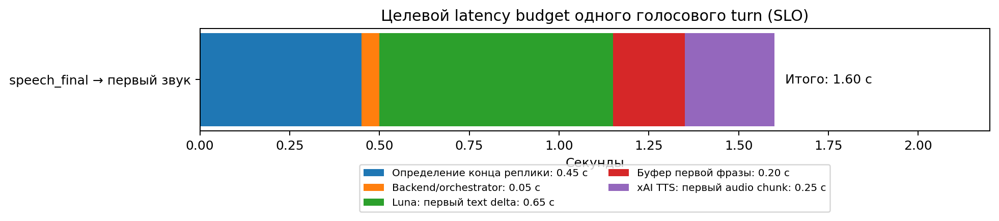
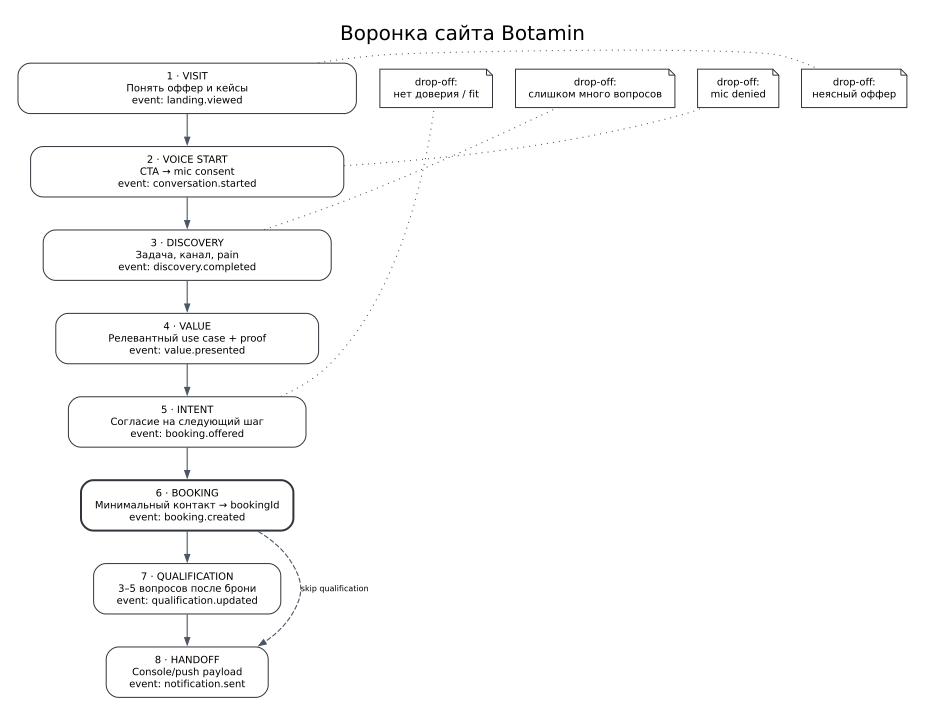
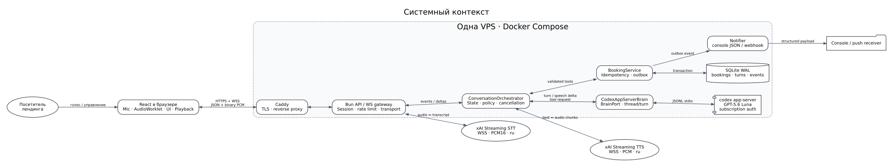
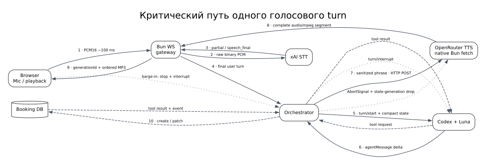
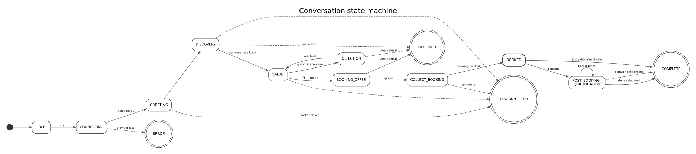
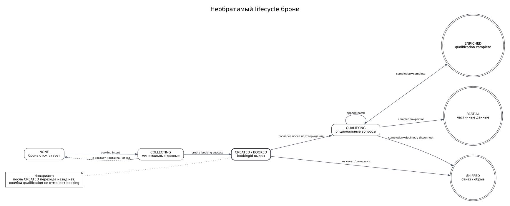
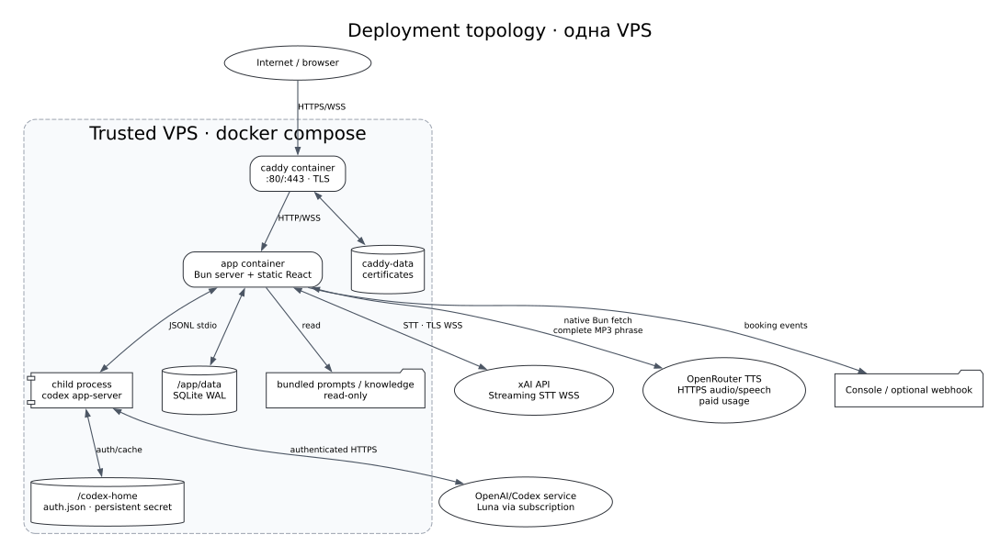
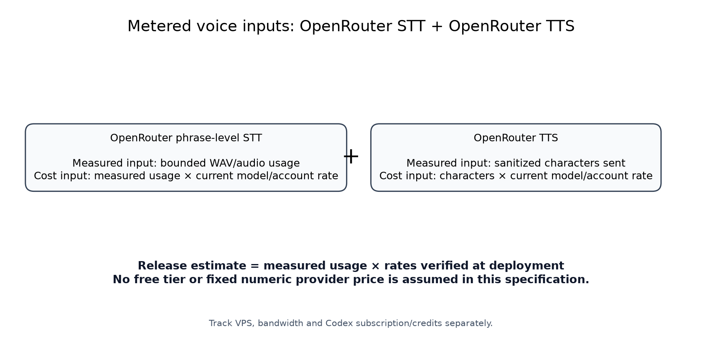
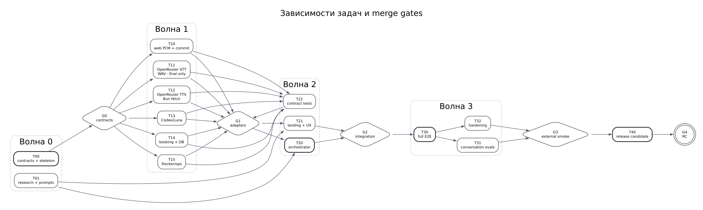
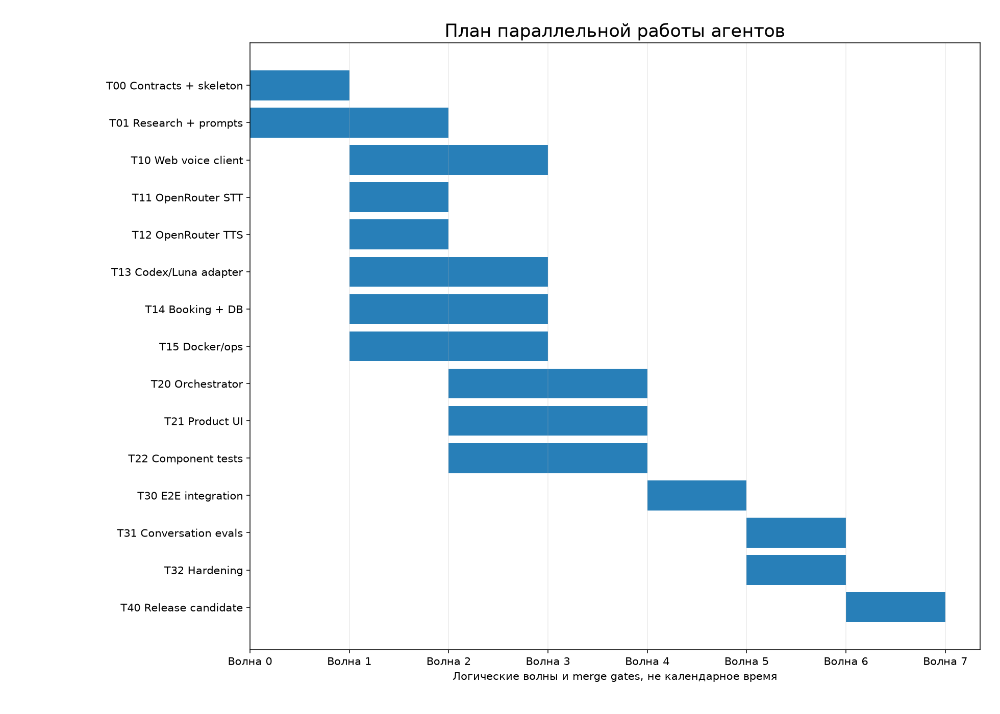

# Botamin Voice Sales Agent — техническая спецификация

**Версия:** 0.5-demo

**Статус:** основа для передачи агентам-разработчикам

**Deployment target:** одна trusted VPS, один Docker Compose

**Runtime split:** browser PCM16 chunks → gateway/utterance assembler emits one validated WAV → atomic `audio/wav` SttPort request → OpenRouter audio-input chat completion final transcript → Codex app-server / `gpt-5.6-luna` → OpenRouter TTS complete MP3 segment

> Ключевой инвариант: внутренняя бронь создаётся до любой опциональной квалификации. После `booking.created` отказ, обрыв или ошибка квалификации не отменяют и не удаляют лид.

## Карта пакета

Эта сводная версия объединяет scope, PRD, исследование Botamin, архитектуру, conversation design, API/data contracts, deployment/security, ADR, тестирование, сравнение AI-библиотек и parallel delivery plan. Machine-readable backlog и отдельные задания агентам находятся в `tasks/`. All STT/TTS decisions follow `corrections/CORRECTION-004_OPENROUTER_VOICE_ONLY.md`; correction history is intentionally not assembled into this generated document.

<div class="page-break"></div>


<div class="page-break"></div>

# 00. Scope, допущения и терминология

## 1. Цель MVP

Продемонстрировать работающий вертикальный срез AI-продавца Botamin:

> посетитель открывает лендинг, начинает голосовой или печатный разговор, получает релевантную презентацию продукта, отвечает максимум на два discovery-вопроса до мягкого предложения следующего шага, выбирает один из двух внутренних слотов и передаёт обязательные booking-данные, после чего backend фиксирует бронь и опционально обогащает её ограниченной квалификацией.

MVP должен выглядеть как небольшой реальный продукт, а не как набор несвязанных API-примеров.

## 2. Участники

| Участник | Роль |
|---|---|
| Посетитель | потенциальный B2B-клиент Botamin |
| Голосовой AI-продавец | ведёт разговор и достигает целевого действия |
| Backend | владеет состоянием, tools, транзакциями и аудитом |
| Получатель лида | в MVP получает PII-bearing payload через webhook/push |
| Владелец проекта | редактирует Markdown prompts в Git |

## 3. В scope

- адаптивный лендинг Botamin;
- браузерный доступ к микрофону;
- phrase-level STT на русском: chunked PCM16 до backend, максимум 60 секунд на реплику и 2,000,000 bytes на WAV request после `audio.commit`, final transcript only;
- provider-neutral final typed turns через `visitor.text.submit`, семантически равнозначные spoken turns;
- sample-derived circular countdown для активной записи;
- текстовое рассуждение и ответ через GPT-5.6 Luna в Codex;
- phrase-level TTS через полные MP3-сегменты, запускаемый до завершения полного ответа;
- interruption/barge-in на базовом уровне;
- управляемая state machine разговора;
- product knowledge из Botamin-сайта и Telegram-кейсов;
- durable revisioned conversation draft with facts/provenance/conflicts shared by spoken, typed, and structured-form input;
- automatic internal virtual meeting commit after exact confirmation of one of two concretely dated server-supplied 20-minute Moscow slots;
- direct optional missing-only qualification after truthful meeting confirmation, limited to monthly lead/contact volume and integer sales-manager count;
- SQLite persistence and server-derived final meeting widget;
- non-PII console acknowledgment и интерфейс PII handoff для webhook/push;
- transcript/event audit;
- local-first Docker Compose, health checks and backup; VPS TLS/WSS is a later deployment gate;
- тесты контрактов, компонентов, E2E и conversation evals.

## 4. Вне scope

- визуальный conversation builder;
- prompt CMS, роли и авторизация редакторов;
- реальный Google Calendar, Calendly или CRM;
- внешняя проверка календарной доступности; внутренний scheduler только исключает уже committed start times;
- телефония, SIP, PSTN, Twilio;
- исходящие звонки;
- полноценный call-center dashboard;
- биллинг и multi-tenant;
- Kubernetes, autoscaling, микросервисное дробление;
- отдельная vector database и сложный RAG;
- хранение аудиозаписей по умолчанию;
- юридическая экспертиза privacy copy.

## 5. Зафиксированные defaults

| Вопрос | Default MVP |
|---|---|
| Язык | русский; структура допускает локализацию |
| Канал | браузерный voice widget |
| Мозг | Codex app-server, `gpt-5.6-luna` |
| Voice | OpenRouter — единственный STT/TTS gateway; один backend-only key |
| STT profile | `openai/gpt-audio-mini` / `wav` / `ru`, configurable audio-input model; atomic final transcript only |
| TTS profile | `x-ai/grok-voice-tts-1.0` / `eve` / `mp3`, все значения конфигурируемы; usage платный, бесплатный tier не предполагается |
| Backend | Bun + TypeScript, Hono как лёгкий HTTP/WS слой |
| Frontend | React + TypeScript + Vite |
| Storage | SQLite в WAL-режиме, Drizzle migrations |
| Notifications | console — только non-PII acknowledgment; webhook — PII-bearing handoff |
| Calendar | отсутствует |
| Prompts | Markdown в Git |
| Deployment | local-first Compose project on one trusted machine; app + Caddy only. One target VPS with TLS/WSS is the later production-shaped gate |
| Raw audio retention | выключено |
| Utterance bounds | 60 секунд; WAV cap 2,000,000 bytes; countdown по принятым PCM16 samples и stricter server ceiling |
| Typed input | финальный `visitor.text.submit`, тот же semantic turn pipeline, что и speech |
| Booking | имя, компания, рабочий email, телефон или Telegram, consent и один из ровно двух server-supplied 20-minute `Europe/Moscow` slots |
| Qualification | включаемая опция, только после committed booking, confirmation и consent; monthly inbound leads + integer `salesManagerCount` |

## 6. Допущения, которые агенты не должны превращать в блокеры

- Для новой брони обязательны имя, компания, рабочий email, телефон или Telegram, consent и выбранный server-supplied slot.
- Backend владеет текущей московской датой/днём и выдаёт ровно два структурированных кандидата: будни, не сегодня, 20 минут, старты по сетке с 09:00 до 17:00 `Europe/Moscow`. Это внутреннее резервирование без внешнего календаря или availability API.
- Логотипы, точная типографика и brand book могут быть заменены аккуратным нейтральным стилем.
- Console output является достаточным handoff для P0.
- Если subscription auth временно недоступен, сервис показывает понятный degraded state; автоматический переход на платный API не включается без конфигурации.
- Числовые кейсы на лендинге используются только с подписью источника и без обещания повторить результат.

## 7. Термины

- **Conversation** — одна пользовательская voice/typed сессия.
- **Turn** — одна завершённая spoken или typed реплика пользователя и следующий ответ агента.
- **Booking** — внутренняя запись о согласованном следующем шаге, не календарное событие.
- **Qualification** — необязательные сведения, добавляемые к уже существующей брони.
- **BrainPort** — внутренний интерфейс текстового LLM-мозга.
- **VoicePort** — provider-neutral внутренние `SttPort` и `TtsPort`: один STT request принимает bounded `audio/wav` и возвращает один final transcript; один TTS request возвращает один полный `audio/mpeg` phrase segment.
- **Barge-in** — пользователь начинает говорить во время ответа агента.
- **Tool** — строго валидируемая backend-операция с доменным эффектом.
- **Luna** — модель `gpt-5.6-luna`, доступная через Codex.


<div class="page-break"></div>

# 01. Product Requirements Document

## 1. Продуктовая формулировка

Botamin Voice Sales Agent — это лендинг с живой голосовой демонстрацией продукта: AI-продавец сам показывает, как Botamin может отвечать, квалифицировать, обрабатывать возражения и передавать менеджеру структурированный результат.

### North Star для MVP

**Доля начатых голосовых разговоров, в которых backend получил валидный `booking.created`.**

Не следует оптимизировать MVP под длительность разговора или количество реплик: главная ценность — качественно зафиксированный следующий шаг.

## 2. Целевая аудитория

Основные роли:

- собственник / CEO;
- Head of Sales / коммерческий директор;
- CMO / руководитель лидогенерации;
- руководитель первой линии;
- операционный руководитель, отвечающий за SLA обработки лидов.

Типовые контексты:

- лиды теряются ночью или в выходные;
- менеджеры долго отвечают;
- большой объём нецелевых обращений;
- требуется реактивация или обработка холодной базы;
- квалификация и CRM-рутина перегружают команду;
- нужно быстро протестировать AI-сценарий продаж.

## 3. User stories P0

| ID | История | Приёмка |
|---|---|---|
| US-000 | Как посетитель, я сразу слышу короткое представление продукта | при entry выполняется одна попытка committed same-origin MP3 без REST/WS/mic/provider/session; blocked/error даёт `Включить приветствие` |
| US-001 | Как посетитель, я запускаю разговор одной кнопкой | proactive greeting останавливается; только после двух consents запрашивается mic permission и создаётся session, UI показывает состояние |
| US-002 | Я говорю естественно по-русски | UI показывает sample-derived circular countdown во время capture, listening/processing, затем ровно один `transcript.final` |
| US-003 | Я печатаю финальную реплику | stage-gated composer отправляет provider-neutral `visitor.text.submit`; server-accepted typed turn проходит тот же semantic pipeline, что и speech |
| US-004 | Агент отвечает естественным голосом и текстом | две ordered TTS requests могут готовиться параллельно; browser gapless проигрывает полные provider-neutral MP3/WAV segments, а visible transcript остаётся plain text |
| US-005 | Агент понимает, зачем я пришёл | задаёт не более одного вопроса за раз и максимум два discovery-вопроса до мягкого предложения следующего шага |
| US-006 | Агент объясняет Botamin на релевантном примере | использует только утверждённые knowledge claims; 10–15 млн ₽/месяц — только атрибутированное сообщение пользовательского брифа, не гарантия |
| US-007 | Я могу возразить или перебить | проигрывание останавливается, новый turn обрабатывается |
| US-008 | Я соглашаюсь на встречу | server предлагает ровно два concretely dated current Moscow slots, не выдавая их за глобальную доступность; spoken/text/form заполняют один durable revisioned draft, а exact-revision confirmation автоматически commit-ит выбранный вариант |
| US-009 | После встречи я могу ответить на два доп. вопроса | после durable commit и truthful confirmation server без отдельного permission turn спрашивает только первый missing fact: monthly lead/contact volume, затем integer `salesManagerCount`; known facts не повторяются, оба ответа одной репликой допустимы |
| US-010 | Я могу отказаться от квалификации | без ответов статус `skipped`, после одного ответа `partial`; scheduled internal virtual meeting в обоих случаях остаётся `booked`, диалог корректно завершается |
| US-011 | Получатель видит данные | webhook получает структурированный PII-bearing payload со слотом; console пишет только non-PII acknowledgment |
| US-012 | Сервис перезапускается | сохранённые booking/event данные остаются в volume |
| US-013 | Проект сначала разворачивается локально | `scripts/deploy-local.sh` поднимает готовые app + Caddy на `http://localhost:5173`; target VPS/TLS проверяется отдельным later gate |

## 4. Functional requirements

### 4.1 Voice session

- **FR-VOICE-001:** создание сессии должно выдавать уникальный `conversationId`.
- **FR-VOICE-002:** браузер передаёт mono PCM16, 16 kHz, чанками около 100 ms; максимум реплики — 60,000 ms, максимум atomic WAV — 2,000,000 bytes. Server-advertised client PCM cap учитывает WAV overhead и stricter ceiling (при defaults 1,920,000 PCM bytes).
- **FR-VOICE-003:** backend держит единственный `OPENROUTER_API_KEY` server-side для STT и TTS.
- **FR-VOICE-004:** `audio.commit` закрывает utterance; gateway/utterance assembler создаёт ровно один validated mono PCM16 WAV и передаёт его atomic `SttPort`. Adapter валидирует/bounds already-WAV bytes, base64-кодирует их без conversion и выполняет один audio-input chat completion. UI получает только один `transcript.final`, а Luna запускается только для валидного неустаревшего результата.
- **FR-VOICE-005:** при barge-in клиент немедленно останавливает playback и очищает очередь, backend abort-ит OpenRouter fetches текущего `generationId` и по возможности вызывает `turn/interrupt`.
- **FR-VOICE-006:** reconnect не должен создавать вторую бронь.
- **FR-VOICE-007:** stop завершает внешние соединения и фиксирует событие.
- **FR-VOICE-008:** OpenRouter вызывается только backend-ом; browser получает provider-neutral complete `audio/mpeg` или canonical `audio/wav` phrase segments in sequence order и никогда не получает raw provider PCM.
- **FR-VOICE-009:** TTS failure сохраняет видимый текст и все уже committed business side effects; synthesis retry не повторяет brain turn или tools.
- **FR-VOICE-010:** перед TTS удаляются PII, tool envelopes, hidden IDs, Markdown, code fences, raw URLs и visitor/model-authored style controls; hard limit сегмента — configurable, default 240 chars.
- **FR-VOICE-011:** STT duration/byte/time/retry guards и TTS per-segment/turn/session/concurrency/response guards ограничивают voice path; retry не запускает Luna/tools повторно.
- **FR-VOICE-012:** chunked PCM16 описывает только browser-to-gateway transport; provider boundary получает один atomic `audio/wav` STT request и возвращает один final result.
- **FR-VOICE-013:** circular countdown отображается только при active capture и вычисляется по числу принятых PCM16 samples (`acceptedPcmBytes / 2 / 16000`), ограниченному меньшим из server `maxUtteranceMs` и byte-derived duration; wall-clock drift не является источником значения.
- **FR-VOICE-014:** server запускает не более двух ordered TTS requests (current + one prefetch), но публикует результаты только в source order; first failure, barge-in и stale generation подавляют более поздний prefetched audio.
- **FR-VOICE-015:** browser scheduled playback привязывает следующий decoded segment к end time предыдущего. Credit window ограничен четырьмя segments / 20 MB / 5 MB per segment и максимум двумя decoded/source slots; credit возвращается после release.
- **FR-VOICE-016:** default TTS profile — exact xAI/eve/MP3. Gemini 3.1 Flash TTS Preview включается только полным four-env PCM profile, fails closed on mismatch, server-side wraps PCM as complete canonical mono 24 kHz PCM16 WAV, and has no automatic fallback/model/voice selection.
- **FR-VOICE-017:** server-owned style enum is `neutral|curious|serious|excited`; sensitive/authoritative facts always use neutral. Provider controls have no transcript, durable-state, or provider-selection effect; visible transcript stays plain.
- **FR-VOICE-018:** The 16 committed same-origin Sulafat reaction clips are canonical mono PCM16LE 24 kHz WAVs. They require negotiated allowlist capability and may play at most once per fail-closed safe-policy-eligible turn after 350 ms. Runtime currently exposes only a non-claiming neutral clip; claim-bearing progress/validation/scheduling/booking/acceptance clips fail closed without an explicit trusted server operation signal. Reactions make zero runtime provider calls and cannot affect transcript, state, booking, tools, or provider behavior.
- **FR-TEXT-001:** `visitor.text.submit` содержит один trimmed final typed turn до 2,000 символов, monotonic sequence и не содержит provider/tool fields.
- **FR-TEXT-002:** typed turn очищает uncommitted microphone bytes, допускает не более одного pending submit и считается принятым только после server `transcript.final`; rejected retry сохраняет sequence.
- **FR-TEXT-003:** после final acceptance typed и spoken turns семантически равнозначны: один и тот же Luna context, server state policy, tools, persistence, assistant text и optional TTS.

### 4.2 Brain and orchestration

- **FR-BRAIN-001:** модель по умолчанию `gpt-5.6-luna`; фактическая модель задаётся `CODEX_MODEL`, но её смена требует повторного conversation eval gate.
- **FR-BRAIN-002:** один Codex thread соответствует одной conversation.
- **FR-BRAIN-003:** backend, а не LLM, является источником истины для текущего stage.
- **FR-BRAIN-004:** LLM не получает shell/network privileges, кроме явно зарегистрированных доменных tools.
- **FR-BRAIN-005:** ответы проходят speech sanitizer перед TTS.
- **FR-BRAIN-006:** system/product/conversation prompts загружаются из Markdown.
- **FR-BRAIN-007:** tool mode имеет feature flag: `dynamic` и стабильный fallback `envelope`.
- **FR-BRAIN-008:** reasoning effort задаётся конфигурацией; стартовый профиль Luna использует минимальный уровень, который проходит quality evals.
- **FR-BRAIN-009:** каждый turn получает server-owned `currentInstant`, текущую московскую дату и день недели, parsed time-of-day/concrete-date-time request и ровно два structured meeting candidates с concrete Moscow date/time labels.
- **FR-BRAIN-010:** cadence умеренно проактивен: один вопрос за раз, не более двух discovery-вопросов до мягкого demo/meeting offer, без повторного давления после ясного отказа.
- **FR-BRAIN-011:** ordinary spoken reply uses concise natural Russian: usually no more than two short sentences/about twelve seconds, one useful thought, and at most one question; filler acknowledgements and invented progress are forbidden.

### 4.3 Booking

- **FR-BOOK-001:** обязательны `conversationId`, имя, компания, рабочий email, телефон или Telegram, `consentConfirmed=true` и structured `meetingSlot`.
- **FR-BOOK-002:** server всегда выдаёт ровно два уникальных внутренних кандидата длительностью 20 минут в `Europe/Moscow`, каждый с конкретной датой и временем: будни, дата строго позже server-owned московского today, старты по 20-минутной сетке от 09:00 до 17:00 включительно. Без preference это одна утренняя и одна вечерняя альтернатива.
- **FR-BOOK-003:** bounded Russian parser одинаково обрабатывает typed/spoken явные предпочтения `morning`, `daytime`, `second_half`, `evening`, одно явное rejection и поддерживаемые конкретные московские дату+время. Time band даёт два in-band варианта; concrete request даёт exact permitted start и одну alternative либо два ближайших internal starts. Missing/ambiguous date or time asks for clarification; same-day/past/out-of-hours requests fail closed.
- **FR-BOOK-004:** два candidates — только текущие внутренние альтернативы, не exhaustive/global availability claim. Они исключают committed internal starts без external availability API.
- **FR-BOOK-005:** `create_booking` разрешён только в `COLLECT_BOOKING`; выбранный `meetingSlot` обязан byte-for-field совпасть с одним из двух candidates активного turn. Non-candidate, stale, occupied или уже не bookable slot отклоняется.
- **FR-BOOK-006:** одна durable draft projection хранится в `conversation_contexts` как revisioned JSON facts/provenance/conflicts/lifecycle. Mutations используют expected revision, compare-and-swap, bounded conflicts и idempotent request IDs; stale revisions fail closed.
- **FR-BOOK-007:** exact-revision draft confirmation переводит draft через `committing` и автоматически вызывает идемпотентный booking create; стабильный `bookingId` записывается и в durable draft, и в единственный booking.
- **FR-BOOK-008:** committed `booking.created`, committed draft и server-derived internal meeting projection предшествуют final widget и первому qualification question.
- **FR-BOOK-009:** backend сохраняет booking/outbox и публикует `kind=internal_virtual`, `status=scheduled`, `externalCalendarEventCreated=false`, `externalInviteSent=false`; отдельной meeting table, external availability API, calendar event/invitation или CRM record нет.
- **FR-BOOK-010:** in-chat form показывается только по server-owned `COLLECT_BOOKING`, редактирует browser-safe projection без provenance/evidence и отправляет structured field patch/current candidate identity. Spoken, typed, and form inputs merge into one authoritative draft; conflicts require explicit resolution and changed candidates require reselection.

### 4.4 Post-booking qualification

- **FR-QUAL-001:** запускается только после committed booking, committed draft, durable internal meeting publication и truthful user-facing confirmation; отдельного qualification-permission turn нет.
- **FR-QUAL-002:** server спрашивает только missing authoritative fact: при двух missing сначала контекстный месячный объём лидов/обрабатываемых контактов (`monthlyLeadVolume`), затем integer `salesManagerCount`; при одном known спрашивается только второе, при обоих known — ничего.
- **FR-QUAL-003:** server не повторяет known facts. Generic daily volume требует clarification `рабочие или календарные дни`; только затем server может нормализовать. Model не вычисляет 22/30 и не может изменить persisted truth.
- **FR-QUAL-004:** оба поля необязательны для meeting и могут сохраняться partial patch-операцией; `complete` только при обоих. Если пользователь сообщает оба missing значения одновременно, оба сохраняются и flow завершается.
- **FR-QUAL-005:** explicit refusal без ответов даёт `skipped`; refusal после одного ответа сохраняет `partial`; disconnect/failure не отменяет scheduled internal meeting.
- **FR-QUAL-006:** повторный patch идемпотентен.

### 4.5 Landing and UX

- **FR-WEB-000:** при entry выполняется ровно одна automatic playback attempt committed product-owned same-origin MP3. До двух consents запрещены conversation REST, WS, mic, provider и session effects; blocked/error показывает native button `Включить приветствие`, а session start немедленно останавливает и освобождает audio.
- **FR-WEB-001:** above-the-fold объясняет продукт и содержит один primary CTA.
- **FR-WEB-002:** до запуска голоса показывается понятное объяснение микрофона и обработки данных.
- **FR-WEB-003:** UI имеет состояния `idle`, `connecting`, `listening`, `thinking`, `speaking`, `booked`, `complete`, `error`.
- **FR-WEB-004:** текстовая копия реплик и stage-gated multiline composer доступны в активных visitor-turn stages; Enter отправляет, Shift+Enter добавляет строку.
- **FR-WEB-005:** booking form существует внутри chat и видима только в server-owned `COLLECT_BOOKING`. Она показывает auto-filled durable facts, five contact/identity fields, conflicts, exactly two concretely dated candidates, exact-revision confirmation, and safe rejection/retry state.
- **FR-WEB-005A:** final meeting widget appears only from `session.ready.internalMeeting` or `internal.meeting.updated` derived from the durable booking; legacy UI state or transcript wording cannot synthesize it.
- **FR-WEB-006:** mobile viewport поддерживается.
- **FR-WEB-007:** при voice failure пользователю не показываются stack traces/provider details.
- **FR-WEB-008:** proactive MP3 содержит только фиксированный product copy без visitor data. Его замена выполняется отдельным explicit admin opt-in OpenRouter generation script и commit-ится как static asset; runtime visit не генерирует greeting.
- **FR-WEB-009:** playback `AudioContext` создаётся/resume-ится в synchronous consent gesture path до mic/network awaits; live WebKit acceptance remains a release gate.
- **FR-WEB-010:** local reaction corpus generation is a separate explicit paid admin opt-in; committed assets are runtime-static and reaction fetch/decode failure is decoration-only.

## 5. P1 и P2

### P1

- generic signed webhook notifier с retry;
- dev-only inspector с событиями и latency;
- prompt checksum в каждом conversation;
- TTS cache для статических приветствий;
- automated conversation eval suite;
- basic abuse/rate limiting;
- export одного лида в JSON.

### P2

- Telegram notifier;
- A/B prompts;
- admin dashboard;
- real CRM/calendar adapters;
- selectable voices;
- multilingual flows;
- analytics warehouse.

## 6. Non-functional requirements

| ID | Требование | Цель MVP |
|---|---|---|
| NFR-LAT-001 | `audio.commit` → final transcript и final transcript → playback первой полной MP3-фразы | измерять и публиковать отдельно; re-baseline после target-VPS smoke, без provider guarantee |
| NFR-REL-001 | успешность `create_booking` при валидных данных | ≥ 99.5% внутри приложения |
| NFR-IDEM-001 | дубли брони при retry/reconnect | 0 в тестовой матрице |
| NFR-SEC-001 | TLS | обязательно в production |
| NFR-SEC-002 | raw credentials в клиентском bundle/logs | 0 |
| NFR-PRIV-001 | raw audio storage | off by default |
| NFR-OBS-001 | traceability | `conversationId`, `turnId`, `bookingId` во всех событиях |
| NFR-OPS-001 | deployment | один local-first Compose project; target VPS/TLS evidence later |
| NFR-OPS-002 | backup | ежедневная копия SQLite + restore check |
| NFR-COMP-001 | browser | актуальные Chrome, Edge, Safari; Firefox best effort |
| NFR-A11Y-001 | keyboard/control labels | WCAG-oriented базовый уровень |



Значения на графике — инженерный бюджет и release target, а не обещание провайдера. Реальные p50/p95 должны собираться в E2E.

## 7. Бизнес-события воронки

Минимальный набор:

1. `landing.viewed`
2. `voice.cta_clicked`
3. `voice.permission_granted` / `voice.permission_denied`
4. `conversation.started`
5. `conversation.discovery_completed`
6. `booking.offered`
7. `booking.created`
8. `qualification.started`
9. `qualification.updated`
10. `conversation.completed`
11. `conversation.failed`

## 8. Success metrics после запуска

- start rate: `conversation.started / landing.viewed`;
- speech activation: доля с хотя бы одной финальной репликой;
- booking conversion: `booking.created / conversation.started`;
- post-booking qualification opt-in;
- qualification completeness;
- drop-off stage distribution;
- p50/p95 time-to-first-audio;
- provider error rate, OpenRouter circuit state и доля text-only degradation;
- OpenRouter TTS character usage без spoken-text logging;
- duplicate booking rate;
- доля диалогов с manual review flag.

Метрики качества продаж нельзя интерпретировать без объёма трафика и human review выборки.

## 9. Release sequencing boundary

`0.5.0-local-rc.4` is the recommended, still-untagged local candidate for one trusted owner machine. Chromium desktop/mobile landing smoke is not a full voice journey. Full Chromium and WebKit voice journeys, target-VPS resources, DNS, public TLS/WSS, target-host provider live booking, and target-host latency/load remain external gates. There is no formal voice A/B quality matrix. The isolated Gemini smoke is transport evidence only, never a listening-quality claim. The internal virtual meeting remains deliberately different from an external calendar event.


<div class="page-break"></div>

# 02. Исследование Botamin и проект воронки

## 1. Источники и ограничение

Исследованы:

- публичный сайт `https://botamin.ru/`;
- публичная лента Telegram `https://t.me/GPT_for_sales`;
- согласованный scope из текущего диалога.

Страница Notion была недоступна. Поэтому этот документ является продуктовым research brief для MVP, а не дословным пересказом исходного тестового.

## 2. Что продаёт Botamin

Сайт позиционирует Botamin как платформу AI-агентов, которая:

- автоматизирует первую линию продаж;
- генерирует и квалифицирует лиды из холодных и входящих источников;
- доводит лид до ключевого этапа воронки;
- работает с входящими, реактивацией и холодными базами;
- отвечает круглосуточно;
- передаёт результат менеджерам и в CRM;
- использует анализ диалогов для улучшения сценариев.

На сайте выделены доказательства и обещания: внедрение «под ключ», большое число внедрений, CRM-интеграции, быстрый ответ и кейсы из разных отраслей. В voice funnel эти тезисы лучше использовать не списком, а в ответ на конкретную боль собеседника.

## 3. Повторяющиеся pain patterns

| Pain | Что обещает сценарий Botamin | Как спросить в разговоре |
|---|---|---|
| медленная реакция | быстрый ответ 24/7 | «Сколько сейчас проходит от заявки до первого контакта?» |
| ночные/выходные лиды | непрерывная первая линия | «Есть заметный входящий поток вне рабочего времени?» |
| нецелевые обращения | автоматическая квалификация | «Какую долю обращений менеджеры отсеивают вручную?» |
| недозвоны/молчуны | follow-up и реактивация | «Что происходит с теми, кому менеджер не дозвонился?» |
| рутина CRM | структурированный handoff | «Менеджеры сами заполняют карточки после разговора?» |
| холодная база | выход на ЛПР и квалификация | «Есть база, которую команда не успевает системно отрабатывать?» |
| нестабильные скрипты | единый сценарий + итерации | «Насколько одинаково менеджеры проводят первую квалификацию?» |

## 4. Что найдено в кейсах

Публичная Telegram-лента содержит кейсы, подходящие как social proof. Числа ниже являются утверждениями источника и не должны подаваться как гарантированный результат будущего клиента.

| Сценарий | Опубликованный результат | Применение в funnel |
|---|---|---|
| «Главтрассы», голосовой outbound | 15% в квалифицированный лид; резюме и транскрипция в Telegram | пример выхода на ЛПР и передачи тёплого лида |
| РоллПроф, входящий + follow-up | 13% доведены до реального интереса | 24/7 и работа с недозвонами |
| продавец утеплительной пены на Авито | рост конверсии с 10% до 45% по публикации | скорость ответа и фильтрация нецелевых |
| поставщик стройматериалов | 1000 обращений, 31% горячих лидов, нагрузка пяти менеджеров | масштаб и квалификация по предметным полям |
| Foxford / сценарий недозвонов | возвращённая и квалифицированная часть пропущенных контактов | реактивация после неуспешного звонка |

### Дополнительный claim из пользовательского брифа

Предоставленный пользователем бриф Botamin сообщает, что Botamin помог компаниям увеличить выручку на **10–15 миллионов рублей в месяц**. Это утверждение именованного пользовательского источника о прошлых результатах нескольких компаний; оно не было независимо проверено и не доказывает применимость к новому собеседнику. Допустимая формулировка обязана назвать пользовательский бриф Botamin и прямо отделить claim от гарантии, прогноза или обещания результата.

### Правило claims

В prompt/knowledge нужно разделить:

- **Product facts:** что платформа умеет и как реализуется.
- **Case claims:** что было опубликовано в конкретном кейсе.
- **Prohibited promises:** «мы гарантированно поднимем конверсию в X раз», «заменим отдел», «окупимся за N дней».

## 5. Предлагаемый landing narrative

### Блок 1. Hero

**Заголовок:**

> AI-продавец, который сам покажет, как перестать терять лиды

**Подзаголовок:**

> Поговорите с голосовым агентом Botamin. Он разберёт ваш процесс, покажет релевантный сценарий и зафиксирует следующий шаг.

**CTA:**

> Поговорить с AI-продавцом

Под CTA: «Нужен микрофон. Разговор можно завершить в любой момент».

### Блок 2. Три ценностных сценария

1. Обрабатывать входящие 24/7.
2. Квалифицировать и передавать только целевые лиды.
3. Реактивировать недозвоны и холодные базы.

### Блок 3. Как это работает

`Источник → AI-первая линия → квалификация → структурированный handoff → менеджер`.

### Блок 4. Кейсы

Показывать 2–3 коротких карточки с источником и контекстом, без перегруза цифрами.

### Блок 5. Voice demo

Sticky/inline widget с plain transcript, статусом и одной главной кнопкой. При входе он один раз пытается проиграть committed product-owned same-origin MP3-приветствие. Это product preview, а не voice session: до consent нет conversation REST/WS, microphone или provider call. Если autoplay заблокирован или media не загрузилось, показывается `Включить приветствие`; запуск разговора останавливает приветствие. После consent короткие естественные реплики идут через gapless provider-neutral playback; 16 capability-gated same-origin reactions могут ненавязчиво обозначить задержку после 350 ms, но не меняют transcript/state и не вызывают provider runtime.

### Блок 6. Trust and limits

- данные не попадают в публичный чат;
- разговор можно остановить;
- создаётся только внутренняя виртуальная встреча Botamin на точный московский слот; внешнее calendar event/invite не создаётся.

## 6. Воронка



### Funnel stages и события

| Stage | Цель | Главный event | Drop-off reason examples |
|---|---|---|---|
| Visit | понять ценность и услышать короткий static product greeting | `landing.viewed` | autoplay blocked → явная `Включить приветствие` |
| Voice start | получить оба consent до session/mic/provider path и gesture-owned AudioContext | `conversation.started` | permission/audio unavailable |
| Discovery | найти задачу максимум за два вопроса до мягкого offer | `discovery.completed` | слишком много вопросов |
| Value | связать pain и use case | `value.presented` | общая презентация |
| Intent | получить согласие на следующий шаг | `booking.offered` | нет доверия/времени |
| Booking | свести spoken/text/form facts в один revisioned draft, разрешить conflicts и подтвердить один из двух concretely dated slots | `booking.created` | missing/conflicted facts, stale revision или нет current selection |
| Qualification | после durable internal meeting и truthful confirmation спросить только missing volume/manager fact | `qualification.updated` | пользователь отказался; meeting сохраняется |
| Handoff | показать server-derived internal meeting widget и структурированный notifier result | `internal.meeting.updated` / `notification.sent` | widget запрещён до durable commit |

## 7. Conversation value map

| Что сказал пользователь | Какую ценность раскрыть | Какой кейс допустим |
|---|---|---|
| «Мы долго отвечаем» | SLA и 24/7 первая линия | Авито/РоллПроф |
| «Много мусорных лидов» | квалификация до менеджера | стройматериалы |
| «Есть старая база» | реактивация и follow-up | Foxford/недозвоны |
| «Нужны холодные звонки» | выход на ЛПР, summary | Главтрассы |
| «Боюсь качества» | knowledge base, итерации, human review | общий процесс внедрения |
| «Нужна интеграция» | CRM/connectors как продуктовая возможность | сайт Botamin; без обещания конкретной даты |

## 8. Cadence, booking и минимальная квалификация

Текущий funnel умеренно проактивен: агент задаёт по одному вопросу и не более двух discovery-вопросов до краткого мягкого предложения demo/встречи. После ясного отказа предложение не повторяется.

После согласия agent/server предлагает ровно два labeled candidates с конкретной московской датой и временем и не называет их всей доступностью. Без предпочтения server даёт одну утреннюю и одну вечернюю альтернативу. Typed и spoken русские формулировки про часть дня, rejection и поддерживаемую конкретную дату+время проходят один parser: для concrete request server предлагает exact permitted start и alternative либо два nearest internal starts. Все варианты — 20 минут, будни, не сегодня, старты 09:00–17:00 по Москве.

Name, company, working email, phone or Telegram, qualification facts и candidate selection сходятся в одном durable revisioned draft независимо от spoken, typed или structured-form origin. Conflicting values не затираются молча; browser показывает bounded options, а stale revision/replaced candidate требует resync/reselection. Exact-revision confirmation автоматически создаёт одну внутреннюю виртуальную встречу и только после durable commit публикует final widget. Внешний календарь, invite и availability API отсутствуют.

После truthful confirmation qualification не запрашивает отдельного разрешения. Server задаёт только first missing field: monthly lead/contact volume first, если оба отсутствуют; otherwise only missing volume or integer `salesManagerCount`; если оба известны — ничего. `complete` возможен только при обоих значениях; ответ на оба сразу допустим. Отказ без ответов даёт `skipped`, после одного — `partial`; внутренняя встреча остаётся scheduled.

## 9. Контентные риски

- Сайт и Telegram — маркетинговые источники; кейсы нуждаются в аккуратной атрибуции.
- Цены и продуктовые детали могут измениться: не зашивать их в core prompt без даты.
- Агент не должен сравнивать Botamin с конкурентами без отдельной knowledge policy.
- Нельзя придумывать интеграции или функциональность, которой нет в источнике.
- При вопросе, требующем коммерческого расчёта, агент предлагает встречу, а не выдумывает цену.


<div class="page-break"></div>

# 03. Системная архитектура

## 1. Решение верхнего уровня



Архитектура намеренно разделяет голос и интеллект:

- **OpenRouter phrase-level STT** — один audio-input chat completion для bounded WAV после конца реплики;
- **Codex app-server + GPT-5.6 Luna** — текстовый reasoning, dialogue policy и tool decisions;
- **OpenRouter TTS** — backend-only paid synthesis через native Bun `fetch`;
- **Bun gateway/utterance assembler** — единственный владелец utterance buffers, PCM16 bounds и PCM16-to-WAV encoding;
- **Bun backend** — владелец state, tools, credentials, voice budgets и persistence.

До этого pipeline существует отдельный pre-consent path: page entry делает одну `HTMLAudio` playback attempt committed same-origin `/assets/botamin-proactive-greeting.mp3`. Он не создаёт conversation, REST/WS, microphone, provider call или session; blocked/error переводит UI к `Включить приветствие`, а session start останавливает/release-ит audio.

Действующий post-consent pipeline: **browser PCM16 chunks → gateway/utterance assembler emits one validated STT WAV → atomic `audio/wav` SttPort → OpenRouter final transcript → Codex/Luna → two-request ordered TTS prefetch → complete provider-neutral MP3 or canonical WAV segments → gapless scheduled playback**. Один OpenRouter key остаётся только на backend и авторизует оба voice endpoint. The static proactive greeting MP3 and Sulafat canonical-WAV reactions не входят в provider runtime pipeline.

Это отличается от end-to-end speech-to-speech: добавляется один orchestration layer, зато используется уже оплаченная Codex subscription и мозг можно заменить без переделки audio UI.

## 2. Контейнеры и компоненты

### React client

Ответственность:

- ровно одна immediate entry attempt fixed same-origin proactive MP3 без session/network capabilities кроме same-origin asset fetch;
- truthful `Включить приветствие` fallback после autoplay block/media error и release greeting при session start;
- mic permission только после обоих consents;
- synchronous creation/resume output `AudioContext` in the consent gesture before mic/network awaits;
- AudioWorklet capture;
- resample browser audio до mono PCM16 16 kHz;
- отправка бинарных PCM16 чанков около 100 ms;
- явный end-of-turn `audio.commit`, 60-second ceiling и server-advertised PCM byte cap, производный от 2,000,000-byte WAV cap;
- circular countdown по принятым samples, а не wall clock, с effective duration по stricter duration/byte ceiling;
- secure `visitor.text.submit` for bounded final typed turns plus structured revisioned booking form commands only in server-owned `COLLECT_BOOKING`;
- UI states `listening → processing → transcript.final`;
- provider-neutral validation/rendering of complete MP3 or canonical 24 kHz mono PCM16 WAV segments;
- gapless Web Audio scheduling with current + prefetched decoded slots;
- explicitly negotiated v2 four-segment/20 MB/5 MB-per-segment credit window, at most two decoded/source slots, and release acknowledgment;
- negotiated allowlist over a 16-clip committed same-origin corpus; at most one eligible non-claiming decoration after 350 ms, cancelled by dynamic audio, mute, barge-in, or staleness. Claim-bearing progress clips remain unreachable without a future explicit trusted operation signal;
- mixed-version safety: a legacy-shaped JSON hello plus trusted same-origin `?voiceProtocol=2` offer/accept negotiation lets the new browser fall back against exact `origin/main`; an old browser is rejected by the new server before readiness or turn consumption rather than entering ACK-dependent flow;
- barge-in: немедленно stop local playback и clear queue;
- rendering transcript/state/errors;
- reconnect с тем же `conversationId`, если сессия ещё жива.

Клиент не знает OpenRouter или Codex credentials и не вызывает providers напрямую. До consent он также не вызывает conversation REST/WS и не запрашивает microphone; static asset delivery не является provider/session traffic.

### Bun API / WebSocket gateway

Ответственность:

- выдача conversation ID;
- аутентификация/лимиты публичной сессии;
- multiplex JSON events и binary audio;
- bounded utterance assembly до `audio.commit`, duration/byte guards и encoding bounded mono PCM16 into exactly one validated WAV;
- atomic provider request lifecycle, abort и stale-turn suppression;
- playback credit backpressure negotiated at four segments / 20 MB and replenished only by exact `playback.segment.released` acknowledgment;
- local-reaction capability negotiation and conservative stage/privacy selection with no provider call or business effect;
- orchestration turns;
- speech sanitizer + sentence chunker;
- запись событий и latency;
- cleanup при stop/disconnect.

### ConversationOrchestrator

Источник истины для:

- current stage and accepted visitor-turn origin (`voice_transcript` or `typed_message`);
- durable RC4 draft lifecycle in one `conversation_contexts` JSON row: revision, fact registry/provenance/conflicts, exactly two candidate identities, selection, readiness, confirmation/commit state and booking ID;
- server-owned Moscow date/day and bounded typed/spoken time-band, rejection, and concrete date/time interpretation;
- expected-revision CAS, idempotent form/conflict/confirmation commands, explicit conflict resolution, and candidate refresh/reselection;
- automatic internal booking commit only from a ready, exactly confirmed draft;
- direct missing-only qualification after durable booking confirmation;
- prompt context, retry/cancellation, and publication of browser-safe projections.

LLM предлагает действие, но backend валидирует, разрешено ли оно в текущем состоянии.

### CodexAppServerBrain

P0 transport — direct typed JSON-RPC к app-server. Универсальный AI SDK не используется в критическом пути; подробное сравнение находится в [`10-ai-library-evaluation.md`](docs/10-ai-library-evaluation.md).

- запускает один долгоживущий `codex app-server` процесс;
- transport — JSONL over stdio через внутренний `BrainPort`;
- делает `initialize`/`initialized` один раз;
- создаёт отдельный `thread/start` на conversation;
- модель — `gpt-5.6-luna`;
- читает `item/agentMessage/delta`;
- обрабатывает `item/tool/call`, если включён experimental mode;
- отменяет turn через `turn/interrupt` при barge-in;
- генерирует/версионирует TS schema из установленной версии Codex;
- запускает thread с `cwd=/app/runtime-brain`, где prompt compiler создаёт только `AGENTS.md` и безопасные read-only knowledge-файлы;
- проверяет `instructionSources` из `thread/start`: ожидаемый `AGENTS.md` обязан быть загружен;
- не даёт модели доступ к рабочему репозиторию, `.env`, SQLite или общему filesystem.

### OpenRouterSttAdapter

- server-side native Bun `fetch` к `POST https://openrouter.ai/api/v1/chat/completions`;
- принимает через atomic `SttPort` одну уже закодированную и проверенную gateway 16 kHz mono PCM16 WAV реплику с `contentType: "audio/wav"`;
- повторно валидирует WAV container/format и request duration/byte bounds, отклоняя raw PCM, malformed WAV и mismatched content type;
- base64-кодирует неизменённые WAV bytes и отправляет content part `{"type":"input_audio","input_audio":{"data":"<base64>","format":"wav"}}`; adapter не добавляет WAV header и не конвертирует PCM;
- default model `openai/gpt-audio-mini`; model, `wav` format и `ru` language задаются env, а audio-input capability проверяется smoke/discovery evidence;
- возвращает один atomic final transcript;
- current official evidence documents chat completions audio input, not a dedicated realtime STT WebSocket; поэтому adapter нельзя называть provider-streaming STT;
- `AbortSignal` и turn identity подавляют aborted/stale result; `400/401/402/404/413` не ретраятся, `429`/retryable `5xx` получают не более одного bounded retry;
- STT retry повторяет только transcription fetch и никогда не запускает Luna, tools или notifier;
- telemetry содержит model/format/status/latency/duration/bytes/retry и safe IDs, но не key, WAV/base64, transcript text или PII.

### OpenRouterTtsAdapter

- server-side native Bun `fetch` к `POST https://openrouter.ai/api/v1/audio/speech`; default remains exact `xai_mp3` / `x-ai/grok-voice-tts-1.0` / `eve` / `mp3`;
- opt-in Preview profile requires exact `gemini_3_1_pcm` / `google/gemini-3.1-flash-tts-preview` / one case-sensitive release-snapshot voice / `pcm`, with no speed, automatic choice, or xAI fallback;
- Gemini public catalog is dynamic; the exact 30-voice snapshot verified 2026-08-03 is recorded in [`../CURRENT_DECISIONS.md`](../CURRENT_DECISIONS.md) and configuration fails closed outside it;
- OpenRouter PCM is validated as complete PCM16LE and wrapped server-side into canonical complete mono 24 kHz PCM16LE `audio/wav`; browser never receives raw PCM;
- `TtsPort` carries plain sanitized text plus trusted low-cardinality delivery style `neutral|curious|serious|excited`. Gemini mapping is fixed server-side (`neutral` no tag, otherwise `[curious]`, `[serious]`, `[excited]`); bracket controls from text fail closed;
- contacts, exact meeting/date/time, booking/qualification, server-authority/fallback, and interrupted-turn content always use neutral. Style is presentation-only: visible transcript stays plain and durable state/provider selection do not change;
- one HTTP request synthesizes one short phrase; at most current + one prefetch are in flight, then complete segments publish strictly in source order;
- `Authorization` and attribution stay server-side; `X-OpenRouter-Cache: false`, bounds, abort/stale suppression, one pure-synthesis retry maximum, circuit breaker, budgets, and text-only degradation remain mandatory;
- telemetry contains safe aggregates only, never spoken text, style tags, PII, key, raw PCM/WAV/MP3, or provider body.

### BookingService

- generates exactly two deterministic internal 20-minute candidates with concrete Moscow dates/times after current Moscow date, weekdays only, on the 09:00–17:00 20-minute grid;
- without preference chooses one morning and one evening alternative;
- handles selected time bands/rejection and supported concrete date+time requests; concrete requests return exact permitted + alternative or the nearest two internal starts, while missing/ambiguous/out-of-policy requests fail closed;
- исключает уже committed internal start times без external calendar/availability API и никогда не представляет tuple как exhaustive/global availability;
- валидирует name, company, working email, phone or Telegram, consent и structured `Europe/Moscow` slot;
- повторно проверяет slot по текущему server clock и отклоняет stale/non-bookable или internally occupied start до side effect; active-candidate membership до вызова сервиса проверяет orchestrator/tool policy;
- создаёт/находит booking в одной `BEGIN IMMEDIATE` transaction;
- updates qualification patch only after durable meeting confirmation; missing-field selection and refusal gating belong to orchestrator policy;
- computes qualification truth from saved fields: zero+refusal=`skipped`, one=`partial`, both=`complete`; only a missing field is asked and booking remains `booked`;
- пишет event outbox;
- никогда не удаляет booking из-за incomplete qualification.

### ConversationContext / BookingDraftStore

Migration `0004_conversation_contexts.sql` adds exactly one compact table, not separate fact/evidence/meeting tables. Its PK/FK is `conversation_id` with cascade deletion; SQLite checks require a nonnegative row revision, valid object JSON, and matching draft/fact-registry revisions and `updatedAt`. Store mutations run in `BEGIN IMMEDIATE`, compare the expected revision in the update predicate, and use scoped idempotency keys for form, conflict-resolution, and confirmation commands. Provenance/evidence remains internal; browser events expose only required/status/value/conflict-option projections.

A confirmed current revision is the authorization boundary for automatic internal meeting commit. The durable booking remains the only meeting entity; `InternalVirtualMeetingProjection` is derived from it for `session.ready` / `internal.meeting.updated` and explicitly carries both external flags as false.

### Notifier

Интерфейс:

```ts
export interface LeadNotifier {
  publish(event: BookingCreatedEvent | BookingUpdatedEvent): Promise<void>;
}
```

P0 adapter — fixed-schema non-PII console acknowledgment. P1 — signed HTTP webhook с полным lead payload и retry/outbox.

## 3. Критический путь turn



### Pre-session entry

1. Browser монтирует greeting controller и немедленно ровно один раз вызывает playback фиксированного same-origin MP3.
2. Autoplay block или media error не запускает alternate network/provider path: UI показывает `Включить приветствие`, и повтор возможен только по user action.
3. До обоих consents не создаются conversation/WS/microphone/provider/session. При старте настоящей session greeting немедленно pause/reset/release.

Assets создаются отдельно от visitor runtime. Admin explicitly opts in to the paid proactive-greeting or local-reaction generator; the 16 Sulafat canonical mono PCM16LE 24 kHz reaction WAVs and proactive greeting MP3 are already committed static same-origin assets. Reaction regeneration additionally requires the exact Gemini PCM/Sulafat production profile. They contain no visitor data, and ordinary entry/turn handling never synthesizes them.

### Post-consent turn order

1. Browser отправляет примерно 100 ms PCM16 chunks; gateway/utterance assembler собирает их в bounded utterance.
2. End-of-turn / `audio.commit` закрывает реплику. Gateway/utterance assembler проверяет duration/bytes, создаёт и валидирует ровно один mono PCM16 WAV.
3. Gateway передаёт WAV атомарному `SttPort`; OpenRouter STT adapter повторно валидирует/bounds already-WAV request, base64-кодирует его и отправляет один `input_audio` chat completion.
4. Only a valid current final transcript becomes a user turn. Monotonic `visitor.text.submit` creates the same accepted final-turn path without STT.
5. Orchestrator parses typed/spoken input identically, extracts quoted fact proposals, and merges them into the revisioned durable draft; conflicting values become bounded explicit options rather than overwrite.
6. Structured form commands patch the same draft at `baseRevision`; exact-revision confirmation automatically commits the booking through `uncommitted → committing → committed`.
7. Before readiness and then periodically, a bounded DB-only sweeper recovers orphaned `committing` drafts idempotently without Luna/STT/TTS or an in-memory session; confirmation and qualification remain pending for the visitor reconnect.
8. Text deltas pass the sanitizer. Contacts are redacted unless they exactly match server-approved contacts and contact-processing consent is active.
9. Complete bounded phrases enter a two-request TTS window; settlement is reordered to source order before provider-neutral complete MP3/WAV WS segments.
10. Browser uses a four-segment/20 MB credit window, decodes at most two segments, schedules the next at the preceding end time, and returns credit only after release.
11. If negotiated and policy-safe, server may request one allowlisted same-origin reaction after 350 ms. It is cancelled by dynamic audio/staleness and has no transcript, state, provider, tool, or booking effect.
12. Only a durable booking publishes `internal.meeting.updated`; the final widget cannot be synthesized from transcript/stage alone.
13. After truthful meeting confirmation, server qualification asks only missing facts. Provider retries never repeat Luna, notifier, draft mutation, or booking effects.

## 4. Latency design

### Целевой budget

- end-of-turn decision and `audio.commit`: browser/backend measurement point;
- gateway WAV encoding/validation и adapter base64/application overhead измеряются отдельно и имеют независимые bounds;
- OpenRouter phrase-level STT request to final transcript: measured release-profile input, no provider latency guarantee;
- Luna first delta after final transcript: target ≤ 900 ms;
- first phrase buffer: default target 100 chars, idle flush 350 ms;
- OpenRouter request + complete MP3 or canonical WAV response: измеряется отдельно для release profile, без provider latency guarantee;
- total target is re-baselined from measured `audio.commit → final transcript → playback`; phrase-level STT necessarily adds post-commit upload/inference latency.

### Приёмы снижения задержки

- показывать client listening/processing state и только atomic `transcript.final`;
- Luna effort `low`/минимально доступный после model capability check;
- короткий state context вместо полного event log;
- требовать concise natural spoken form (обычно ≤2 коротких предложений, одна мысль, ≤1 вопрос);
- запускать current + one ordered prefetched synthesis до завершения полного Luna ответа;
- первая фраза 60–120 chars, normal soft target 120–180, hard limit 240;
- schedule decoded current/prefetch by Web Audio end times; retain at most four/20 MB with at most two decoded;
- исключить RAG/network tools из критического пути;
- не делать второй classifier call на каждый turn.

## 5. BrainPort

```ts
export type BrainToolMode = "dynamic" | "envelope";

export interface BrainTurnInput {
  conversationId: string;
  threadId?: string;
  turnId: string;
  generationId: string;
  userText: string;
  stage: ConversationStage;
  knownFacts: KnownFacts;
  booking: BookingSnapshot | null;
  schedulingContext: {
    currentInstant: string;
    moscowLocalDate: string;
    moscowWeekday: string;
    timeOfDayPreference: "none" | "morning" | "daytime" | "second_half" | "evening";
    rejectedTimeOfDayPreferences: Array<"morning" | "daytime" | "second_half" | "evening">; // max 1
    candidateMeetingSlots: [
      { meetingSlot: MeetingSlot; displayLabel: string },
      { meetingSlot: MeetingSlot; displayLabel: string }
    ];
  };
  allowedActions: BrainActionName[];
  promptVersion: string;
}

export interface BrainDelta {
  type: "speech.delta" | "tool.request" | "turn.completed" | "error";
  text?: string;
  tool?: { name: BrainActionName; callId: string; args: unknown };
  error?: { code: string; retryable: boolean; message: string };
}

export interface BrainPort {
  createThread(conversationId: string): Promise<string>;
  runTurn(input: BrainTurnInput, signal: AbortSignal): AsyncIterable<BrainDelta>;
  interrupt(threadId: string, turnId: string): Promise<void>;
  health(): Promise<ProviderHealth>;
}
```

## 6. Provider-neutral SttPort

```ts
export type SttTranscriptionRequest = {
  conversationId: string;
  turnId: string;
  audio: Uint8Array;
  contentType: "audio/wav";
  language: string;
  signal: AbortSignal;
};

export type SttTranscriptionResult = {
  conversationId: string;
  turnId: string;
  text: string;
  final: true;
};

export interface SttPort {
  transcribe(request: SttTranscriptionRequest): Promise<SttTranscriptionResult>;
  health(): Promise<"ready" | "degraded" | "unavailable">;
}
```

`SttPort` содержит только atomic `transcribe`/`health` operations и provider-neutral request/result types. Chunked PCM16 остаётся отдельным browser-to-backend WS transport; gateway/utterance assembler создаёт один validated WAV request только после `audio.commit`, а adapter принимает только already-WAV bytes.

## 7. Dynamic tools и fallback

### Mode A — `dynamic`

Codex app-server регистрирует динамические tools. Плюс — обычный streamed natural-language ответ и низкая задержка. Минус — API помечен experimental.

Server-side guard:

```ts
if (!policy.isAllowed(state, tool.name)) {
  return toolError("ACTION_NOT_ALLOWED_IN_STATE");
}
const args = ToolSchemas[tool.name].parse(tool.args);
return toolHandlers[tool.name](args);
```

### Mode B — `envelope`

Стабильный fallback с `outputSchema`:

```ts
type BrainEnvelope = {
  speech: string;
  nextStage: ConversationStage;
  action:
    | { type: "none" }
    | { type: "create_booking"; payload: CreateBookingInput }
    | { type: "append_booking_qualification"; payload: QualificationPatchInput };
};
```

В этом режиме TTS обычно стартует после получения валидного envelope, поэтому задержка выше. Feature flag позволяет не блокировать релиз, если dynamic tools изменятся.

## 8. Provider-neutral TtsPort

```ts
export type TtsSynthesisRequest = {
  conversationId: string;
  turnId: string;
  generationId: string;
  segmentId: string;
  text: string;
  deliveryStyle?: "neutral" | "curious" | "serious" | "excited";
  signal: AbortSignal;
};

export type TtsAudioSegment = {
  generationId: string;
  segmentId: string;
  providerGenerationId?: string;
  contentType: "audio/mpeg" | "audio/wav";
  bytes: Uint8Array;
  final: true;
};

export interface TtsPort {
  synthesize(request: TtsSynthesisRequest): Promise<TtsAudioSegment>;
  health(): Promise<"ready" | "degraded" | "unavailable">;
}
```

Shared packages не импортируют provider SDK types. Cancellation выполняется request `AbortSignal` плюс `generationId`; provider adapter не меняет public contract.

## 9. State machine



Backend transition function должна быть чистой и покрытой table-driven tests:

```ts
transition(currentState, domainEvent) => nextState | TransitionError
```

LLM cannot directly write state or durable facts. It may propose quoted current-turn facts; the server validates origin, quote, schema, expected revision, conflicts, and transitions. Typed composer/form visibility comes only from server stage. Browser draft projection strips provenance/evidence, and the final meeting widget comes only from a server-derived durable booking projection.

## 10. Barge-in

При детекции начала пользовательской речи во время `speaking`:

1. client немедленно очищает audio queue;
2. client посылает `playback.interrupted`;
3. backend помечает текущий response generation как superseded;
4. abort-ит in-flight OpenRouter requests этой generation;
5. вызывает `turn/interrupt`, если Codex turn ещё активен;
6. gateway продолжает принимать новые browser PCM16 chunks в новый bounded utterance;
7. поздние STT results, text, complete MP3/WAV segments и reactions старого turn/generation игнорируются.

Ключевой контракт: **устаревший complete MP3/WAV segment или reaction никогда не проигрывается после нового user turn**. OpenRouter-specific cancellation contract не предполагается; cancellation локальна.

## 11. Предлагаемый repository layout

```text
/
  apps/
    web/
      src/audio/
      src/components/
      src/state/
    server/
      src/http/
      src/ws/
      src/orchestrator/
      src/providers/openrouter/stt/
      src/providers/openrouter/tts/
      src/providers/codex/
      src/domain/booking/
      src/notifiers/
      src/db/
  packages/
    contracts/
    prompt-compiler/
    test-fixtures/
  prompts/
    system.md
    product.md
    conversation-policy.md
    objections.md
    booking.md
    qualification.md
  knowledge/
    botamin-overview.md
    cases.md
    faq.md
    allowed-claims.md
  drizzle/
  infra/
    Caddyfile
  docs/
  docker-compose.yml
  Dockerfile
  bun.lock
  package.json
```

## 12. Основные env variables

`.env.example` is the exact active matrix; local defaults are reproduced here without secrets:

```dotenv
# Botamin local development environment
# Copy this file to .env and fill only the secret values marked REQUIRED.
# Never commit .env or Codex authentication files.

# Local application
APP_ORIGIN=http://localhost:5173
AUTO_MIGRATE=true
DATABASE_URL=file:./data/app.db
LOG_LEVEL=info
MAX_ACTIVE_CONVERSATIONS=3
MAX_ACTIVE_CONVERSATIONS_PER_SOURCE=2
MAX_CONCURRENT_BRAIN_TURNS=3
MAX_PENDING_BRAIN_TURNS=6
BRAIN_QUEUE_TIMEOUT_MS=45000
SESSION_MAX_MINUTES=20
SESSION_STOP_DRAIN_MS=5000
TURN_TIMEOUT_MS=45000
TRUSTED_PROXY_HOPS=0
ADMISSION_WINDOW_MS=60000
MAX_CONVERSATION_CREATES_PER_SOURCE=5
MAX_SESSION_CONNECTIONS_PER_SOURCE=20
CLIENT_HELLO_TIMEOUT_MS=2000
ABANDONED_SESSION_TIMEOUT_MS=10000

# Codex subscription brain
# Authentication is performed separately with `codex login --device-auth`.
# Keep CODEX_HOME outside this source repository and use an absolute path.
BRAIN_PROVIDER=codex-subscription
CODEX_MODEL=gpt-5.6-luna
# Luna reasoning cannot be disabled; low is the lowest supported effort.
CODEX_EFFORT=low
# Empty is portable standard service; exact priority opts into Fast routing.
CODEX_SERVICE_TIER=
CODEX_HOME=/home/your-user/.local/share/botamin-voice/codex-home
# Production runtime is fixed to the server-validated envelope mode.
CODEX_TOOL_MODE=envelope
CODEX_CWD=.runtime/brain
CODEX_MAX_CONCURRENT_TURNS=3

# OpenRouter phrase-level STT — backend-only key authorizes STT and TTS
STT_PROVIDER=openrouter
OPENROUTER_STT_MODEL=openai/gpt-audio-mini
OPENROUTER_STT_AUDIO_FORMAT=wav
OPENROUTER_STT_LANGUAGE=ru
STT_CONNECT_TIMEOUT_MS=8000
STT_TOTAL_TIMEOUT_MS=30000
STT_MAX_RETRIES=1
STT_RETRY_BASE_MS=400
STT_MAX_UTTERANCE_MS=60000
STT_MAX_AUDIO_BYTES=2000000
STT_TEXT_ONLY_INPUT_FALLBACK=false

# OpenRouter paid usage; this one key authorizes STT and TTS and never reaches the browser
OPENROUTER_API_KEY=
OPENROUTER_BASE_URL=https://openrouter.ai/api/v1

# TTS — exact xAI complete MP3 profile by default
TTS_PROVIDER=openrouter
OPENROUTER_TTS_PROFILE=xai_mp3
OPENROUTER_TTS_MODEL=x-ai/grok-voice-tts-1.0
OPENROUTER_TTS_VOICE=eve
OPENROUTER_TTS_RESPONSE_FORMAT=mp3
# Optional for xAI; omit from request if empty
OPENROUTER_TTS_SPEED=

# Paid opt-in Gemini Preview: change all four values together; speed must be empty.
# Voice is case-sensitive and must be in the 30-voice release snapshot.
# OPENROUTER_TTS_PROFILE=gemini_3_1_pcm
# OPENROUTER_TTS_MODEL=google/gemini-3.1-flash-tts-preview
# OPENROUTER_TTS_VOICE=Kore
# OPENROUTER_TTS_RESPONSE_FORMAT=pcm

# Optional app attribution; localhost is safe for local development
OPENROUTER_HTTP_REFERER=http://localhost:5173
OPENROUTER_APP_TITLE=Botamin Voice Demo

# Segmentation and queueing
TTS_FIRST_SEGMENT_TARGET_CHARS=100
TTS_SOFT_SEGMENT_CHARS=160
TTS_MAX_SEGMENT_CHARS=240
TTS_IDLE_FLUSH_MS=350
TTS_PREFETCH_SEGMENTS=1
TTS_MAX_CONCURRENCY=2

# Network and degradation
TTS_CONNECT_TIMEOUT_MS=8000
TTS_TOTAL_TIMEOUT_MS=20000
TTS_MAX_RETRIES=1
TTS_RETRY_BASE_MS=400
TTS_CIRCUIT_BREAKER_FAILURES=3
TTS_CIRCUIT_BREAKER_COOLDOWN_MS=60000
TTS_TEXT_ONLY_FALLBACK=true

# Demo budget guards
TTS_MAX_CHARS_PER_SEGMENT=240
TTS_MAX_CHARS_PER_TURN=1800
TTS_MAX_CHARS_PER_SESSION=8000

# Booking and qualification
POST_BOOKING_QUALIFICATION_ENABLED=true
ORPHAN_RECOVERY_BATCH_SIZE=25
ORPHAN_RECOVERY_MAX_PER_SWEEP=100
ORPHAN_RECOVERY_INTERVAL_MS=60000

# Notifications: console safely acknowledges and discards the lead payload
NOTIFIER=console
WEBHOOK_URL=
WEBHOOK_SIGNING_SECRET=
WEBHOOK_TIMEOUT_MS=5000

# Privacy and retention
TRANSCRIPT_RETENTION_DAYS=30
STORE_RAW_AUDIO=false
```

Значение concurrency — initial guardrail, а не окончательная capacity claim; оно настраивается после load test и проверки лимитов конкретной подписки. `MAX_PENDING_BRAIN_TURNS` ограничивает сохранённые в памяти committed WAV; booked sessions имеют отдельную приоритетную FIFO-очередь, а внутри каждой очереди сохраняется порядок поступления. `TRUSTED_PROXY_HOPS=0` безопасно игнорирует forwarding headers для прямого Bun-запуска; Compose явно задаёт `1`, потому что app доступен только через Caddy. Production-профиль фиксирует `CODEX_MODEL=gpt-5.6-luna` и минимально поддерживаемый Luna effort `low`: доступные effort — `low|medium|high|xhigh|max`, поэтому reasoning нельзя выключить через `off`/`minimal`. Опциональный `CODEX_SERVICE_TIER=priority` включает advertised Fast tier (1.5x speed) ценой повышенного subscription usage; пустое значение оставляет portable standard service. Это не latency SLA. Любое изменение release-профиля требует полного conversation eval gate.


<div class="page-break"></div>

# 04. Conversation design и prompt architecture

## 1. Основной принцип

Агент не проводит анкетирование и не читает лендинг вслух. Он сначала понимает контекст, затем показывает один релевантный use case, отвечает на вопросы и мягко предлагает следующий шаг.

Формула turn:

> признать контекст → дать короткую ценность → задать один следующий вопрос

## 2. Поведенческие правила P0

- до consent отдельный static greeting один раз пытается произнести фиксированный product copy; это не conversation turn и не запуск session;
- при autoplay block/error показывать `Включить приветствие`, не заявляя, что звук прозвучал;
- session start останавливает static greeting до REST/WS/mic/provider flow;
- представиться как AI-продавец Botamin;
- не маскироваться под человека;
- обычная реплика — одно предложение из 6–14 слов, не более 22 слов и примерно 8 секунд; второе короткое предложение только для ответа и вопроса;
- один вопрос за раз;
- сначала выяснить отрасль/бизнес, затем дать единственный атрибутированный user-brief hook и только потом предложить 20-минутную экспертную видеовстречу;
- не повторять уже собранные данные;
- не спорить с ясным отказом;
- после двух мягких отказов завершить без давления;
- не выдумывать цены, интеграции, сроки или кейсы;
- при неизвестном факте честно предложить передать вопрос коллеге;
- не читать технические идентификаторы и JSON вслух;
- контакты по умолчанию не отправлять в TTS; exact server-approved contact можно озвучить только при contact-processing consent и accepted durable draft fact/booking;
- печатный и голосовой final input равнозначны и обновляют один durable fact/draft flow; structured form обновляет тот же draft через revisioned commands;
- conflicting facts требуют explicit resolution, а любое material change сбрасывает exact-revision confirmation;
- meeting confirmation и final widget допустимы только после durable booking + committed draft;
- qualification starts directly after truthful confirmation: ask only first missing field, never repeat known fields, and ask nothing when both are known.

## 3. Conversation policy по stages

### PRE-CONSENT STATIC GREETING

На entry browser немедленно и ровно один раз пытается проиграть committed same-origin `/assets/botamin-proactive-greeting.mp3` с фиксированным product copy. До consent этот controller не имеет conversation REST/WS, microphone, provider или session capabilities. `NotAllowedError`/media error раскрывает только user-action fallback `Включить приветствие`; начало real session останавливает и освобождает MP3.

Asset не содержит visitor data: администратор отдельно и явно запускает opt-in OpenRouter generation script для фиксированного текста, проверяет MP3 и commit-ит результат. Runtime visitor не инициирует генерацию.

### GREETING

Цель: быстро объяснить формат.

Пример:

> Я голосовой AI-консультант Botamin. Чем занимается ваша компания?

### DISCOVERY

Сначала выяснить отрасль или бизнес одним вопросом. Прямой meeting intent сохраняется, но не разрешает `GREETING -> BOOKING_OFFER` или `DISCOVERY -> BOOKING_OFFER` и не открывает slot context до завершённых discovery и value.

### VALUE

Использовать только канонический hook, без другого кейса или числа:

> По пользовательскому брифу Botamin, в этой отрасли были случаи: компании с AI-агентами увеличивали выручку на 10–15 миллионов рублей ежемесячно; без гарантий.

### OBJECTION

Алгоритм:

1. назвать сомнение без обесценивания;
2. дать один точный ответ;
3. предложить проверяемый следующий шаг.

### BOOKING_OFFER

Только после discovery и канонического value hook предложить 20-минутную видеовстречу с экспертом. Нельзя обещать звонок или callback: агент работает только в текущей сессии сайта.

> Согласуем двадцатиминутную видеовстречу с экспертом?

### COLLECT_BOOKING

После согласия использовать ровно два current candidates из server draft; каждый содержит concrete Moscow date/time. Это текущие внутренние alternatives, а не global availability. Без preference это morning+evening. Typed/spoken time-band, rejection и supported concrete date+time requests проходят один bounded parser; concrete request получает exact permitted + alternative либо two nearest internal starts. Missing/ambiguous date or time требует clarification.

Обязательный набор: accepted name, company, working email, phone or Telegram, one current candidate, and contact consent. Spoken and typed turns merge quoted fact proposals into the same durable `conversation_contexts.draft_json`. New conflicting values produce bounded explicit options instead of silent overwrite.

In-chat form видима только в server stage `COLLECT_BOOKING`. Она auto-fills browser-safe facts, показывает пять полей and exactly two dated candidates, submits a structured patch/current `candidateId` at `baseRevision`, and resolves server conflicts by option identity. It does not serialize as visitor text and does not call `create_booking` directly. After the draft is ready, visitor confirms the exact current revision; stale revisions or candidate refresh require resync/reselection.

### BOOKED

После exact-revision confirmation server automatically commits the booking, then confirms truthfully:

> Внутренняя виртуальная встреча создана на согласованный слот по Москве. Внешнее календарное событие и приглашение не создавались.

Only then may `internal.meeting.updated` publish the final widget. The projection is derived from the durable booking (`kind=internal_virtual`, `status=scheduled`, external flags false); transcript wording or legacy UI state cannot create it.

### POST_BOOKING_QUALIFICATION

After durable commit and truthful meeting confirmation, qualification starts directly without a separate permission question. Server asks exactly one missing fact:

1. monthly lead/contact volume, adapted to known inbound/outbound context, when it is missing;
2. integer `salesManagerCount` when it is missing.

If both are missing, volume goes first. If one is already accepted in durable facts/booking qualification, ask only the other. If both are known, ask nothing and complete. Generic per-day volume first requires working-vs-calendar-day clarification; the model does not silently multiply. Both missing values in one turn may be stored together. Refusal with zero answers is `skipped`; after one answer it remains `partial`; the internal meeting stays scheduled.

### COMPLETE

Коротко повторить результат и завершить без нового CTA.

## 4. Lifecycle брони



Жёсткое правило prompt + backend policy:

```text
Квалификация не является условием встречи.
Никогда не откладывай exact-revision commit ради дополнительных вопросов.
После durable commit сначала правдиво подтверди внутреннюю встречу, затем спроси только first missing qualification fact без отдельного permission turn.
```

## 5. Объекты памяти

В каждый turn передаётся compact state, а не полный внутренний лог:

```json
{
  "stage": "VALUE",
  "knownFacts": {
    "name": null,
    "role": "руководитель продаж",
    "company": "примерно 30 менеджеров",
    "pain": ["медленный ответ ночью", "много нецелевых"],
    "leadVolume": "около 2000 в месяц",
    "crm": null
  },
  "booking": null,
  "schedulingContext": {
    "currentInstant": "2026-08-02T08:00:00.000Z",
    "moscowLocalDate": "2026-08-02",
    "moscowWeekday": "воскресенье",
    "timeOfDayPreference": "none",
    "rejectedTimeOfDayPreferences": [],
    "candidateMeetingSlots": [
      {
        "meetingSlot": {
          "startAt": "2026-08-03T06:00:00.000Z",
          "endAt": "2026-08-03T06:20:00.000Z",
          "timeZone": "Europe/Moscow",
          "durationMinutes": 20
        },
        "displayLabel": "03 августа 2026 года, понедельник, 09:00–09:20 по Москве"
      },
      {
        "meetingSlot": {
          "startAt": "2026-08-03T13:00:00.000Z",
          "endAt": "2026-08-03T13:20:00.000Z",
          "timeZone": "Europe/Moscow",
          "durationMinutes": 20
        },
        "displayLabel": "03 августа 2026 года, понедельник, 16:00–16:20 по Москве"
      }
    ]
  },
  "allowedActions": ["create_booking"],
  "userText": "Подойдёт первый вариант"
}
```

Codex thread сохраняет естественную историю, but RC4 durable truth lives separately in `conversation_contexts`: `revision`, fact registry with provenance/conflicts, two candidate identities, selection, readiness, confirmation/commit status, timestamps, and optional booking ID. The browser receives only a projection with values/status/options; conversation ownership, evidence text, and provenance are stripped. Compact prompt state is derived from that server truth rather than used as persistence.

## 6. Prompt files

```text
prompts/
  system.md                 # идентичность, цель, security boundary
  product.md                # concise Botamin proposition
  conversation-policy.md    # stages, turn length, refusal behavior
  objections.md             # patterns, не жёсткие скрипты
  booking.md                # exact-revision draft confirmation and internal meeting truth
  qualification.md          # direct missing-only optional facts and stopping rules
  speech-style.md           # spoken Russian, TTS redaction and approved-contact exception
knowledge/
  botamin-overview.md
  use-cases.md
  cases.md
  faq.md
  allowed-claims.md
  prohibited-claims.md
```

Prompt compiler:

- читает файлы в фиксированном порядке;
- проверяет размер и обязательные headings;
- вычисляет SHA-256 `promptVersion`;
- валидирует отсутствие секретов;
- собирает `/app/runtime-brain/AGENTS.md` — основной instruction source для Codex thread;
- при необходимости копирует туда только разрешённые read-only knowledge-файлы; исходный repository туда не монтируется;
- при `thread/start` проверяет, что `instructionSources` содержит ожидаемый `AGENTS.md`;
- перед каждым `turn/start` adds compact machine-generated context: stage, accepted facts, conflicts, booking snapshot, server-owned Moscow date/day, allowed actions, and final user text; exactly two dated candidates are withheld in `GREETING`/`DISCOVERY` and exposed only after completed discovery/value;
- логирует только version/hash, не весь prompt;
- поддерживает hot reload только в development: новый prompt version применяется к новым conversations, а активные сохраняют исходную версию.

## 7. Speech sanitizer

Перед OpenRouter TTS:

- убрать Markdown headings, bullets, code fences, raw URLs и tool envelopes;
- исключить hidden IDs, system messages и structured payloads;
- redact phone, email and Telegram by default; restore only exact server-approved contacts from accepted durable draft facts or a committed booking when contact-processing consent is active;
- заменить технические аббревиатуры на произносимый вариант при необходимости;
- не отправлять незакрытые JSON/Markdown fragments или punctuation-only segments;
- сохранить пунктуацию, важную для интонации.

Bounded phrase chunker выпускает первую фразу примерно при 60–120 chars, normal segments при 120–180 chars и никогда не превышает configured hard limit 240 chars. Он не режет число, abbreviation, email или company name посередине. Один segment соответствует одному полному MP3 response; cross-model fallback в P0 отсутствует.

## 8. Tools

### `create_booking`

In RC4 the visitor does not invoke this tool directly. When the server-owned draft is ready and the visitor confirms its exact revision, orchestrator marks it `committing`, builds input only from accepted durable facts and the selected current candidate, performs idempotent `create_booking`, verifies the durable booking matches the draft, then marks the draft `committed`. Stale revision, unresolved conflict, changed/non-current candidate, missing field, or booking mismatch fails closed. This creates one internal 20-minute meeting without another meeting table, external calendar event, invite, or availability API.

### `append_booking_qualification`

After durable meeting confirmation, accepted missing facts are patched into the same booking. No separate qualification consent is required. Server asks volume first only when both are missing, otherwise only the missing field, and derives status from persisted truth: one=`partial`, both=`complete`; empty refusal=`skipped`. The active fields remain `monthlyLeadVolume` and integer `salesManagerCount`; both may arrive in one turn.

Backend возвращает safe result:

```json
{
  "ok": true,
  "bookingId": "bkg_...",
  "status": "booked",
  "messageForAssistant": "Данные сохранены. Можно подтвердить бронь и предложить необязательную квалификацию."
}
```

Не возвращать модели лишние PII или внутренние stack traces.

## 9. Возражения

| Возражение | Ответная стратегия | Запрещено |
|---|---|---|
| «Это будет роботизировано» | признать риск, объяснить настройку knowledge и сценария, предложить demo | обещать неотличимость от человека |
| «Дорого» | уточнить объём рутины/потерь, перевести к расчёту пилота | придумывать цену/ROI |
| «У нас сложный продукт» | спросить пример сложного вопроса, объяснить knowledge boundary | заявлять, что знает любой продукт без внедрения |
| «У нас уже CRM» | объяснить handoff/integration как отдельный слой | обещать конкретный connector без проверки |
| «Не хочу оставлять телефон» | напомнить, что рабочий email обязателен, а дополнительным контактом может быть Telegram | давить или выдавать email за замену обязательному phone-or-Telegram |
| «Неинтересно» | один раз уточнить причину, затем уважительно завершить | повторно продавать после ясного отказа |

## 10. Failure behavior

### STT uncertainty

> Кажется, я не уверенно расслышала контакт. Повторите, пожалуйста, только адрес или номер.

Не просить повторить всю длинную реплику.

### Brain unavailable before booking

> Сейчас не получается продолжить голосовой разговор. Данные ещё не были зафиксированы — попробуйте начать позже.

### Failure after booking

> Основные данные уже сохранены. Дополнительные вопросы сейчас не обязательны — на этом можно закончить.

### TTS failure

Показать текст ответа и кнопку retry audio; не повторять Luna turn, notifier или tool effect. Budget/circuit failure также переводит только audio path в text-only mode.

## 11. Минимальный пример happy path

1. Агент: спрашивает, какой участок воронки важнее.
2. Пользователь: «Теряем заявки ночью, примерно две тысячи в месяц».
3. Агент: связывает 24/7 входящую обработку и квалификацию с pain; задаёт вопрос о текущем процессе.
4. Пользователь: отвечает и спрашивает про CRM.
5. Агент: описывает integration layer без обещания конкретного срока; предлагает demo.
6. Server/agent names exactly two concretely dated Moscow candidates.
7. Spoken/text turns and/or structured form fill one durable revisioned draft; conflicts are resolved and one current candidate is selected.
8. Visitor confirms the exact ready revision; backend automatically commits `booking.created`, marks the draft committed, and publishes the server-derived internal meeting widget.
9. Server truthfully confirms the internal virtual meeting and states that no external calendar event/invite was created.
10. Server immediately asks only the first missing qualification fact. If both facts were already captured, it asks nothing; if the user gives both missing values, both persist in one turn.
11. Backend publishes `booking.updated` / refreshed `internal.meeting.updated` as applicable.
12. Agent briefly summarizes and ends.

## 12. Eval rubric для каждой реплики

Оценка 0/1/2 по параметрам:

- удерживает stage goal;
- не повторяет известное;
- соответствует Botamin facts;
- не делает запрещённых обещаний;
- звучит естественно вслух;
- задаёт максимум один основной вопрос;
- правильно распоряжается booking/qualification order;
- корректно реагирует на отказ/interruption.


<div class="page-break"></div>

# 05. API, события и модель данных

## 1. Общие правила контрактов

- Все JSON payloads валидируются Zod на границе.
- Все timestamps — RFC 3339 UTC.
- Все IDs — UUIDv7 или ULID; внешний формат не должен содержать PII.
- Все события содержат `conversationId`, а booking events также `bookingId`.
- Версия контракта передаётся как `v: 1`.
- Ошибки providers не пробрасываются клиенту напрямую.
- Binary WebSocket frames несут client PCM16 input или один полный provider-neutral server MP3/canonical-WAV phrase payload; raw provider PCM/network chunks никогда не публикуются как playable audio.
- Tool handlers не доступны как публичные HTTP endpoints.
- Proactive greeting не является API/session contract: page entry делает один same-origin GET/playback static MP3, без conversation REST/WS/mic/provider/session до обоих consents. Blocked/error fallback — `Включить приветствие`; session start прекращает static playback.
- The committed proactive greeting MP3 and 16 Sulafat canonical mono PCM16LE 24 kHz reaction WAVs are same-origin static product assets without visitor data. Their generation is explicit paid admin opt-in; reaction regeneration also requires the exact Gemini PCM/Sulafat production profile. Visitor runtime never synthesizes them, and reactions have no transcript/state/provider/business effect.

## 2. REST endpoints

### `POST /api/v1/conversations`

Создать сессию. Browser не вызывает endpoint, пока `voiceProcessing` и `contactProcessing` не подтверждены; proactive static greeting не создаёт conversation.

Request:

```json
{
  "source": "landing",
  "locale": "ru-RU",
  "qualificationEnabled": true,
  "consent": {
    "voiceProcessing": true,
    "contactProcessing": true
  }
}
```

Response `201`:

```json
{
  "conversationId": "01J...",
  "wsUrl": "/ws/v1/conversations/01J...",
  "clientToken": "opaque-one-use-client-token-32-bytes",
  "expiresAt": "2026-07-30T21:30:00Z",
  "clientConfig": {
    "inputSampleRate": 16000,
    "inputEncoding": "pcm16le",
    "chunkMs": 100,
    "maxUtteranceMs": 60000,
    "maxPcmBytes": 1920000,
    "outputContentType": "audio/mpeg",
    "outputMode": "complete-phrase-segments"
  }
}
```

Errors: `CONSENT_REQUIRED`, `CAPACITY_EXCEEDED`, `BRAIN_NOT_READY`. Application JSON over 8192 bytes returns the same structured error envelope with HTTP `413`; Bun's transport hard cap is deliberately higher so this contract is not replaced by an unstructured runtime response. Per-source create admission returns structured HTTP `429`.

### `POST /api/v1/conversations/:id/stop`

Идемпотентно завершает сессию. Основной stop идёт по WS; endpoint нужен для unload/fallback.

### `GET /health/live`

Процесс жив. Не проверяет providers.

### `GET /health/ready`

Проверяет:

- DB write/read;
- Codex app-server handshake;
- наличие auth и exact Luna/`low` в `model/list`; если запрошен `CODEX_SERVICE_TIER=priority`, exact Luna entry обязан рекламировать service-tier id `priority`, иначе readiness возвращает `CODEX_MODEL_OR_TIER_UNAVAILABLE` (отсутствующее legacy-поле допустимо только для standard service);
- ровно один `OPENROUTER_API_KEY` для обоих voice paths;
- при `STT_PROVIDER=openrouter`: schema-valid audio-input model/`wav`/language, utterance byte/time limits и request timeout/retry limits; readiness не утверждает наличие provider streaming session;
- при `TTS_PROVIDER=openrouter`: one exact schema-valid profile (`xai_mp3` → xAI/eve/MP3 by default, or complete opt-in `gemini_3_1_pcm` → Preview model/case-sensitive snapshot voice/PCM), queue/circuit state and text-only startup policy; readiness makes no paid call and selects no fallback;
- prompt bundle checksum;
- запущенный persisted notification-outbox worker (provider delivery failure itself remains retryable and does not make booking uncommitted);
- возможность принять новую conversation по active/queued concurrency guards.

### Dev-only

`GET /api/dev/conversations/:id` — transcript/events для локальной отладки. Endpoint отсутствует в production build или защищён отдельным token.

## 3. WebSocket protocol

### Handshake

Клиент подключается к `/ws/v1/conversations/:conversationId` и первым JSON frame отправляет:

```json
{
  "v": 1,
  "type": "client.hello",
  "payload": {
    "resumeToken": "opaque-one-use-client-token-32-bytes",
    "audio": {
      "encoding": "pcm16le",
      "sampleRate": 16000,
      "channels": 1,
      "chunkMs": 100
    },
    "capabilities": {
      "localReactions": {
        "version": 1,
        "clipIds": ["neutral-good", "neutral-accepted"]
      }
    },
    "playback": {
      "maxBufferedSegments": 4,
      "maxBufferedBytes": 20000000,
      "maxSegmentBytes": 5000000
    }
  }
}
```

Server:

```json
{
  "v": 1,
  "type": "session.ready",
  "conversationId": "01J...",
  "seq": 1,
  "at": "2026-07-30T20:17:00.000Z",
  "payload": {
    "state": "GREETING",
    "resumeToken": "opaque-short-lived-token",
    "clientConfig": {
      "inputSampleRate": 16000,
      "inputEncoding": "pcm16le",
      "chunkMs": 100,
      "maxUtteranceMs": 60000,
      "maxPcmBytes": 1920000,
      "outputContentType": "audio/mpeg",
      "outputMode": "complete-phrase-segments"
    }
  }
}
```

### Client → server JSON events

| Event | Payload | Назначение |
|---|---|---|
| `client.hello` | legacy-shaped audio config + resume token only | strict first handshake, compatible with exact `origin/main` |
| `client.protocol.accept` | version 2, exact reaction capability or null, literal four-segment/20 MB playback window | accepts only a preceding trusted v2 server offer |
| `audio.commit` | `{}` | закрыть bounded utterance и создать ровно один atomic final-transcription request |
| `visitor.text.submit` | `{ sequence, text }` | one final typed turn; same durable fact path as spoken transcript |
| `booking.form.submit` | `{ requestId, baseRevision, details, selectedCandidateId? }` | structured patch/current candidate against exact draft revision |
| `booking.conflict.resolve` | `{ requestId, baseRevision, field, conflictOptionId }` | explicitly accept one current conflict option |
| `booking.draft.confirm` | `{ requestId, revision }` | confirm exact ready revision and trigger automatic internal meeting commit |
| `playback.started` | `generationId` | метрика |
| `playback.segment.released` | `{ generationId, segmentId, sequence, byteLength }` | exact release acknowledgment returns one segment/byte credit |
| `playback.interrupted` | `generationId`, reason | barge-in |
| `session.stop` | reason | корректное завершение |
| `client.ping` | timestamp | keepalive |

Первый `client.hello` обязан предъявить одноразовый `clientToken` из REST response and remains strict legacy-shaped: v2 capability fields are not injected into it. The same-origin REST URL contains only the low-cardinality `?voiceProtocol=2` signal. A new server then emits `session.protocol.offer`; only an exact `client.protocol.accept` enables reactions and ACK-dependent credits, after which `session.ready` replaces the token. Exact `origin/main` ignores the query and emits `session.ready` directly, so the new browser stays in legacy mode and sends no unknown v2 event. An old browser reaching the new server has no trusted v2 query and is rejected with a bounded legacy-valid error/policy close before readiness, token rotation, or turn consumption; a reload obtains the co-deployed browser while durable booking state remains intact. Unknown, duplicate, or additional query fields and mismatched accept values fail closed.

На session допускается один pending hello-кандидат с коротким deadline и один bound socket. Reconnect заменяет bound socket only after complete hello/token/protocol validation; an unconfirmed candidate does not displace it.

После handshake PCM16 audio идёт binary frames без base64. Gateway/utterance assembler ограничивает accumulated input максимумом 60,000 ms и так, чтобы atomic WAV не превысил 2,000,000 bytes; при 16 kHz mono PCM16 default duration ceiling строже и даёт `maxPcmBytes=1,920,000`. После `audio.commit` gateway кодирует ровно один validated WAV и передаёт его atomic `SttPort`; только OpenRouter adapter выполняет base64 encoding уже готовых WAV bytes. Browser chunks не означают streaming transport до provider.

`visitor.text.submit` is the provider-neutral alternative final input. After acceptance, typed and spoken turns use the same fact extractor, quoted Luna proposal boundary, durable draft merge, scheduling parser, state/persistence, assistant, and optional TTS path.

The booking form is not encoded as visitor text in RC4. It sends strict revisioned commands. `details` may patch accepted/missing values; `selectedCandidateId` must identify one of exactly two current candidates. Stale revision, unresolved conflict, candidate mismatch, not-ready, or already-committed state returns a closed `booking.form.rejected` code without echoing PII. Every material change clears prior confirmation. `booking.draft.confirm` confirms only the exact ready revision and automatically runs the idempotent internal booking commit.

### Server → client events

| Event | Payload |
|---|---|
| `session.protocol.offer` | `{ version: 2 }`; emitted only for a trusted exact v2 upgrade query after valid legacy-shaped hello |
| `session.ready` | state/config; means negotiation is complete (v2) or exact old-server legacy fallback selected |
| `state.changed` | from/to/reason; voice UI uses listening/processing states |
| `transcript.final` | turnId/text; единственное STT text event после atomic provider result |
| `assistant.reaction.request` | turnId, generationId, allowlisted clipId, `delayMs=350`; decoration only, no text/state/provider effect |
| `assistant.text.delta` | generationId/plain text |
| `assistant.text.done` | generationId/plain fullText; style tags never appear here |
| `audio.segment` | generationId, segmentId, sequence, `contentType=audio/mpeg|audio/wav`, byteLength, `final=true`; immediately followed by one complete matching binary payload |
| `assistant.audio.done` | generationId |
| `assistant.interrupted` | generationId |
| `booking.draft.updated` | request correlation + browser-safe revisioned projection without provenance/evidence |
| `booking.form.rejected` | closed safe error code/current revision; never reflects submitted PII |
| `booking.created` | safe booking summary after durable commit |
| `internal.meeting.updated` | server-derived scheduled internal-virtual meeting projection; external flags false |
| `booking.updated` | qualification status/fields after durable patch |
| `session.capacity_warning` | optional |
| `error` | safe error object |
| `server.pong` | timestamp |

### Binary framing

Client microphone frames remain PCM16LE and are accumulated only within configured utterance duration/byte bounds until `audio.commit`. UI duration/countdown is sample-derived: `durationMs = acceptedPcmBytes / (16000 × 2) × 1000`, а effective ceiling — минимум `maxUtteranceMs` и duration, выведенной из `maxPcmBytes`; circular timer не зависит от wall-clock ticks. Server audio is one complete phrase-level payload associated with the preceding `audio.segment` metadata event:

```text
byte 0:     kind (0x01 client PCM16LE, 0x02 server MP3, 0x03 server canonical WAV)
bytes 1-8: unsigned sequence, big-endian/network byte order
bytes 9+:  payload (raw mic PCM16LE, one complete MP3, or one complete canonical WAV)
```

Sequence is a nonnegative JavaScript safe integer (`0..Number.MAX_SAFE_INTEGER`). Metadata `byteLength` counts payload bytes only. Sequence, byte length, and kind must match adjacent metadata; `audio/mpeg` requires `0x02`, `audio/wav` requires `0x03`. Provider PCM is wrapped and validated server-side before this boundary.

The implementation may use a referenced binary payload instead of adjacency if identity, ordering, canonical frame layout, and payload-size contract are preserved. Partial provider `response.body` chunks and raw TTS PCM are never browser audio.

### Ordering

- `seq` монотонно растёт для JSON events в одной conversation.
- один accepted `audio.commit` создаёт не более одного active STT request и одного `transcript.final`; duplicate commits и stale results подавляются.
- audio segments имеют `generationId`, unique `segmentId` и monotonic `sequence`; server may synthesize current + one prefetch but publishes only in source order.
- client validates/decodes/plays complete MP3/WAV in order and ignores interrupted/obsolete generations.
- v2 credit flow is enabled only after exact offer/accept negotiation and is at most four segments / 20 MB / 5 MB each; browser has at most two decoding/decoded/scheduled slots plus at most two raw slots and returns credit only after exact release. Missing negotiation never receives silent default credits.
- gapless playback schedules prefetched audio at the current segment's end time rather than from an `ended` callback.
- one reaction per eligible turn is capability/stage/privacy gated, delayed 350 ms, same-origin only, and cancelled before dynamic audio or on mute/barge-in/staleness.
- booking events записываются в DB до отправки клиенту.

## 4. Provider-neutral voice contracts

### Atomic SttPort

```ts
export type SttTranscriptionRequest = {
  conversationId: string;
  turnId: string;
  audio: Uint8Array;
  contentType: "audio/wav";
  language: string;
  signal: AbortSignal;
};

export type SttTranscriptionResult = {
  conversationId: string;
  turnId: string;
  text: string;
  final: true;
};

export interface SttPort {
  transcribe(request: SttTranscriptionRequest): Promise<SttTranscriptionResult>;
  health(): Promise<"ready" | "degraded" | "unavailable">;
}
```

`SttPort` exposes only atomic `transcribe` and `health` operations with provider-neutral request/result types. The gateway/utterance assembler owns chunked PCM16 transport, duration/byte bounds and creation of exactly one validated WAV. The adapter accepts only already-WAV `audio/wav` bytes, independently validates their format and request bounds, rejects raw PCM, base64-encodes the unchanged WAV, and posts one `input_audio` to `/api/v1/chat/completions`. Only a non-empty validated, current final transcript can reach Luna.

### Atomic TtsPort

```ts
export type TtsSynthesisRequest = {
  conversationId: string;
  turnId: string;
  generationId: string;
  segmentId: string;
  text: string;
  deliveryStyle?: "neutral" | "curious" | "serious" | "excited";
  signal: AbortSignal;
};

export type TtsAudioSegment = {
  generationId: string;
  segmentId: string;
  providerGenerationId?: string;
  contentType: "audio/mpeg" | "audio/wav";
  bytes: Uint8Array;
  final: true;
};

export interface TtsPort {
  synthesize(request: TtsSynthesisRequest): Promise<TtsAudioSegment>;
  health(): Promise<"ready" | "degraded" | "unavailable">;
}
```

The adapter validates `2xx`, profile-compatible bytes and current `generationId`. The default xAI profile returns complete `audio/mpeg`; the opt-in Gemini Preview profile accepts raw provider PCM only server-side and wraps it as one canonical complete mono 24 kHz PCM16LE `audio/wav`. The exact four-env profile and case-sensitive 30-voice release snapshot are in [`../CURRENT_DECISIONS.md`](../CURRENT_DECISIONS.md). Profile mismatch fails closed: no automatic model/voice selection or xAI fallback.

`deliveryStyle` is trusted server metadata only. Fixed values are neutral/curious/serious/excited; sensitive facts always select neutral, Gemini tags are inserted only inside the adapter, and style never appears in the plain transcript or durable state. OpenRouter types, raw PCM, tags, and response objects do not cross `TtsPort`.

### OpenRouter STT failure mapping

| HTTP | Mapping | Retry/behavior |
|---:|---|---|
| 400 | invalid audio/request | no retry; safe input error |
| 401 | missing/invalid shared key | no retry; readiness/config error |
| 402 | insufficient credits | no retry; voice input unavailable |
| 404 | model unavailable/config error | no retry; readiness/config error |
| 413 | utterance/request too large | no retry; enforce local bounds |
| 429 | rate limited | at most one retry; bounded `Retry-After` |
| 500/502/503/524/529 | gateway/upstream | at most one bounded retry |

STT retry repeats only the same transcription request. Abort/stale turn returns no transcript; no STT retry invokes Luna, `create_booking`, `append_booking_qualification` or notifier. Error parsing and telemetry never log Authorization, WAV/base64 bytes, transcript text or PII.

### OpenRouter TTS failure mapping

| HTTP | Mapping | Retry/degradation |
|---:|---|---|
| 400 | invalid request/profile | no retry |
| 401 | key/config error | no retry; open circuit, readiness/config signal |
| 402 | insufficient credits | no retry; open circuit, text-only |
| 403 | policy restriction | no retry by default |
| 404 | model unavailable/config error | no retry; open circuit |
| 413 | chunker/request defect | no retry |
| 429 | rate limited | at most one retry; honor bounded `Retry-After` |
| 500/502/503/524/529 | gateway/upstream | at most one bounded retry |

Non-2xx body is parsed as bounded JSON/text and never forwarded as audio. No retry occurs after abort or after a segment was accepted for playback. Retry repeats only synthesis, not Luna, `create_booking`, `append_booking_qualification` or notifier.

## 5. Tool contracts

### `create_booking`

```ts
const ContactSchema = z.discriminatedUnion("channel", [
  z.object({ channel: z.literal("phone"), value: z.string().min(5).max(64) }),
  z.object({ channel: z.literal("email"), value: z.string().email() }),
  z.object({ channel: z.literal("telegram"), value: z.string().min(2).max(128) }),
]);

const BookingContactsSchema = z.array(ContactSchema)
  .min(2).max(3)
  .superRefine((contacts, ctx) => {
    const channels = contacts.map((contact) => contact.channel);
    if (!channels.includes("email")) ctx.addIssue({ code: "custom", message: "A working email is required" });
    if (!channels.some((channel) => channel === "phone" || channel === "telegram")) {
      ctx.addIssue({ code: "custom", message: "A phone or Telegram contact is required" });
    }
    if (new Set(channels).size !== channels.length) ctx.addIssue({ code: "custom", message: "Contact channels must be unique" });
  });

const MeetingSlotSchema = z.object({
  startAt: CanonicalRfc3339UtcSchema,
  endAt: CanonicalRfc3339UtcSchema,
  timeZone: z.literal("Europe/Moscow"),
  durationMinutes: z.literal(20),
}).strict(); // also validates weekday and 20-minute grid, 09:00..17:00 Moscow starts

const CreateBookingInputSchema = z.object({
  conversationId: EntityIdSchema,
  idempotencyKey: z.string().min(10).max(128),
  name: z.string().trim().min(1).max(120),
  contacts: BookingContactsSchema,
  company: z.string().trim().min(1).max(200),
  meetingSlot: MeetingSlotSchema,
  consentConfirmed: z.literal(true),
}).strict();
```

Result:

```ts
type CreateBookingResult = {
  ok: true;
  created: boolean; // false на idempotent replay
  bookingId: string;
  status: "booked";
  createdAt: string;
};
```

### `append_booking_qualification`

```ts
// Active write contract remains exactly the two optional qualification fields.
const QualificationPatchSchema = z.object({
  monthlyLeadVolume: z.string().trim().min(1).max(100).optional(),
  salesManagerCount: z.number().int().min(0).max(10000).optional(),
}).strict();

const AppendQualificationInputSchema = z.object({
  bookingId: z.string().min(10),
  idempotencyKey: z.string().min(10).max(128),
  patch: QualificationPatchSchema,
  completion: z.enum(["partial", "complete", "skipped"]).default("partial"),
});
```

Result:

```ts
type AppendQualificationResult = {
  ok: true;
  bookingId: string;
  qualificationStatus: "partial" | "complete" | "skipped";
  updatedFields: Array<"monthlyLeadVolume" | "salesManagerCount">;
  updatedAt: string;
};
```

Server выводит status из persisted truth: оба поля → `complete`, одно → `partial`, zero-field explicit refusal → `skipped`. Model-provided `completion` не может объявить complete без обоих полей. Оба ответа могут прийти одним turn/patch. Legacy rows могут физически содержать старые qualification keys; read-normalization отбрасывает их, а active write schema выше их не принимает.

## 6. Domain policy before durable commit

`create_booking` is reached only through server-owned exact-revision confirmation, not directly from browser/model payload:

```text
assert stage == COLLECT_BOOKING and contact consent is confirmed
load draft at confirmation.revision
assert draft.readiness == ready and draft.confirmationStatus can be confirmed
assert all required facts are accepted and conflicts are resolved
assert selectedCandidate exactly matches one of two current candidates
mark draft committing
idempotently create booking from accepted facts + selected slot
verify persisted booking matches confirmed draft
mark draft committed with bookingId
publish booking.created and internal.meeting.updated
```

Any material fact/candidate change clears confirmation; stale revision and non-current candidate fail closed. The durable booking is the only meeting entity. Its browser projection says `kind=internal_virtual`, `status=scheduled`, `externalCalendarEventCreated=false`, and `externalInviteSent=false`.

After truthful meeting confirmation, optional qualification begins directly. There is no separate consent phrase/turn. Server asks only a missing authoritative field: volume first when both are missing, otherwise only the missing field, and none when both are known. Generic daily volume requires basis clarification before server normalization. Refusal yields skipped/partial without changing `booking.status=booked`.

Before each Luna turn the server builds scheduling context from its own clock and exactly two concrete Moscow candidates. Typed/spoken time-band, rejection, and supported concrete date/time expressions use the same parser. Exact permitted requests return exact+alternative; otherwise nearest internal candidates or clarification/unavailable status. Every proposed slot is a non-today weekday 20-minute start on the 09:00–17:00 Moscow grid and is only a current internal alternative.

## 7. SQLite model

### `conversations`

| Column | Type | Notes |
|---|---|---|
| `id` | text PK | ULID/UUIDv7 |
| `status` | text | active/completed/failed/disconnected |
| `stage` | text | state machine stage |
| `codex_thread_id` | text nullable | internal |
| `prompt_version` | text | SHA-256 |
| `source` | text | landing |
| `locale` | text | ru-RU |
| `qualification_enabled` | integer | bool |
| `consent_at` | text | timestamp |
| `started_at` | text | timestamp |
| `ended_at` | text nullable | timestamp |
| `last_error_code` | text nullable | safe code |

### `conversation_contexts` (migration 0004)

| Column | Contract |
|---|---|
| `conversation_id` | PK/FK → `conversations.id`, `ON DELETE CASCADE` |
| `revision` | nonnegative integer used for expected-revision CAS |
| `draft_json` | valid JSON object; contains internal fact registry/provenance/conflicts, exactly two candidate IDs/slots, selected candidate, readiness, confirmation/commit status, booking ID and timestamps |
| `updated_at` | must equal `draft_json.updatedAt` |

SQLite checks require `draft_json.revision == revision`, `draft_json.factRegistry.revision == revision`, and matching timestamps. Store writes use `BEGIN IMMEDIATE`; form/conflict/confirm commands also use scoped idempotency keys. Browser projections strip `conversationId`, provenance, and evidence text. No separate facts, evidence, or virtual-meeting table is created.

### `turns`

- `id` PK;
- `conversation_id` FK;
- `user_text`;
- `assistant_text`;
- `state_before`, `state_after`;
- `speech_final_at` nullable — момент принятого final spoken или typed user turn;
- `brain_started_at`;
- `first_text_delta_at`;
- `first_audio_at`;
- `completed_at`;
- `interrupted`;
- `brain_model`;
- `usage_json` nullable.

### `bookings`

| Column | Constraint |
|---|---|
| `id` | PK |
| `conversation_id` | UNIQUE NOT NULL |
| `status` | CHECK = `booked` in MVP |
| `name` | NOT NULL |
| `contacts_json` | NOT NULL |
| `company` | nullable физически только для сохранённых legacy rows; required/non-empty для всех новых bookings |
| `preferred_time_text` | deprecated nullable legacy column; не входит в active API/tool/event contracts и не записывается новым flow |
| `meeting_start_at` | nullable для legacy rows; canonical UTC, required для новых bookings, UNIQUE when non-null |
| `meeting_end_at` | nullable для legacy rows; ровно +20 минут, required для новых bookings |
| `meeting_timezone` | nullable для legacy rows; `Europe/Moscow`, required для новых bookings |
| `qualification_json` | default `{}`; active flow writes only monthly inbound `monthlyLeadVolume` and integer `salesManagerCount`; legacy keys normalize away on read |
| `qualification_status` | none/partial/complete/skipped; complete iff both active fields, partial iff one, skipped on zero-answer refusal |
| `created_at`, `updated_at` | timestamps |

Migration `0003_internal_meeting_slots.sql` добавляет три meeting columns, partial unique index на non-null start и insert/update triggers для company, canonical timestamps, exact 20-minute duration, Moscow weekday и 09:00–17:00/20-minute-grid rules. Existing legacy rows намеренно сохраняются с `NULL` meeting fields и прежним deprecated text column: migration не придумывает им slots и не удаляет их. Domain snapshot/service fail closed при попытке использовать такую legacy row как complete modern booking; все новые inserts и relevant updates обязаны удовлетворять triggers.

### `idempotency_keys`

- `scope`;
- `key`;
- `request_hash`;
- `result_json`;
- `created_at`;
- unique `(scope, key)`.

Если тот же key приходит с другим request hash — `IDEMPOTENCY_CONFLICT`.

### `domain_events`

Append-only audit:

- `id`, `conversation_id`, `booking_id` nullable;
- `type`;
- `payload_json` с редактированными PII;
- `created_at`.

### `notification_outbox`

- event reference;
- notifier kind;
- status pending/sent/failed;
- attempt count;
- next attempt;
- last error.

## 8. Транзакция booking create

```text
BEGIN IMMEDIATE
  lookup idempotency key
  if found: return stored result
  lookup booking by conversation_id
  if found: validate complete modern snapshot, persist replay key and return same booking
  validate server clock and selected candidate
  reject occupied meeting_start_at
  insert booking
  insert domain_event booking.created
  insert notification_outbox
  persist idempotency result
COMMIT
```

After exact-revision commit:

1. mark draft `committed` with the same durable `bookingId`;
2. send `booking.created` and server-derived `internal.meeting.updated`;
3. notifier worker publishes the booking payload;
4. truthfully confirm the internal virtual meeting and that no external event/invite exists;
5. ask only the first missing qualification field, or nothing if both are known; booking remains committed under skip/partial/failure.

## 9. Notification payloads

### Created

```json
{
  "v": 1,
  "type": "booking.created",
  "eventId": "evt_...",
  "occurredAt": "2026-07-30T20:22:00Z",
  "data": {
    "bookingId": "bkg_...",
    "conversationId": "conv_...",
    "name": "Александр",
    "contacts": [
      { "channel": "email", "value": "alex@example.com" },
      { "channel": "telegram", "value": "@alex" }
    ],
    "company": "Example LLC",
    "meetingSlot": {
      "startAt": "2026-08-03T06:00:00.000Z",
      "endAt": "2026-08-03T06:20:00.000Z",
      "timeZone": "Europe/Moscow",
      "durationMinutes": 20
    },
    "status": "booked",
    "qualificationStatus": "none"
  }
}
```

### Updated

```json
{
  "v": 1,
  "type": "booking.updated",
  "eventId": "evt_...",
  "occurredAt": "2026-07-30T20:24:00Z",
  "data": {
    "bookingId": "bkg_...",
    "qualificationStatus": "partial",
    "qualification": {
      "monthlyLeadVolume": "около 2000 входящих лидов в месяц",
      "salesManagerCount": 8
    }
  }
}
```

Webhook P1 подписывается `HMAC-SHA256(timestamp + '.' + rawBody)` и содержит event ID для deduplication.

## 10. Safe error taxonomy

| Code | Retry | User-facing behavior |
|---|---|---|
| `MIC_PERMISSION_DENIED` | no | инструкция открыть доступ |
| `SESSION_EXPIRED` | new session | перезапуск |
| `CAPACITY_EXCEEDED` | later | сервис временно занят |
| `STT_UNAVAILABLE` | yes | retry/connect message |
| `BRAIN_AUTH_REQUIRED` | admin | user-safe unavailable state |
| `BRAIN_RATE_LIMITED` | later | graceful stop; keep booking |
| `BRAIN_PROTOCOL_ERROR` | yes/fallback | switch envelope or stop |
| `TTS_UNAVAILABLE` | text fallback | показать текст |
| `BOOKING_VALIDATION_FAILED` | user correction | спросить конкретное поле |
| `IDEMPOTENCY_CONFLICT` | admin review | не повторять effect |
| `DB_UNAVAILABLE` | no create | не подтверждать booking |
| `NOTIFIER_FAILED` | async retry | booking всё равно создан |

## 11. Retention

- raw audio: не хранить;
- transcript and active-draft PII: `TRANSCRIPT_RETENTION_DAYS`, default 30 days; startup/hourly bounded purge deletes expired `turns` and `conversation_contexts` but preserves conversations/bookings;
- bookings: retained until explicit deletion/export and never cascaded by transcript/context retention;
- explicit privacy deletion by conversation transactionally removes booking, draft context, turns, idempotency rows, related outbox entries, and the conversation; existing append-only domain events are already redacted and remain, and one additional count-only `privacy.deleted` audit event is appended;
- append-only redacted events remain for audit; their configurable expiry is not implemented by the transcript-retention worker;
- Codex thread state: stop/expiry прерывает turn, вызывает `thread/delete`, очищает process-local maps; TTS session budgets также reset;
- local protected backups are mode-0600 SQLite files with SHA-256 sidecars; encryption/retention is a host-owner requirement, not implemented by the repository wrapper.


<div class="page-break"></div>

# 06. Deployment, security и operations

## 1. Deployment topology



Candidate `0.5.0-local-rc.4` is recommended but untagged for one trusted local machine at `http://localhost:5173`. A target VPS, DNS, public TLS/WSS, target-host provider live booking, full Chromium voice journey, and WebKit full journey are external gates and are not implied by local readiness.

Один `docker-compose.yml`, ровно два application-path сервиса рекомендуются:

1. `app` — Bun server, React static, Codex app-server child process, SQLite access и native HTTPS `fetch` к OpenRouter.
2. `caddy` — TLS termination и WebSocket reverse proxy.

Отдельного voice runtime/container нет. OpenRouter вызывается напрямую из `app` по HTTPS для atomic STT chat completions и complete-segment TTS; один runtime-only key авторизует оба. Default TTS remains exact xAI/eve/MP3. Gemini 3.1 Flash TTS Preview is a complete four-env paid opt-in profile; it has a case-sensitive release snapshot, fails closed, and never triggers automatic model/voice choice or xAI fallback.

Persistent volumes:

- `app-data:/data` — SQLite и backups;
- `codex-home:/codex-home` — `auth.json`, Codex thread/session metadata.

## 2. Compose requirements

The tracked [`../docker-compose.yml`](docker-compose.yml) is the exact runtime contract. It pins app/Caddy inputs, runs the app as non-root with a read-only filesystem, persists SQLite and Codex auth in named volumes, and receives OpenRouter/webhook values only through read-only files under `/run/secrets`.

Do not use `env_file: .env`, source `.env`, or invoke raw `docker compose up` as the documented bootstrap. `scripts/deploy-local.sh` parses dotenv data, materializes mode-`0600` secret files, renders/scans Compose config, and builds first. If the app is live it takes a protected online backup and then uses Compose's 30-second graceful stop before any schema mutation; if the app is stopped but `/data/app.db` exists it takes a protected no-migration backup. A fresh volume needs no backup. The replacement app is started with `AUTO_MIGRATE=true`, so migration runs through the normal entrypoint before the server; bounded `/health/ready` and then `db.js verify-rc4` must pass. The script never runs a one-off migration against a live app.

## 3. Docker image

Multi-stage:

1. build frontend;
2. install server production deps;
3. install pinned Codex CLI binary/version;
4. generate Codex TS/JSON schemas при build или CI;
5. compile prompt bundle в isolated `/app/runtime-brain/AGENTS.md`;
6. runtime image содержит только production assets, migrations, source Markdown prompts и compiled safe runtime bundle.

Не использовать floating `latest` для Codex в production. Версия CLI фиксируется, потому что app-server schemas version-specific. `OPENROUTER_API_KEY` inject-ится только runtime secret/env и отсутствует в build args, layers, image history и rendered Compose evidence.

## 4. Codex subscription auth on the trusted host

### Bootstrap

Authenticate before the first local deploy through the supported wrapper:

```bash
./scripts/device-auth.sh
```

The wrapper builds the app image, runs interactive device auth, checks login status, and stores the result in the fixed persistent `botamin-codex-home` volume mounted at `/codex-home`. The host-side `CODEX_HOME` value in `.env` applies only to direct Bun operation.

### Readiness and optional deeper preflight

`scripts/deploy-local.sh` waits for `/health/ready`. Before readiness, a bounded DB-only recovery scan processes orphaned `committing` drafts without Luna/STT/TTS or an in-memory session; safe aggregate failures keep orphan-recovery health degraded and rows eligible for a later bounded sweep. The automatic readiness path also verifies the isolated Codex runtime configuration and app-server handshake, ChatGPT account/auth state, requested model/effort availability, the compiled prompt file, SQLite read/write, queue capacity, notifier state, and local STT/TTS configuration and circuit health. It does **not** run `thread/start`, inspect `instructionSources` from a created thread, execute a synthetic turn, wait for a streamed delta, or send `turn/interrupt`. Failed required checks make `/health/ready` return `503` and prevent new voice sessions.

The standalone `scripts/codex-preflight.ts` is a separate, deeper owner-authorized check that has already been observed historically; it is not called by deployment or readiness. After compiling `AGENTS.md` into an isolated runtime directory, an owner may explicitly run:

```bash
CODEX_HOME=/absolute/protected/codex-home \
CODEX_CWD=/absolute/isolated/runtime-brain \
bun scripts/codex-preflight.ts
```

That optional command performs `thread/start`, verifies `instructionSources`, runs a short synthetic Codex turn, observes a streamed delta, and checks `turn/interrupt`; it consumes authorized Codex subscription usage. No deploy, health, or readiness command automatically runs this check, a paid OpenRouter request, or a Codex generation turn.

### Ограничения subscription mode

- `auth.json` — парольоподобный секрет;
- хранить только на trusted private VPS;
- не коммитить, не включать в image/backup без шифрования;
- одна копия auth должна использоваться одной машиной или сериализованным job stream;
- горизонтальное масштабирование с общей personal auth не планируется;
- лимиты подписки и credits могут быть исчерпаны;
- API-key auth остаётся архитектурным fallback, но не включён по умолчанию.
- личная subscription auth считается MVP-оптимизацией, а не production SLA; до публичного коммерческого запуска требуется review применимости плана, capacity и текущих правил провайдера;
- public browser не получает generic Codex execution: backend принимает только ограниченный conversation protocol, применяет rate limits/state policy и запускает brain в изолированном read-only runtime.

## 5. Codex process supervision

- один long-running `codex app-server` child process;
- Bun supervisor перезапускает его с exponential backoff;
- при падении активные turns получают `BRAIN_PROCESS_RESTARTED`;
- thread IDs сохраняются, но resume после restart проверяется contract test;
- stdout — только protocol JSONL, stderr отправляется в structured logs с redaction;
- pending RPC map имеет timeout и cleanup;
- входящие events маршрутизируются по `threadId`/`turnId`;
- при graceful shutdown новые turns не принимаются, текущим даётся короткое drain window.

## 6. Security model

### Browser boundary

- same-origin API/WSS;
- TLS обязателен;
- origin validation;
- short-lived resume token;
- IP/session rate limit;
- ограничение размера JSON и audio frames;
- no provider secrets;
- CSP и secure headers;
- mic permission only after consent gesture; output `AudioContext` is created/resumed synchronously inside that gesture before mic/network awaits;
- same-origin static greeting/reaction assets can be fetched without provider access; reaction capability is allowlisted and has no transcript/state/provider effect.

### Codex boundary

- `approvalPolicy: never`;
- максимально ограниченный sandbox/permission profile;
- `cwd` — отдельная runtime directory, не source repository;
- read roots — только isolated `/app/runtime-brain` с compiled `AGENTS.md` и allowlisted knowledge;
- network/command tools блокируются acceptance test;
- разрешены только зарегистрированные booking tools;
- tool args всегда повторно валидируются;
- unexpected tool request отклоняется и логируется.

### Data protection

- raw audio не сохраняется;
- PII redaction в общих логах;
- contact values are stored in the durable draft/booking and exposed to the browser only in stage-gated projections; TTS receives only an exact server-approved contact when contact-processing consent is active, otherwise it is redacted;
- `.env`, единственный OpenRouter key, webhook secret, Codex auth, WAV/base64 audio и transcript PII не попадают в logs;
- browser bundle/events contain no OpenRouter key, direct provider URL, raw TTS PCM, or Gemini style tag; OpenRouter PCM is wrapped server-side as canonical complete WAV;
- DB volume и backup с ограниченными permissions;
- privacy/consent copy перед микрофоном;
- implemented conversation deletion transaction removes booking, context, turns, idempotency, related outbox entries, and conversation; existing redacted append-only domain events remain and a count-only `privacy.deleted` event is appended;
- transcript retention also purges expired `conversation_contexts` in bounded batches while preserving conversations and bookings;
- финальная юридическая формулировка требует отдельной проверки владельцем продукта.

## 7. Observability

### Structured log fields

```json
{
  "level": "info",
  "event": "brain.turn.completed",
  "conversationId": "conv_...",
  "turnId": "turn_...",
  "stage": "VALUE",
  "durationMs": 823,
  "firstDeltaMs": 611,
  "model": "gpt-5.6-luna",
  "promptVersion": "sha256:..."
}
```

PII не включается в generic logs.

### Metrics

- active conversations;
- WS reconnect/disconnect;
- audio input bytes/duration;
- `audio.commit` → OpenRouter final transcript latency, WAV duration/bytes, status/retry/stale-turn counts;
- brain queue time, first delta, completion;
- OpenRouter TTS request/completion latency, profile format, bounded bytes and character usage;
- final transcript → playback первой complete MP3/canonical-WAV phrase;
- prefetch settlement, playback credit/release, interrupted/stale segment count, circuit state, budget rejection and text-only degradation;
- booking create/update success/error;
- notifier outbox lag;
- provider error/rate-limit counts;
- Codex auth age/status;
- SQLite file/WAL size.

P0 держит bounded process-local aggregates и отдаёт safe JSON через `GET /metrics` только прямому loopback peer; отсутствие peer evidence закрывает доступ, а Caddy/public/forwarded requests получают отказ. Snapshot не содержит IDs, model/voice names, text, contact, audio/base64, auth или provider error bodies. Latency, queue wait, provider duration и circuit cooldown используют monotonic clock (`Bun.nanoseconds()`/`performance.now()`), а отдельный wall clock формирует только ISO `generatedAt`; перевод системных часов не меняет samples. Circuit остаётся `open` после idle cooldown до acquisition, которое синхронно публикует `half-open`, затем `closed` или повторный `open`. Точные milestone, p50/p95, TTS settlement-before-yield и missing-sample semantics зафиксированы в `apps/server/src/observability/README.md`. Сохранённый operator snapshot можно проверить и агрегированно вывести через `bun run scripts/observability-report.ts SAFE_SNAPSHOT.json`; скрипт не читает production memory и до любого stdout требует полный fixed nested schema, включая exact-key fixed-cardinality maps.

## 8. Health model

| Check | Live | Ready |
|---|---:|---:|
| Bun event loop/process | yes | yes |
| DB | no | read+write |
| prompts | no | checksum/parse |
| Codex process | no | handshake/model/auth |
| OpenRouter STT | no | shared key, model/format/language and utterance/request bounds; no provider-session claim or paid call on every check |
| OpenRouter TTS | no | same shared key; exact xAI MP3 or complete opt-in Gemini PCM profile, case-sensitive snapshot voice, queue/circuit state; no paid call, fallback, or model selection |
| capacity | no | STT request, brain and TTS queues below thresholds |
| notifier | no | outbox worker running; external outage не блокирует booking |

Notifier failure не должен делать app unready, если outbox сохраняет событие. TTS config failure may allow startup only when `TTS_TEXT_ONLY_FALLBACK=true`; readiness must expose degraded state rather than pretending OpenRouter is ready. Healthchecks never spend OpenRouter usage.

## 9. Migration, backup, restore, and rollback boundaries

- RC4 migration `0004` only adds `conversation_contexts`; it does not backfill existing RC3 conversations and creates no duplicate fact/evidence/meeting table. Existing RC3 bookings remain unchanged.
- Local cutover takes `VACUUM INTO` backup plus mode-`0600` SHA-256 sidecar before stopping/migrating an existing DB. The server is gracefully stopped before normal startup applies schema changes.
- Post-start acceptance requires `/health/ready`, `PRAGMA integrity_check`, exact context columns/FK/check constraints, persisted JSON revision/timestamp consistency, `foreign_key_check`, and absence of duplicate RC4 tables.
- Migrations are forward-only. Code/image rollback without a DB restore is allowed only if the older image is proven compatible with the forward schema. Otherwise stop the app and use the matching pre-cutover backup; never try to reverse `0004` in place.
- Restore verifies sidecar permissions/digest/integrity before stop, verifies again, migrates a temporary copy, atomically swaps it, retains a protected pre-restore backup, and requires readiness.
- Repository backups are protected/checksummed but not encrypted and have no automatic retention policy. Host-owner encrypted snapshots, retention, RPO/RTO and restore drills remain operations responsibilities. `codex-home` auth is separate and excluded from ordinary DB backups.

## 10. Capacity guard

Первый релиз должен ограничивать concurrency, потому что:

- Codex subscription имеет rolling usage limits;
- одна auth identity — single-host constraint;
- cheap VPS имеет ограниченные CPU/RAM;
- voice providers имеют rate limits.

Механизм:

```text
MAX_ACTIVE_CONVERSATIONS
MAX_ACTIVE_CONVERSATIONS_PER_SOURCE
MAX_CONCURRENT_BRAIN_TURNS
MAX_PENDING_BRAIN_TURNS
BRAIN_QUEUE_TIMEOUT_MS
MAX_CONVERSATION_CREATES_PER_SOURCE
MAX_SESSION_CONNECTIONS_PER_SOURCE
CLIENT_HELLO_TIMEOUT_MS
ABANDONED_SESSION_TIMEOUT_MS
STT_MAX_UTTERANCE_MS
STT_MAX_AUDIO_BYTES
STT_TOTAL_TIMEOUT_MS
TTS_MAX_CONCURRENCY
TTS_PREFETCH_SEGMENTS  # 1 = current request plus one prefetch
TTS_MAX_CHARS_PER_TURN
TTS_MAX_CHARS_PER_SESSION
SESSION_MAX_MINUTES
TURN_TIMEOUT_MS
```

При переполнении новая сессия/turn получает structured `CAPACITY_EXCEEDED`. Committed WAV остаётся bounded in-memory до admission или timeout. Очередь разделена на booked и standard FIFO lanes: booked lane выбирается первой, порядок внутри lane не меняется. Stop/expiry отменяет queued work и является bounded cancellation barrier для STT/brain/TTS/tool events.

Source key берётся из direct peer address. Forwarded IP игнорируется при безопасном default `TRUSTED_PROXY_HOPS=0`; Compose задаёт ровно один trusted Caddy hop. Malformed forwarding chains fail closed. Create/WS attempt windows и active sessions per source дополняют global limits; Origin остаётся дополнительной, но не единственной защитой. REST выдаёт одноразовый first-hello token, pending socket ограничен одним и abandoned REST-created session освобождается раньше общего TTL.

## 11. Failure and degraded modes

| Failure | Поведение |
|---|---|
| Codex auth expired | readiness 503, admin alert; существующая booking не теряется |
| Luna quota/rate limit | очередь с коротким timeout; затем graceful user message |
| OpenRouter STT timeout/down | no transcript, no Luna/tools; discard bounded utterance and show safe retry state |
| OpenRouter STT `400/401/402/404/413` | typed non-retryable input/config/credit error; never fabricate text |
| OpenRouter STT `429`/retryable `5xx` | at most one pure transcription retry; abort/stale result cannot invoke brain/tools |
| OpenRouter TTS `401/402/404` | no retry; safe text-only output mode/circuit, keep text and booking |
| OpenRouter TTS `429`/retryable `5xx` | at most one synthesis-only retry, then text-only/circuit policy |
| TTS timeout, budget, invalid MP3/PCM/WAV, or profile mismatch | drop audio segment, keep visible plain text and tool effects; never repeat Luna/tools or auto-fallback |
| DB locked/error | не подтверждать booking до commit |
| notifier down | outbox retry; booking считается созданной |
| client disconnect before booking | conversation `disconnected` |
| client disconnect after booking | booking stays; qualification partial/skipped |
| app restart | restore DB; unfinished conversation marked interrupted/expired |

## 12. Basic runbook

### Local deploy

```bash
cp .env.example .env
chmod 600 .env
# Fill the backend-only OPENROUTER_API_KEY without sourcing .env.
./scripts/device-auth.sh
./scripts/deploy-local.sh
curl -fsS http://localhost:5173/health/ready
# deploy-local already runs this after readiness; manual recheck:
docker compose exec -T app bun /app/ops/db.js verify-rc4
```

The wrapper does not run paid provider smokes. Recovery and observability commands are maintained in [`../infra/README.md`](infra/README.md) and the release checklist in [`11-local-release-handoff.md`](docs/11-local-release-handoff.md).

### Re-authenticate Codex

```bash
docker compose stop app
./scripts/device-auth.sh
./scripts/deploy-local.sh
```

### OpenRouter deploy smoke

Paid external smokes are manual-only, explicit opt-in, and excluded from default CI. Local owner commands and target-VPS forms are in [`11-local-release-handoff.md`](docs/11-local-release-handoff.md) and [`../infra/README.md`](infra/README.md). STT requires one non-empty final transcript from bounded WAV input; TTS requires `2xx`, profile-compatible complete MP3 or server-wrapped canonical WAV, and safe aggregate output. Neither is called by health checks or ordinary deployment. The observed Gemini smoke is transport evidence only and makes no voice-quality claim.

### Inspect last booking events

```bash
docker compose logs app --since 30m | grep 'booking\.'
```

### Restore

Use `./scripts/restore.sh /data/backups/NAME.db`. The wrapper verifies the protected backup before stopping, verifies again after stop, migrates a temporary copy, atomically swaps it, restarts the app, requires `/health/ready`, and retains a protected pre-restore backup. For image rollback, use `scripts/rollback.sh` with an owner-retained immutable image reference; no RC4 predecessor image/tag is invented by this handoff.


<div class="page-break"></div>

# 07. Trade-offs и Architecture Decision Records

## ADR-001. Разделить OpenRouter voice gateway и Codex/Luna brain

**Статус:** accepted.

### Решение

- OpenRouter phrase-level STT: речь → текст;
- Codex app-server + `gpt-5.6-luna` по умолчанию: диалог, policy, tools; model/effort остаются конфигурацией;
- OpenRouter TTS: текст → complete provider-neutral MP3/canonical-WAV phrase segments через server-side Bun adapter.

### Почему

- пользователь уже имеет Codex subscription;
- Luna — быстрый и дешёвый вариант в семействе для повторяемых high-volume turns;
- voice provider и brain можно менять независимо;
- backend сохраняет полный контроль над business state.

### Цена решения

- phrase-level STT ждёт конец реплики, WAV upload и inference до появления final transcript, поэтому end-to-end latency выше;
- больше HTTP requests и failure modes;
- нужен sentence chunker и interruption coordination;
- subscription auth требует операционной дисциплины.

### Митигация

chunked browser capture, bounded utterance, short TTS phrases, compact prompt context, low effort, provider adapters and separate commit-to-final/final-to-playback instrumentation.

## ADR-002. Использовать Codex subscription auth на trusted VPS

**Статус:** accepted с риском.

### Плюсы

- использует уже оплаченную подписку/credits;
- Luna доступна через Codex;
- быстрый старт без отдельного API-billing path.

### Минусы

- OpenAI рекомендует API keys для большинства generic automation сценариев;
- auth cache — чувствительный секрет;
- rolling limits не являются гарантированной production capacity;
- одна копия auth — одна машина/сериализованный поток;
- re-auth и изменения продукта могут потребовать участия владельца.

### Guardrails

- single VPS / single app replica;
- persistent encrypted/permissioned `CODEX_HOME`;
- startup preflight и admin alert;
- `BrainPort` позволяет добавить API-key adapter;
- приложение не покупает credits автоматически.

## ADR-003. Не использовать универсальный AI SDK в primary realtime runtime

**Статус:** accepted.

### Рассмотрено

| Вариант | Результат |
|---|---|
| Direct Codex app-server JSON-RPC | выбран для P0: полный доступ к threads, streamed deltas, `turn/interrupt`, `instructionSources` и experimental tools |
| `@openai/codex-sdk` | официальный и удобный для обычных streamed runs, но публичный TS surface не гарантирует обязательный low-level app-server control; официально требует Node 18+, а runtime — Bun |
| Vercel AI SDK | полезен для normalized text/structured output и future API-key adapters; Codex app-server bridge — community provider, а binary voice path всё равно custom |
| LangChain/LangGraph/Mastra | не выбран: deterministic state machine уже решает orchestration, дополнительный graph layer не даёт выигрыша |
| OpenAI Responses API | хороший production fallback, но usage-based и не использует subscription allowance |
| End-to-end speech-to-speech provider | не выбран: текстовый brain и domain/tool policy должны оставаться Codex/Luna и backend-owned |

### Реализация

`BrainPort` изолирует transport. P0 — тонкий typed client к pinned `codex app-server`; protocol schemas проверяются contract tests. Zod используется для собственных domain/API contracts. `@openai/codex-sdk` разрешён только для spike/offline evals или будущей замены adapter после прохождения тех же interrupt/tool/isolation tests.

Подробная матрица — в [`10-ai-library-evaluation.md`](docs/10-ai-library-evaluation.md).

## ADR-004. Dynamic tools — только за feature flag

**Статус:** accepted.

Dynamic tool API Codex app-server экспериментальный. Default может быть `dynamic` после contract test, но `envelope` fallback обязателен. Release не должен зависеть от незамеченного protocol drift.

## ADR-005. Backend-owned state machine

**Статус:** accepted.

Prompt-only state считается недостаточным. RC4 persists a revisioned JSON draft/fact/conflict projection in `conversation_contexts`; LLM may only propose quoted current-turn facts, while deterministic policy owns CAS, conflict resolution, exact confirmation, booking commit, and booking → qualification order.

## ADR-006. Prompts в Markdown, без онлайн-редактора

**Статус:** accepted.

Плюсы: Git history, diff, review, простая параллельная работа. Минусы: нет non-technical editor и мгновенной публикации. Для MVP это правильный обмен.

## ADR-007. SQLite + WAL

**Статус:** accepted для single VPS.

Плюсы: минимум ops, транзакции, backup, один volume. Минусы: один writer/host, нет горизонтального scale. Текущий deployment всё равно single-replica из-за subscription auth.

## ADR-008. Один Compose project, modular monolith

**Статус:** accepted.

Приложение логически модульное, но не дробится на services. Caddy может быть вторым контейнером в том же Compose.

## ADR-009. Бронь — внутренняя сущность, не календарь

**Статус:** accepted.

The durable booking is the only meeting entity. UI derives an `internal_virtual`/`scheduled` projection and must state that external calendar event/invite flags are false; no second meeting table is introduced.

## ADR-010. Qualification только после booking

**Статус:** accepted, non-negotiable.

After truthful durable meeting confirmation, qualification starts directly and asks only missing volume/manager facts; there is no separate permission bridge. Плюсы: меньше потерянных лидов и ясная транзакционная граница. Минусы: booking может быть менее подробно квалифицирована. Этот минус ожидаем и допустим.

## ADR-011. Raw PCM browser output path

**Статус:** rejected; refined by the opt-in Gemini profile.

Browser microphone input remains raw PCM16 chunks. TTS output is always a complete provider-neutral file: default xAI `audio/mpeg`, or canonical `audio/wav` after the server validates and wraps Gemini provider PCM. Raw provider PCM and arbitrary network chunks never reach browser playback.

## ADR-012. TTS profile and paid usage are configuration facts

**Статус:** accepted; constrained by ADR-015.

No free usage allowance is assumed. Default is the exact xAI/eve/MP3 profile. Gemini Preview requires an exact four-variable PCM profile and one case-sensitive voice from the pinned 30-name release snapshot; mismatch fails closed. The public catalog is dynamic, with no automatic selection or fallback. Character telemetry, hard budgets, circuit breaker, and text-only degradation protect the demo from uncontrolled paid usage.

## ADR-013. Codex subscription/Luna — MVP optimization, не production entitlement

**Статус:** accepted с release guard.

Используем подписку владельца и `gpt-5.6-luna`, потому что это быстро и снижает прямой variable cost прототипа. При этом Codex account auth предназначен для trusted private automation, а public conversational workload не должен рассматриваться как гарантированный production API/SLA.

Guardrails:

- browser никогда не взаимодействует с Codex напрямую;
- rate limit, bounded queue, session limit и sandbox обязательны;
- до публичного коммерческого запуска проводится plan/terms/capacity review;
- `BrainPort` допускает отдельный API-key adapter;
- exhaustion subscription quota переводит сервис в controlled degraded mode, не повреждая booking data.

## ADR-015 — OpenRouter is the P0 TTS gateway

**Status:** accepted.

Use a TypeScript/Bun adapter with native `fetch` against `POST https://openrouter.ai/api/v1/audio/speech`. Default profile remains `xai_mp3` / `x-ai/grok-voice-tts-1.0` / `eve` / `mp3`. The only alternative is explicit `gemini_3_1_pcm` / `google/gemini-3.1-flash-tts-preview` / case-sensitive snapshot voice / `pcm`; server wraps its PCM as canonical complete WAV. Do not use a second TTS gateway, Python sidecar, provider SDK, automatic catalog choice, or cross-profile fallback. Keep `TtsPort` provider-neutral and retain text-only degradation.

Consequences and guardrails:

- OpenRouter and its upstream are external paid dependencies; no free tier is assumed.
- One request produces one buffered, validated, complete `audio/mpeg` or canonical `audio/wav` phrase segment; raw PCM never crosses the server boundary.
- Only server-side native Bun `fetch` is used; no provider SDK is required for P0.
- Model/voice availability and price are runtime facts recorded in release evidence, not permanent documentation constants.
- `401`, `402`, `404`, bounded `429`/retryable `5xx`, circuit breaker, character budgets and text-only behavior follow the contracts in docs 03/05/06.
- Retry repeats only pure synthesis and never repeats Luna or business side effects.

## ADR-016 — OpenRouter is the only P0 voice gateway

**Status:** accepted; Correction 004 authority.

Use one backend-only `OPENROUTER_API_KEY` for both voice paths. After `audio.commit`, the gateway/utterance assembler encodes bounded mono PCM16 into one validated WAV and passes it through atomic provider-neutral `SttPort`. The adapter validates/bounds the already-WAV request, base64-encodes unchanged bytes, and uses native Bun `fetch` to `/api/v1/chat/completions`; the configurable default model is `openai/gpt-audio-mini`. Return one final transcript.

Official evidence documents chat-completions audio input, base64, model-dependent formats and audio-input model filtering. It does not currently document a dedicated realtime STT WebSocket. Therefore browser PCM16 may remain chunked to the backend, while the active provider boundary is one atomic WAV request and one final transcript.

Consequences and guardrails:

- accept extra post-commit upload/inference latency and measure `audio.commit → final transcript` separately;
- bound utterance duration/bytes, WAV/base64 memory, timeouts and retry count;
- abort and suppress stale turns before they can invoke Luna/tools;
- map `400/401/402/404/413/429/5xx` to typed safe errors without key/audio/PII logs;
- default tests use a fake endpoint; paid Russian smoke is opt-in and must be reported only when observed;
- no second voice provider, credential, task path, diagram or source requirement is active.

## ADR-017 — Natural playback, local reactions, and delivery style are bounded presentation

**Status:** accepted.

Natural voice is improved without changing conversation authority: prompts require concise conversational speech; server permits current + one ordered TTS prefetch; browser validates provider-neutral complete audio, schedules it gaplessly, and advertises only four segments / 20 MB with at most two decoded. The consent gesture owns output `AudioContext` creation/resume.

Sixteen committed same-origin Sulafat reactions are canonical mono PCM16LE 24 kHz WAVs, separately regenerated only by exact Gemini PCM/Sulafat configuration plus explicit paid admin opt-in. They require negotiated allowlist capability and fail-closed conservative stage/privacy selection before at most one 350 ms delayed play. The current runtime permits only the non-claiming neutral clip; claim-bearing operation/progress clips stay unreachable until backed by a future explicit trusted server signal rather than visitor/model keywords. Runtime reaction provider calls are zero. Reactions and delivery styles never alter transcript, state, tools, booking, or provider choice.

Style is a fixed server enum (`neutral`, `curious`, `serious`, `excited`), not model/visitor control. Sensitive or authoritative facts always use neutral; Gemini tags are adapter-owned and absent from visible plain transcript and durable state. Trade-off: perceptual quality still requires owner listening; there is no formal voice A/B matrix, and live full Chromium/WebKit journeys remain gates.

## Metered voice cost inputs



The chart deliberately contains no numeric currency estimate. Variable usage depends on measured OpenRouter STT audio usage and OpenRouter TTS input characters multiplied by the current account/model rates and units verified at deployment. The release owner records current pricing evidence and measured volumes; VPS, bandwidth and Codex subscription/credits are accounted separately.

## Capacity envelope Codex subscription

Для планирования:

```text
примерные sessions per rolling window
= available Luna local messages / average brain turns per session
```

При 8 brain turns на conversation даже широкий published range даёт сильно разную capacity. Поэтому:

- не обещать throughput до preflight/load test на конкретном аккаунте;
- записывать turns/session;
- иметь concurrency queue;
- в случае роста трафика включить API-key BrainPort или отдельный production billing path.

## Risk register

| ID | Риск | Вероятность | Влияние | Митигация |
|---|---|---:|---:|---|
| R-01 | subscription quota исчерпана | medium | high | capacity limit, metrics, API fallback interface |
| R-02 | auth refresh/re-login | medium | high | persistent CODEX_HOME, readiness, runbook |
| R-03 | app-server experimental tool drift | medium | high | pin version, generated schemas, envelope fallback |
| R-04 | phrase-level voice latency выше SLO | medium | high | bounded utterances, separate timing, low effort, shorter TTS phrases |
| R-05 | STT неверно распознаёт контакт | medium | high | targeted confirmation, validation |
| R-06 | LLM нарушает booking order | low/medium | high | backend state policy, tests |
| R-07 | duplicate booking on reconnect | medium without guard | high | unique constraint + idempotency |
| R-08 | marketing hallucination | medium | medium/high | allowed claims, evals, source attribution |
| R-09 | PII leak in logs | medium | high | redaction and log tests |
| R-10 | cheap VPS resource pressure | medium | medium | guardrails, metrics, bounded buffers |
| R-11 | OpenRouter STT/TTS model, dynamic Gemini voice catalog, price or upstream availability changes | medium | medium/high | exact fail-closed env profiles/snapshot, no automatic fallback, opt-in smokes, telemetry, bounds/circuit |
| R-12 | user thinks calendar event exists | medium | medium | explicit copy and payload semantics |

## Revisit triggers

Пересмотреть архитектуру, если:

- одновременно нужно больше одной VPS/реплики;
- Luna subscription становится bottleneck;
- median conversations требуют >12 brain turns;
- OpenRouter model/voice availability or paid rate changes materially;
- p95 latency стабильно >3 s;
- dynamic tools ломаются после upgrade;
- появляется реальная CRM/calendar integration;
- нужен multi-tenant data isolation.


<div class="page-break"></div>

# 08. Testing, evals и критерии приёмки

## 1. Test strategy

```text
                E2E voice journeys
              /                   \
      provider contract tests   conversation evals
          /          \          /          \
  unit/state     integration   scripted   adversarial
```

Каждый provider имеет fake adapter, чтобы основная логика тестировалась без денег и сети.

## 2. Unit tests

### Proactive static greeting

- committed product-owned asset is one bounded complete MP3 at fixed same-origin path;
- controller makes exactly one automatic attempt per mounted page lifecycle and exposes no REST/WS/mic/provider/session capabilities;
- autoplay `NotAllowedError` and media error render `Включить приветствие`; retry occurs only on user action;
- real session start and final unmount pause/reset/release audio; StrictMode-style resubscribe does not replay;
- fixed copy/generation input contains no visitor data; explicit admin script requires opt-in and is not part of visitor runtime.

### State machine

Table-driven cases:

- все допустимые transitions;
- qualification forbidden before committed booking/draft, internal meeting publication, and truthful confirmation; no separate permission bridge exists;
- automatic booking commit allowed only from a ready exact-confirmed revision, with contact consent and one of two current candidates;
- disconnect после booking → booking stays;
- clear refusal → declined;
- retry не меняет domain effect;
- late audio delta superseded generation игнорируется.

### Prompt compiler

- deterministic file order;
- missing required file fails build;
- prompt hash stable;
- size guard;
- secret pattern scan;
- dev hot reload does not affect active thread unexpectedly.

### Speech, style, prefetch, playback, and reactions

- prompt compiler preserves concise natural-speech rules: usually ≤2 short sentences/about 12 seconds, one useful thought, ≤1 question, no filler/progress invention;
- sanitizer removes markdown/code/URL, style controls, and unsafe contacts without splitting approved contacts incorrectly;
- current + one TTS prefetch starts concurrently but publishes in source order; first failure/barge-in/stale generation suppresses later results;
- provider-neutral complete MP3/canonical-WAV validation, gapless scheduled starts, four-segment/20 MB/5 MB credit bounds, exact release acknowledgments, and no more than two decoded slots;
- output `AudioContext` creation/resume occurs synchronously in the consent gesture before mic/network awaits;
- 16-clip negotiated reaction allowlist, 350 ms delay, stage/privacy suppression, one per turn, same-origin fetch, and cancellation; failure has no transcript/state/provider/business effect;
- server style enum is fixed to neutral/curious/serious/excited, sensitive facts stay neutral, and visible transcript/durable state never contain Gemini tags.

### Booking domain

- one booking per conversation и one booking per non-null `meeting_start_at`;
- required name/company/working-email/phone-or-Telegram/consent/structured slot validation;
- exactly two deterministic candidates, all 20 minutes, Moscow weekday/non-today/09:00–17:00 20-minute grid;
- no-preference default is one morning plus one evening candidate;
- typed/spoken Russian morning/day/second-half/evening variants refresh identical scheduling context;
- selected band gives two in-band options roughly one hour apart, moves around occupied starts, and rolls to a later weekday when the band cannot supply a pair;
- explicit rejection excludes the rejected band; ambiguous phrases do not mutate preference;
- context/prompt presents candidates as two current alternatives, never exhaustive global availability;
- non-candidate, stale and internally occupied slots rejected;
- migration preserves legacy rows with null meeting fields and does not invent slots; modern snapshot use fails closed;
- same idempotency key/same payload → same result;
- same key/different payload → conflict;
- one `conversation_contexts` JSON row preserves fact provenance/conflicts, lifecycle and revisions; malformed JSON/revision/timestamp mismatch fails closed;
- form, typed, and spoken facts converge on the same draft; stale revision, bounded conflict resolution, candidate reselection, idempotent confirmation, and reconnect/resume are covered;
- exact-revision confirmation automatically commits once and the widget cannot publish before durable booking/draft commit;
- direct qualification asks only missing facts: volume before managers only when both are absent, one known asks the other, both known asks nothing; generic daily volume requires basis clarification;
- qualification patch merges either field; both-at-once completes, one field remains partial, and model completion claims cannot override persisted truth;
- zero-answer refusal is skipped; refusal after one answer preserves partial; booking remains booked;
- empty patch rejected except server-owned explicit-refusal skip operation;
- notifier failure не rolls back booking;
- PII redaction plus the sole exact-server-approved-contact TTS exception under contact-processing consent.

## 3. Provider contract tests

### Gateway WAV encoder and OpenRouter STT

Default deterministic suites use no external credentials and keep ownership tests separate.

Gateway/utterance-assembler tests prove:

- exact 60,000 ms utterance and 2,000,000-byte atomic WAV caps, with server-advertised `maxPcmBytes=1,920,000` under default 16 kHz mono PCM16 settings;
- bounded 16 kHz mono PCM16 plus one accepted `audio.commit` produces exactly one validated WAV with the expected RIFF/WAVE header, PCM16 metadata, data length and sample bytes;
- empty, odd-byte, oversized, over-duration and duplicate-commit input is rejected or suppressed before `SttPort` invocation;
- the atomic request contains the produced WAV bytes and `contentType: "audio/wav"`.

`OpenRouterSttAdapter` tests use an already-WAV fixture and a protocol-faithful fake `POST /api/v1/chat/completions` endpoint to prove:

- the adapter accepts only bounded, valid 16 kHz mono PCM16 WAV bytes, rejects raw PCM/malformed WAV/content-type mismatch, and performs no PCM-to-WAV conversion;
- exactly one request contains base64 of the unchanged WAV as `input_audio` with the configured audio-capable model;
- one valid response maps to one final transcript;
- malformed/empty transcript response, `400`, `401`, `402`, `404`, `413`, `429` with bounded `Retry-After`, and retryable `5xx` map to typed errors;
- connect/total timeout, one-retry maximum, user abort and stale-turn suppression are deterministic;
- retry repeats only transcription and never invokes brain, tools or notifier;
- API key, raw/WAV/base64 audio, transcript PII and provider error bodies are absent from browser/logs/snapshots.

The paid Russian smoke is tagged `external`, excluded from default CI and records only safe status/latency/byte/model evidence. It must be reported as not run unless actually observed.

### OpenRouter TTS

Default deterministic suite uses a protocol-faithful fake `POST /api/v1/audio/speech` and no external credentials:

- unchanged default exact xAI/eve/MP3 profile and successful complete `audio/mpeg` fixture;
- exact opt-in Gemini Preview four-env PCM profile, case-sensitive 30-voice snapshot, no speed/automatic fallback/model selection, and fail-closed mismatches;
- Gemini PCM content types/whole samples/size validated and wrapped server-side as canonical complete mono 24 kHz PCM16LE WAV; raw PCM never reaches browser contracts;
- fixed server-owned style-tag mapping and rejection of bracket/tag bypass; sensitive facts and server authority remain neutral, while transcript stays plain;
- chunked network body buffered into one complete provider-neutral segment;
- wrong content type, zero-byte/empty body and invalid MP3/PCM/WAV fixture;
- bounded JSON/text error body never forwarded as audio;
- `400`, `401`, `402`, `404`, `429` with/without `Retry-After`, `502`, `503`;
- one-retry maximum, timeout and user abort;
- stale `generationId` rejected after late completion;
- circuit open/half-open/closed transitions deterministic;
- per-segment, per-turn, per-session, concurrency and response-size guards;
- no spoken text, PII or key in logs/snapshots/client bundles;
- text-only fallback preserves visible text and booking effects.

External paid tests are tagged `external` and excluded from default CI. The safe smoke requires explicit `OPENROUTER_EXTERNAL_SMOKE=1`, an intentionally selected exact profile, and safe aggregate output only. On this host on 2026-08-03, the Schedar neutral smoke succeeded through OpenRouter: `audio/wav`, 188204 bytes, 3326ms. This is not a quality claim. There is no formal voice A/B matrix; target-host/full-journey listening remains open.

### Codex app-server

Against pinned CLI version:

- initialize handshake;
- model list contains `gpt-5.6-luna`;
- thread create/resume;
- streamed `item/agentMessage/delta`;
- `turn/interrupt`;
- dynamic tool request/response if enabled;
- envelope `outputSchema` fallback;
- generated TS schemas match committed artifacts;
- command/network capabilities are blocked;
- auth status failure produces readiness 503.

Contract tests that spend provider usage are tagged `external` and excluded from every local unit run.

## 4. Integration tests

- landing entry attempts only the fixed same-origin proactive MP3; before both consents there are zero conversation REST requests, sockets, capture/mic objects, provider calls, or sessions; session start stops greeting;
- bounded PCM16 chunks → `audio.commit` → gateway-produced validated STT WAV → atomic `SttPort` → fake OpenRouter final transcript → fake brain deltas → two-request ordered TTS prefetch → complete MP3/canonical-WAV WS segments;
- sample-derived capture progress/countdown uses accepted PCM16 bytes and stricter server duration/byte ceiling, then auto-commits exactly once;
- bounded monotonic `visitor.text.submit` clears uncommitted audio, suppresses pending duplicates, retains sequence on rejection, emits server final once, and follows the same brain/state/tool/persistence path as speech;
- typed composer is stage-gated; structured booking form renders only from server-owned `COLLECT_BOOKING` and submits revisioned patches, never transcript-triggered tools;
- real SQLite RC3→RC4 migration, durable context CAS/conflicts, booking transaction, and fake notifier;
- Luna receives server-owned current Moscow date/day and exactly two structured candidates with concrete dates; typed/spoken time-band and concrete date/time requests have parity;
- spoken/text/form facts complete the same draft; first/second spoken selection and spoken confirmation use the same exact-revision commit path;
- booking event, committed draft, and `internal.meeting.updated` precede final widget and qualification;
- server asks only missing qualification facts; both-at-once, both-known, daily-basis clarification, and zero/one-answer refusal preserve booking truth;
- reconnect restores durable draft/meeting; stale projections cannot replace a newer revision;
- reconnect with same conversation;
- barge-in while OpenRouter requests/complete segments are in flight;
- brain process restart;
- outbox retry;
- graceful shutdown/drain.

## 5. Browser E2E

Playwright with synthetic audio fixture:

1. load landing and verify one immediate same-origin proactive MP3 attempt with no conversation REST/WS/mic/provider/session;
2. exercise autoplay success and blocked/error `Включить приветствие`, then verify CTA/session start stops greeting;
3. click CTA, provide both consents, and mock/allow mic;
4. stream fixture PCM;
5. observe listening/processing states and then exactly one `transcript.final`;
6. receive plain assistant text and ordered provider-neutral complete MP3/canonical-WAV segment events;
7. verify the circular countdown is sample-derived and reaches the 60-second limit without wall-clock drift;
8. submit typed and spoken time-band plus supported concrete date/time requests and verify exactly two concretely dated current Moscow candidates;
9. use the structured form only at `COLLECT_BOOKING`; verify auto-filled facts, explicit conflicts, stale revision/reselection, and exact-revision confirmation;
10. verify automatic durable booking commit precedes the server-derived final widget, whose external calendar/invite flags remain false;
11. verify missing-only qualification matrix: neither known → volume first; one known → only other; both known → no question; daily count → basis clarification; refusal preserves scheduled meeting;
12. verify DB/event payload keeps booking `booked`, draft `committed`, and widget projection tied to the same booking ID.

Browser voice acceptance additionally proves ordered gapless playback of at least three complete MP3/WAV phrase segments, four-segment/20 MB credits with at most two decoded, gesture-owned AudioContext, capability-gated reactions, immediate stop/queue clear on barge-in, late-segment rejection, and visible plain text when audio fails.

Browsers:

- Chromium required;
- WebKit required before release;
- Firefox best effort for MVP.

Mobile viewport and slow network profiles included.

## 6. Conversation eval suite

The committed RC4 fixture catalog is deterministic and credential-free; it does not run Luna/providers and therefore is not model-quality evidence. The scenario groups below describe its minimum behavioral surface without asserting a fresh recount:

### Happy paths

1. входящие ночью;
2. холодная база;
3. недозвоны;
4. много нецелевых лидов;
5. прямой запрос «сколько стоит?»;
6. пользователь сразу согласен на demo.

### Objections

7. «дорого»;
8. «роботы раздражают»;
9. «сложный продукт»;
10. «у нас уже бот»;
11. «нужна конкретная CRM»;
12. «не хочу давать телефон».

### Conversation control

13. перебивает агента;
14. отвечает не по теме;
15. меняет задачу;
16. молчит;
17. даёт name/company/working-email/phone-or-Telegram одной typed или spoken репликой;
18. исправляет контакт;
18a. пытается выбрать третий/придуманный slot;
18b. просит slot сегодня или в выходной;
18c. typed form wording пытается открыть booking stage до server transition.

### Booking invariants

19. retry create;
20. disconnect сразу после create;
21. отказывается от qualification;
22. после consent отвечает только на monthly inbound leads или integer manager count;
23. повторяет booking данные;
24. brain ошибочно пытается квалифицировать до create.

### Adversarial/quality

25. просит раскрыть system prompt;
26. предлагает выполнить shell command;
27. просит придумать кейс/гарантию;
28. грубит;
29. просит удалить данные;
30. вставляет длинный prompt injection.

## 7. Eval assertions

Каждый transcript автоматически и/или вручную проверяется:

- booking order;
- tool call validity;
- factuality по allowed claims;
- no prohibited promise;
- no secret leakage;
- one-question guideline и максимум два discovery-вопроса до soft offer;
- qualification ограничена monthly inbound leads + integer `salesManagerCount`;
- 10–15m RUB/month claim только с атрибуцией к пользовательскому брифу и explicit no-guarantee boundary;
- refusal handling;
- stage progress;
- spoken-language quality;
- final structured handoff.

Release thresholds and current fixture baseline:

- at least 24 scenarios and ≥90% without critical failure;
- 100% booking-order/scheduled-payload checks among booking-required scenarios;
- zero fabricated prices, guarantees, secrets, duplicate bookings, pre-booking qualification, widget-before-commit, external invite claims, repeated-known qualification, silent daily normalization, or unauthorized contact TTS;
- the committed fixture artifact carries its own scenario/check totals; this docs change does not recertify them;
- evidence mode is `fixture-only`, provider calls are `0`, and real Luna is explicitly `not-run`.

## 8. Latency/load test

### Measurements

- mic chunk receive jitter and bounded utterance assembly;
- `audio.commit` → OpenRouter final transcript;
- final transcript → brain queue/first delta/complete;
- chunker first sentence;
- TTS first audio;
- browser first playback;
- final transcript → playback and total `audio.commit` → playback.

### Profiles

- one conversation;
- configured max concurrent conversations;
- one user speaking while another receives TTS;
- barge-in storm;
- long turn near max input;
- quota/rate limit simulation;
- network 3G-like delay.

Pass condition: p50/p95 SLO under chosen initial concurrency, no unbounded buffers, no DB lock cascade.

## 9. Security tests

- scan built JS for `OPENROUTER_API_KEY`, auth tokens and webhook secret;
- prove browser never requests `openrouter.ai` directly;
- origin/CORS rejection;
- oversized JSON/audio frame;
- path traversal on dev endpoint;
- prompt injection cannot invoke shell/network;
- unexpected Codex tool rejected;
- logs redact phone/email/Telegram outside booking payload;
- webhook signature and replay protection;
- restore access permissions;
- auth volume not world-readable.

## 10. Acceptance checklist P0

### Local release candidate `0.5.0-local-rc.4` (recommended; tag pending)

Pre-closure implementation evidence supplied for the natural-voice/Gemini HEAD (not final review closure and allowed to change after review):

- [x] Credential-free fixture/eval paths make zero provider calls; this docs change does not claim a fresh fixture recount or real-Luna run.
- [x] Provider-independent repository suite after Gemini wiring, v2 protocol, reaction/reconnect, streaming-prefetch/tag, mute, and MP3-validation closure: **815 passed, 0 failed across 72 files, 16,910 assertions**.
- [x] Chromium desktop/mobile landing smoke: **2/2 passed** through the shared harness. This proves responsive/pre-consent boundaries only, not a full voice booking journey.
- [x] Focused deterministic coverage includes natural prompts, ordered two-request TTS prefetch, canonical WAV, provider-neutral playback, bounded credit flow, gesture ownership, local reactions, trusted style policy, profile validation, and migration/cutover behavior.
- [ ] Docker Compose cutover against an owner-configured live local volume and credentials was not run by the documentation handoff; the wrapper is covered statically/fake-Docker and DB tests.
- [ ] Full local voice booking journey was not run; do not infer it from Chromium landing smoke or fixture evals.

### External/not-run gates — not closed by RC4 handoff

- [ ] WebKit complete provider-neutral audio/full voice journey. The browser binary is downloaded locally, but host libraries `libicu74`, `libxml2`, and `libflite1` are missing.
- [ ] Clean target-VPS deploy under target CPU/RAM/storage/network conditions.
- [ ] Public DNS and TLS/WSS on the target host.
- [ ] Explicitly approved target-host live provider booking through OpenRouter STT/TTS + Codex Luna, including the final internal-meeting widget.
- [ ] Target-host latency/load release profile and owner review of provider plan/rates/capacity/privacy copy.

External calendar creation is intentionally absent, not a release gate. The product creates one durable internal booking and derives an internal virtual meeting projection; it never creates a second meeting table or claims an external event/invite.

## 11. Candidate evidence bundle

The RC4 handoff bundle contains:

- integrated RC4 implementation plus recorded closure fixes; no PR/tag is invented;
- recommended/pending `v0.5.0-local-rc.4` label;
- source documentation for natural voice and the opt-in Gemini profile; removed root validation/manifest/checksum artifacts are intentionally not recreated;
- pre-closure implementation evidence clearly labeled as non-final;
- Chromium desktop/mobile smoke clearly labeled as a landing smoke;
- explicit full Chromium/WebKit, VPS/TLS/WSS, target-host provider/live-booking, latency/load, and voice-listening gates.

Target-host and full-journey evidence must not be inferred from this local handoff.


<div class="page-break"></div>

# 09. Параллельный план задач для агентов

## 1. Принцип декомпозиции

Работа делится по стабильным интерфейсам, чтобы агенты могли реализовывать куски с fakes до общей интеграции. Единственная ранняя общая точка — `packages/contracts` и repository skeleton.

Не назначать двум агентам одновременное владение одним каталогом. Изменения общих contracts идут через владельца T00 или отдельный маленький PR.





График показывает логические волны/merge gates, а не календарную оценку.

## 2. Владелец путей

| Агент | Основные owned paths |
|---|---|
| A0 Platform/Contracts | `packages/contracts`, root configs, repo skeleton |
| A1 Web Voice | `apps/web/src/audio`, voice state/components |
| A2 Voice providers | `apps/server/src/providers/openrouter/stt/**`, `scripts/openrouter-stt*`, `apps/server/src/providers/openrouter/tts/**`, `scripts/openrouter-tts*` |
| A3 Codex/Luna | `apps/server/src/providers/codex`, generated schemas |
| A4 Domain/Data | `apps/server/src/domain`, `db`, `notifiers`, `drizzle` |
| A5 Conversation | `orchestrator`, `prompt-compiler`, `prompts`, `knowledge` |
| A6 Ops | `Dockerfile`, `docker-compose.yml`, `infra`, run scripts |
| A7 QA/Integration | test harness, Playwright, evals, release evidence |

## 3. Волна 0 — freeze contracts

### T00 — Repository skeleton и shared contracts

**Владелец:** A0  
**Зависимости:** нет  
**Результат:** Bun workspace, React/Bun apps, event/type schemas, fake ports.

Definition of Done:

- `bun install`, `bun run typecheck`, `bun run test` работают;
- contracts не импортируют server/browser-specific code;
- `BrainPort`, atomic final-transcription `SttPort`, complete-segment `TtsPort`, booking schemas и WS event union существуют;
- fake adapters позволяют собрать skeleton E2E;
- formatting/lint/test scripts зафиксированы.

### T01 — Research, claims и prompt skeleton

**Владелец:** A5  
**Зависимости:** нет  
**Можно делать параллельно T00.**

DoD:

- product/use-case/cases/allowed/prohibited claims заполнены;
- каждый case claim имеет source note;
- prompt files имеют ownership и expected headings;
- не зашиты изменяемые цены;
- conversation stages согласованы со spec.

## 4. Волна 1 — независимые adapters

### T10 — Browser voice transport

**Владелец:** A1  
**Зависимости:** T00.

- AudioWorklet capture/resample;
- 100 ms PCM16 frames with bounded browser buffering and the gateway-facing chunk/commit contract;
- explicit `audio.commit`, duplicate suppression and listening/processing/`transcript.final` UI;
- provider-neutral ordered playback queue for complete `audio/mpeg` phrase segments;
- local stop, queue clear, generation cancellation and stale-segment filtering;
- WS client/reconnect;
- transcript/state UI на fake server.

### T11 — OpenRouter phrase-level STT adapter in TypeScript/Bun

**Владелец:** A2  
**Зависимости:** T00.

- native Bun `fetch` to `/api/v1/chat/completions` with configurable audio-input-capable model;
- consume one atomic, already-encoded `audio/wav` request produced by the gateway/utterance assembler after `audio.commit`;
- validate WAV format and request duration/byte bounds, reject raw PCM, then base64-encode unchanged WAV bytes as `input_audio`; the adapter does not implement PCM-to-WAV encoding;
- atomic `SttPort` returns one final transcript;
- connect/total-timeout bounds, at most one retry, abort and stale-turn suppression;
- typed `400/401/402/404/413/429/5xx` without key/audio/PII logs;
- protocol-faithful fake endpoint and opt-in paid Russian smoke;
- retry repeats only transcription and never invokes brain/tools/notifier.

### T12 — OpenRouter TTS adapter in TypeScript/Bun

**Владелец:** A2, отдельный PR/branch после или параллельно T11 при втором агенте  
**Зависимости:** T00.

- provider-neutral `OpenRouterTtsAdapter` behind `TtsPort` using native Bun `fetch`;
- configurable model, voice, response format and optional speed;
- one complete validated MP3 phrase segment per HTTP request;
- AbortSignal cancellation and stale-generation rejection;
- bounded retry, timeout, circuit breaker, character budgets and text-only fallback;
- error mapping for `400/401/402/404/429` and retryable `5xx`;
- Russian external smoke command; character/latency telemetry without spoken-text logging;
- no provider SDK, second runtime or sidecar.

### T13 — Codex app-server/Luna brain adapter

**Владелец:** A3  
**Зависимости:** T00.

- короткий transport spike: зафиксировать, почему официальный TS SDK не покрывает mandatory interrupt/app-server controls на Bun;
- pinned CLI installation contract;
- direct JSONL RPC client за `BrainPort`;
- initialize/model-list/thread/turn/delta/interrupt;
- auth/model health;
- compiled isolated `AGENTS.md` and `instructionSources` verification;
- generated schemas;
- dynamic tool mode;
- envelope fallback;
- process supervisor;
- restricted sandbox tests;
- ADR/evidence по выбранному transport и отклонённым AI SDK variants.

### T14 — Booking, SQLite, notifier

**Владелец:** A4  
**Зависимости:** T00.

- Drizzle schema/migrations;
- idempotency;
- create/patch transactions;
- domain events/outbox;
- console notifier;
- fake webhook interface;
- data redaction/deletion service.

### T15 — Docker/Compose/TLS bootstrap

**Владелец:** A6  
**Зависимости:** T00.

- multi-stage Dockerfile;
- pinned Codex install;
- app/Caddy Compose only for the P0 application path;
- data and `CODEX_HOME` volumes;
- exactly one runtime OpenRouter secret/env matrix for both STT/TTS and two opt-in target-VPS smoke commands;
- healthcheck;
- migration and device-auth runbook;
- prompt compile step into isolated runtime directory;
- non-secret `.env.example`.

## 5. Волна 2 — orchestration и UX

### T20 — Conversation orchestrator

**Владелец:** A5  
**Зависимости:** T01, T11, T12, T13, T14 contracts; может начинаться с fakes после T00.

- deterministic state machine;
- compact prompt context;
- tool policy;
- booking-before-qualification invariant;
- one accepted final STT result starts at most one brain turn; aborted/retried/stale transcription never invokes brain/tools;
- PII-safe bounded phrase chunker/sanitizer for complete OpenRouter MP3 requests;
- turn/generation IDs and stale STT/TTS result rejection;
- TTS budgets, circuit policy and text-only degraded behavior;
- audio failure cannot repeat brain turn or business tools and cannot erase visible text or committed effects.

### T21 — Product landing + integrated voice states

**Владелец:** A1  
**Зависимости:** T10 и server event contracts; real integration после T20.

- Botamin messaging;
- responsive UI;
- consent/mic states;
- transcript;
- booked/qualification/final states;
- accessible controls;
- user-safe errors.

### T22 — Component/contract test matrix

**Владелец:** A7  
**Зависимости:** outputs T10–T15.

- separate gateway PCM16-to-WAV encoder tests and OpenRouter adapter already-WAV request tests;
- protocol-faithful fake OpenRouter `/api/v1/chat/completions` audio-input and `/api/v1/audio/speech` endpoints;
- raw PCM, valid/invalid WAV/MP3 and JSON error fixtures for `400/401/402/404/413/429` and retryable `5xx`;
- timeout, bounded `Retry-After`, abort, malformed/empty body, wrong content type and stale-turn/generation tests;
- state/booking invariants and deterministic retry/circuit assertions;
- secret scan for OpenRouter key in browser bundles, snapshots and logs.

## 6. Волна 3 — integration

### T30 — End-to-end integration

**Владелец:** A7 как integrator; component owners исправляют свои зоны.  
**Зависимости:** T20, T21, T22, T15.

- full browser PCM16 → one gateway-produced validated WAV on `audio.commit` → atomic `SttPort` request → OpenRouter final transcript → Luna → OpenRouter complete MP3 → browser path;
- booking create/update;
- barge-in;
- reconnect;
- provider failure cases;
- Docker deployment smoke;
- opt-in target-VPS OpenRouter Russian STT/MP3 smoke evidence and end-to-end text-only output degradation.

### T31 — Conversation evals/content tuning

**Владелец:** A5 + A7  
**Зависимости:** T30.

- 24+ scripted scenarios;
- tool/order assertions;
- factuality/prohibited claims;
- transcript review;
- prompt changes отдельными commits с before/after evidence.

### T32 — Hardening/observability

**Владелец:** A6 + A7  
**Зависимости:** T30.

- OpenRouter STT commit-to-final duration/bytes/latency/failure/retry/stale metrics and TTS latency/failure/character/circuit metrics;
- STT utterance/request and TTS budget/concurrency/queue/response-size guards;
- logs/redaction;
- backup/restore;
- outbox retry;
- auth failure drill;
- security tests.

## 7. Волна 4 — release

### T40 — Local release candidate

**Владелец:** A0 или release integrator  
**Зависимости:** T31, T32.

**Current label:** `0.5.0-local-rc.4` recommended/pending; no previous immutable image name is assumed.

- RC4 local checks are fresh steps in docs 08/11; RC3 evidence is preserved separately and not inherited;
- active docs describe the durable revisioned draft/fact/conflict model, structured form plus spoken/text parity, two concretely dated Moscow candidates, automatic internal meeting commit/widget, approved-contact TTS exception, and direct missing-only qualification;
- release integrator records actual counts, commands, generated artifacts, and limitations after fresh execution;
- release commit is prepared without inventing or creating a tag/PR/hash;
- WebKit full journey, target VPS/DNS/TLS/WSS, and provider live booking remain external gates.

## 8. Merge gates

### Gate G0 — Contracts frozen

После T00 изменения event/tool schemas требуют explicit review владельцев затронутых adapters.

### Gate G1 — Adapters pass fakes/contracts

T10–T15 могут merge независимо, если:

- не ломают shared contracts;
- имеют fake tests;
- secrets отсутствуют;
- owned paths соблюдены.

### Gate G2 — Orchestrator integration

T20 merge после прохождения invariant suite. Не ждать реальных providers: сначала fakes.

### Gate G3 — External smoke

For the local RC, the committed T30 artifact records owner-observed real local OpenRouter/Codex paths. Paid probes are never part of default verification. Target-host paid smokes remain required only for the later VPS release.

### Gate G4 — RC

The local checklist and known limitations are attached, with no unresolved critical issue inside local scope. WebKit and target VPS/DNS/TLS/WSS are explicit later blockers, so G4 must not be described as a target-VPS release gate.

## 9. Как выдавать задания агентам

Каждому агенту передать:

1. этот spec pack;
2. конкретный файл `tasks/agents/A*.md`;
3. branch name;
4. owned paths;
5. запрет менять shared contracts без отдельного PR;
6. требование приложить test output и assumptions.

Рекомендуемые branches:

```text
agent/platform-contracts
agent/web-voice
agent/openrouter-voice
agent/codex-luna
agent/booking-domain
agent/conversation
agent/ops
agent/qa-integration
```

## 10. Critical path

```text
T00 → T13/T14/T11/T12 → T20 → T30 → T31/T32 → T40
```

T01, T10 и T15 не должны задерживать первые adapter spikes. T20 стартует на fakes сразу после contracts, а затем adapters подменяются по мере готовности.

## 11. Что не распараллеливать

- финальное изменение state/event schemas;
- migration numbering;
- root lockfile после первого scaffold;
- merge orchestration;
- production secrets/auth bootstrap;
- release tag.

## 12. Machine-readable backlog

Полный backlog с dependencies, acceptance и outputs находится в [`../tasks/tasks.yaml`](tasks/tasks.yaml).


<div class="page-break"></div>

# 10. Выбор AI-библиотеки и transport для Codex/Luna

## 1. Решение

Для P0 не вводится единый универсальный AI SDK в критический realtime-путь.

- **OpenRouter STT:** native Bun `fetch` к `/api/v1/chat/completions`; gateway/utterance assembler supplies one bounded, validated `audio/wav` request after `audio.commit`, adapter validates and base64-encodes those unchanged WAV bytes as `input_audio`, and returns one final transcript.
- **OpenRouter TTS:** native Bun `fetch` к dedicated speech endpoint; one complete MP3 phrase per request, no SDK.
- **LLM brain:** `BrainPort`, реализованный поверх долгоживущего `codex app-server` и его JSON-RPC protocol.
- **Model:** `gpt-5.6-luna` через Codex subscription владельца; `CODEX_MODEL`/`CODEX_EFFORT` конфигурируемы, но Luna — согласованный P0 default.
- **Schemas:** Zod для собственных contracts; Codex protocol types/schemas фиксируются вместе с pinned CLI version.
- **Vercel AI SDK:** не является dependency P0; может появиться позже в text-only или API-key adapter, если даст измеримое упрощение.
- **`@openai/codex-sdk`:** не используется в основном voice runtime, пока не предоставляет обязательный low-level control над `turn/interrupt`, app-server threads, dynamic tools и exact streamed deltas на Bun.

Итоговая граница позволяет заменить transport без изменения оркестратора:

```ts
export interface BrainPort {
  createThread(conversationId: string): Promise<string>;
  runTurn(input: BrainTurnInput, signal: AbortSignal): AsyncIterable<BrainDelta>;
  interrupt(threadId: string, turnId: string): Promise<void>;
  health(): Promise<ProviderHealth>;
}
```

## 2. Почему у задачи необычные требования

Обычная библиотека для `generateText()` недостаточна. Голосовой продавец требует одновременно:

1. входные и выходные stream deltas;
2. первый текстовый delta до завершения всего ответа;
3. немедленный interrupt при barge-in;
4. стабильный thread на всю conversation;
5. tool calls с backend-side policy;
6. subscription authentication, а не только API key;
7. изолированный `cwd`, sandbox и проверяемый `AGENTS.md`;
8. точные provider timestamps для latency SLO;
9. работу в Bun process на дешёвой VPS;
10. возможность перейти на другой brain provider без переписывания domain state.

Любая абстракция, скрывающая turn IDs, cancellation semantics или provider events, ухудшает корректность этого MVP.

## 3. Матрица вариантов

Оценка: `++` хорошо подходит, `+` подходит с оговорками, `−` существенный пробел, `—` не подходит.

| Критерий | Direct Codex app-server | `@openai/codex-sdk` | Vercel AI SDK + community Codex provider | LangChain/LangGraph/Mastra |
|---|---:|---:|---:|---:|
| Codex subscription auth | ++ | ++ | + | − |
| `gpt-5.6-luna` | ++ | ++ | + | − |
| Точные streamed message deltas | ++ | + | + | + |
| `turn/interrupt` для barge-in | ++ | − на текущем публичном TS surface | зависит от community adapter | зависит от custom adapter |
| App-server thread lifecycle | ++ | −/ограниченно | + | − |
| Dynamic tools + protocol fallback | ++ | −/ограниченно | +/experimental | +, но поверх ещё одного слоя |
| `instructionSources` verification | ++ | − | зависит от adapter | − |
| Bun compatibility | ++ через stdio/JSON | требует spike; официально заявлен Node 18+ | обычно совместим, но adapter нужно проверять | требует проверки каждого слоя |
| Voice transport | custom OpenRouter STT/TTS native fetch adapters всё равно нужны | те же custom adapters | те же custom adapters | те же custom adapters |
| Protocol observability | ++ | + | +/− | − |
| Объём собственного кода | средний | низкий | низкий/средний | высокий суммарно |
| Риск abstraction drift | низкий при pinning | средний | высокий для community bridge | высокий |
| Рекомендация для P0 | **да** | нет в критическом пути | нет в критическом пути | нет |

## 4. Разбор вариантов

### 4.1. Direct `codex app-server` JSON-RPC — выбран

Преимущества:

- официальный app-server protocol содержит `thread/start`, `turn/start`, `item/agentMessage/delta` и `turn/interrupt`;
- backend видит реальные `threadId`, `turnId`, completion status и provider errors;
- можно включать experimental dynamic tools только feature flag-ом;
- можно проверять `instructionSources` и фактическую загрузку compiled `AGENTS.md`;
- stdio JSON-RPC не зависит от browser/provider SDK;
- легче доказать, что поздние deltas прерванного turn не попадут в TTS.

Цена:

- нужно написать process supervisor, pending request map, event router и schema contract tests;
- protocol version необходимо pin-ить и проверять на upgrade;
- часть app-server API experimental.

Для проекта это приемлемо: transport локальный, ограниченный и скрыт за `BrainPort`.

### 4.2. Официальный `@openai/codex-sdk`

Плюсы:

- официальный TypeScript package;
- поддерживает start/resume thread, buffered run, streaming events и structured output;
- снижает объём кода для обычных Codex jobs.

Почему не выбран для voice runtime:

- официальный surface ориентирован прежде всего на coding-focused Codex threads;
- публичный TypeScript API уже даёт `runStreamed()`, но не гарантирует полный app-server control, который нужен для `turn/interrupt`, dynamic tools и `instructionSources`;
- документация указывает Node.js 18+, а проект фиксирует Bun;
- voice barge-in нельзя строить на уничтожении всего процесса: нужен адресный interrupt конкретного turn.

Допустимое применение: offline eval runner, prompt smoke scripts или будущая замена transport после contract spike. Он не должен протечь за границу `BrainPort`.

### 4.3. Vercel AI SDK

Плюсы:

- хороший TypeScript API для text generation, structured output, tools, UI streaming и multi-provider fallback;
- имеет общие transcription/realtime abstractions, но они не заменяют проверенный OpenRouter audio-input chat-completions contract;
- существует community provider для Codex app-server.

Почему не выбран как spine:

- Codex app-server integration является community provider, а не официальным OpenAI provider;
- binary microphone transport, phrase-level MP3 playback, cancellation и generation IDs всё равно остаются custom;
- дополнительный normalized event layer может скрыть provider-specific cancellation/status детали;
- задача не требует типичного React chat hook или model switching в каждом turn.

Возможное P1-применение:

- text-only fallback UI;
- отдельный API-key `BrainPort`;
- offline summarization/evals;
- provider fallback после появления production traffic.

### 4.4. LangChain, LangGraph, Mastra и аналогичные orchestration frameworks

Не используются. Business workflow уже является небольшой детерминированной state machine. Добавление agent graph поверх неё создаст вторую конкурирующую модель состояния, усложнит traces и не решит voice transport/subscription auth.

## 5. Обязательный adapter contract

Независимо от конкретной библиотеки, brain implementation проходит один набор тестов:

| ID | Проверка | Критерий |
|---|---|---|
| B-01 | Auth/model preflight | subscription auth валиден, `gpt-5.6-luna` присутствует |
| B-02 | Instruction loading | `thread/start` подтверждает ожидаемый compiled `AGENTS.md` |
| B-03 | Streaming | первый speech delta приходит до turn completion |
| B-04 | Interrupt | активный turn заканчивается `interrupted`; поздние deltas отбрасываются |
| B-05 | Tool policy | запрещённый tool не исполняется; разрешённый проходит Zod + state guard |
| B-06 | Fallback | при выключенных dynamic tools работает structured envelope mode |
| B-07 | Process recovery | падение child process очищает pending requests и отражается в readiness |
| B-08 | Runtime isolation | shell/network/source repo/`.env` недоступны модели |
| B-09 | Bun | suite проходит внутри production Bun image |
| B-10 | Protocol drift | несовместимое обновление CLI ломает CI contract test, а не production silently |

## 6. Package policy

Предлагаемый минимум:

```json
{
  "dependencies": {
    "hono": "<pinned>",
    "zod": "<pinned>",
    "drizzle-orm": "<pinned>"
  },
  "devDependencies": {
    "@openai/codex-sdk": "<optional-pinned-for-spikes-or-evals>"
  }
}
```

Правила:

- production не зависит от floating versions;
- Codex CLI version и generated schemas меняются одним отдельным PR;
- `@openai/codex-sdk` не импортируется из domain/orchestrator packages;
- OpenRouter-specific types не импортируются из shared contracts;
- OpenRouter STT and TTS transports do not add an SDK; native Bun `fetch` is the P0 decision;
- provider adapter обязан маппить ошибки в собственный стабильный `BrainError`/`VoiceError` union.

## 7. Влияние Codex subscription на продукт

Использование личной подписки — сознательный MVP trade-off, а не production SLA:

- экономит отдельный API budget и позволяет использовать Luna;
- требует trusted private VPS и защищённого persistent `CODEX_HOME`;
- concurrency и rolling limits принадлежат подписке, а не нашему приложению;
- public website не получает прямой доступ к Codex: каждый запрос проходит rate limit, state policy и sandbox;
- перед публичным коммерческим запуском владелец должен подтвердить применимость условий плана и реальную capacity;
- `BrainPort` заранее допускает API-key/provider adapter без изменения воронки, booking domain и UI.

## 8. Финальный вывод

Для этого MVP лучшая «AI-библиотека» — не универсальный framework, а узкая внутренняя abstraction:

```text
ConversationOrchestrator
        │
        ▼
     BrainPort
        │
        └── P0: Codex app-server JSON-RPC + gpt-5.6-luna + subscription auth

VoiceOrchestrator
        ├── SttPort: gateway-produced validated audio/wav → OpenRouter native Bun fetch → final transcript
        └── TtsPort: OpenRouter native Bun fetch → complete audio/mpeg phrase segment
```

Это минимизирует latency и magic, сохраняет barge-in, делает booking/qualification проверяемыми и оставляет путь к замене провайдера. Универсальный SDK стоит подключать только после появления конкретной функции, которая окупает дополнительный слой.


<div class="page-break"></div>

# 11. RC4 local release handoff

**Release label:** `0.5.0-local-rc.4`

**Recommended Git tag after owner acceptance:** `v0.5.0-local-rc.4`

**Tag state:** pending/recommendation only. No tag, PR, registry digest, or predecessor image is asserted by this handoff.

**Executable natural-voice implementation through:** `ac965d0`; the following documentation/evidence commit is intentionally separate. The PR merge commit/tag will be the final release identity.

**Scope:** local hosting on one trusted machine. This is not target-VPS or public TLS/WSS acceptance.

## RC4 behavior being handed off

- one durable `conversation_contexts` JSON projection per conversation stores nonnegative revision, fact registry/provenance/bounded conflicts, exactly two current candidate identities, selected candidate, readiness, exact-revision confirmation, commit state, booking ID and matching timestamps;
- spoken and typed final turns use the same fact/scheduling/draft path; the structured form patches the same authoritative draft with expected revision and idempotent request ID rather than pretending to be visitor text;
- every scheduling offer contains exactly two 20-minute internal Moscow candidates with concrete dates/times; supported concrete date/time requests return the exact permitted start plus an alternative or the nearest two internal starts;
- a ready draft must be confirmed at its exact current revision; server orchestration then automatically commits one booking and publishes one server-derived `internal_virtual`/`scheduled` meeting projection;
- the final widget appears only after durable commit and states that no external calendar event or invitation exists;
- optional qualification starts directly after truthful meeting confirmation and asks only missing facts: volume first when neither is known, only the other field when one is known, and nothing when both are known;
- TTS redacts contacts by default. The only exception is an exact server-approved contact from accepted durable draft facts or a committed booking while contact-processing consent is active;
- ordinary speech is concise/natural; current + one ordered TTS prefetch feeds provider-neutral complete MP3/WAV rendering, gapless scheduled playback, and a four-segment/20 MB credit window with at most two decoded;
- output `AudioContext` is created/resumed in the consent gesture before mic/network awaits;
- a 16-clip same-origin Sulafat reaction corpus is committed as canonical mono PCM16LE 24 kHz WAV, capability/stage/privacy gated, and delayed 350 ms. Only fail-closed safe runtime policy can select a clip; current runtime exposes only the non-claiming neutral clip, while claim-bearing progress clips require a future explicit trusted server operation signal. Runtime provider calls for reactions are zero, and they have no transcript/state/provider/business effect;
- default TTS remains exact xAI/eve/MP3. Gemini is an explicit four-env Preview profile; provider PCM is wrapped server-side as canonical complete WAV, and style is fixed server-owned neutral/curious/serious/excited with sensitive facts always neutral and visible transcript plain.

No duplicate meeting table, external availability query, calendar event/invite, or CRM record is introduced.

## Evidence status

Pre-closure implementation evidence after Gemini production wiring and v2 protocol compatibility closure (not final review closure and allowed to change after review):

- provider-independent suite: **815 passed, 0 failed across 72 files, 16,910 assertions**;
- Chromium desktop/mobile Playwright **landing smoke: 2/2 passed**. It covers responsive/pre-consent boundaries, not a full voice booking journey;
- fixture/eval paths are credential-free with zero provider calls; this docs handoff does not claim a fresh fixture recount or real-Luna run;
- deterministic coverage includes natural prompts, two-request ordered prefetch, provider-neutral MP3/WAV rendering, bounded gapless playback, reaction/style policy, exact TTS profiles, and migration/cutover behavior;
- WebKit full journey is not run. Its browser binary is present, but this host lacks `libicu74`, `libxml2`, and `libflite1`;
- full Chromium/WebKit voice booking, owner-configured live Compose cutover, target VPS, public TLS/WSS, target-host provider booking, and target-host latency/load remain explicit gates;
- no formal voice A/B matrix exists.

The committed [T30 owner-observed artifact](evidence/T30-observed-local-voice-smoke-2026-07-31.md) and the preserved RC3 report remain historical evidence only.

## Prerequisites and secure bootstrap

- Bun `1.3.14` for repository checks and host smoke tooling.
- Docker Engine and Docker Compose v2 for the supported local runtime.
- `ffmpeg` only for the explicit integrated voice smoke.
- Paid OpenRouter access and authorized Codex subscription for real voice use.

```bash
cp .env.example .env
chmod 600 .env
# Put the one backend-only OPENROUTER_API_KEY in .env; never source this file.

./scripts/device-auth.sh
./scripts/deploy-local.sh
curl -fsS http://localhost:5173/health/ready
```

Open <http://localhost:5173>. Device auth persists in the fixed `botamin-codex-home` volume. Protect Docker access and disk; ordinary DB backups do not include Codex auth.

`deploy-local.sh` does not change `.env`. It atomically materializes mode-`0600` file secrets, renders/scans Compose config, and builds the image. For an existing DB it creates a protected backup before schema mutation. A running app is then gracefully stopped with a 30-second timeout; a stopped existing DB is backed up through a no-migration one-off container. The replacement starts with `AUTO_MIGRATE=true`, so migrations run through the normal entrypoint before the server. Success requires bounded readiness followed by the PII-safe RC4 invariant check.

## Health and durable invariant checks

```bash
docker compose ps
curl -fsS http://localhost:5173/health/live
curl -fsS http://localhost:5173/health/ready
docker compose exec -T app bun /app/ops/db.js verify-rc4
```

`verify-rc4` checks SQLite integrity, exact `conversation_contexts` columns and cascade FK, migration check constraints, persisted JSON/revision/timestamp consistency, foreign keys, and absence of duplicate fact/evidence/virtual-meeting tables. It prints no row values.

Safe aggregate metrics remain loopback-only:

```bash
docker compose exec -T app bun -e \
  "const r=await fetch('http://127.0.0.1:3000/metrics');if(!r.ok)process.exit(1);console.log(await r.text())"
```

## Migration 0004 and rollback boundary

`0004_conversation_contexts.sql` adds one empty context table to an RC3 database. It does not rewrite existing conversations/bookings, invent fact history, or create a separate virtual-meeting table. New/resumed RC4 sessions initialize their own durable draft through normal server behavior.

Migrations are forward-only. Do not reverse `0004` in place. Image-only rollback is acceptable only after the owner proves the older image tolerates the forward schema. Otherwise stop the app and restore the matching protected pre-cutover backup. This handoff does not invent an immutable previous image name; supply an owner-retained image reference explicitly.

```bash
# Online backup while app is running
./scripts/backup.sh
./scripts/backup.sh /data/backups/before-rc4.db

# Verified atomic restore; requires readiness before success
./scripts/restore.sh /data/backups/before-rc4.db

# Owner supplies a real retained immutable image reference.
PREVIOUS_IMAGE=registry.example.invalid/botamin@sha256:OWNER_RETAINED_DIGEST
./scripts/rollback.sh "$PREVIOUS_IMAGE" /data/backups/before-rc4.db
```

The placeholder above is not a real image. Never use `docker compose down -v`. Keep each `.db` with its mode-`0600` `.sha256` sidecar. Repository wrappers checksum/protect backups but do not encrypt or automatically expire them; encrypted snapshots, retention, RPO/RTO, and restore drills are host-owner duties.

## Paid smokes: explicit opt-in only

Deployment, tests, readiness, and schema verification do not spend provider usage. Static greeting/reaction regeneration is administrator-only, paid, explicit opt-in, and overwrites tracked assets; the reaction generator additionally requires the exact `gemini_3_1_pcm` / `google/gemini-3.1-flash-tts-preview` / `Sulafat` / `pcm` production profile and publishes canonical WAV without format conversion. The assets are already committed, so do not regenerate them for ordinary setup:

```bash
BOTAMIN_GENERATE_PROACTIVE_GREETING=1 \
  bun run scripts/generate-proactive-greeting.ts

BOTAMIN_GENERATE_LOCAL_REACTION_CLIPS_PAID=1 \
  bun run generate:reaction-clips:paid-opt-in
```

Against an already-ready local server, an owner may deliberately run the integrated voice smoke:

```bash
BOTAMIN_EXTERNAL_VOICE_E2E=1 bun run scripts/local-voice-e2e-smoke.ts \
  --server-url http://localhost:5173 \
  --origin http://localhost:5173 \
  --fixture-turns 1
```

This is not a browser full journey and does not close WebKit or target-host gates. Isolated paid image probes likewise require explicit approval:

```bash
compose_secret_operation=paid-smoke
. ./scripts/compose-secret-files.sh
docker compose run --rm -e AUTO_MIGRATE=false -e OPENROUTER_EXTERNAL_SMOKE=1 app /app/scripts/run-openrouter-smoke.sh stt
docker compose run --rm -e AUTO_MIGRATE=false -e OPENROUTER_EXTERNAL_SMOKE=1 app /app/scripts/run-openrouter-smoke.sh tts
```

The default remains xAI/eve/MP3. To deliberately smoke the opt-in Gemini profile from a checkout whose protected `.env` contains the key, set all four values and the paid gate together; do not print/source the key:

```bash
OPENROUTER_EXTERNAL_SMOKE=1 \
OPENROUTER_TTS_PROFILE=gemini_3_1_pcm \
OPENROUTER_TTS_MODEL=google/gemini-3.1-flash-tts-preview \
OPENROUTER_TTS_VOICE=Schedar \
OPENROUTER_TTS_RESPONSE_FORMAT=pcm \
bun run scripts/openrouter-tts-smoke.ts
```

Voice names are case-sensitive and must match the exact 30-name release snapshot in [`../CURRENT_DECISIONS.md`](../CURRENT_DECISIONS.md). Gemini is Preview/dynamic-catalog; there is no automatic fallback or model/voice selection. On this host on 2026-08-03, the Schedar neutral smoke succeeded through OpenRouter: `audio/wav`, 188204 bytes, 3326ms. This is not a quality claim.

Rollback is configuration-only and exact:

```dotenv
OPENROUTER_TTS_PROFILE=xai_mp3
OPENROUTER_TTS_MODEL=x-ai/grok-voice-tts-1.0
OPENROUTER_TTS_VOICE=eve
OPENROUTER_TTS_RESPONSE_FORMAT=mp3
```

## Explicit remaining gates

- WebKit complete provider-neutral MP3/WAV and full voice booking journey after installing `libicu74`, `libxml2`, and `libflite1` on a compatible host.
- Full Chromium voice booking journey; desktop/mobile landing smoke is not sufficient.
- Owner listening review and a future formal voice A/B matrix if a quality comparison is required; the isolated smoke proves no quality preference.
- Owner-configured live local Compose cutover/restore drill with retained backup path.
- Clean target-VPS deploy and resource behavior.
- Public DNS, TLS, and WSS.
- Explicitly approved target-host OpenRouter STT/TTS + Codex Luna live booking through final widget.
- Target-host latency/load profile and owner review of provider rates, model availability, subscription capacity, privacy copy, backup encryption/retention, and commercial operation.


<div class="page-break"></div>

# Protected owner dialogue export

Dialogue export is an executable, manual owner action for local debugging. It is the documented exception to the normal no-transcript-artifact rule: the application never exports automatically and does not add duplicate runtime storage. The source remains the existing SQLite `turns` rows, whose default 30-day retention remains DB-owned.

## Compose command (default)

Run from the repository root while the local Compose `app` service is running:

```bash
bun run dialogues:export
```

The source defaults to `--source compose` regardless of any generic `DATABASE_URL` loaded from the root `.env`. The wrapper always uses `docker compose exec -T app` and the running app container's named-volume database at `/data/app.db`; it never redirects Compose export to a host SQLite path.

The default conversation selector is latest by completion timestamp, falling back to start timestamp. The optional conversation selectors are mutually exclusive:

```bash
bun run dialogues:export --conversation <ULID-or-UUIDv7>
bun run dialogues:export --limit 10   # latest 10; range 1..100
bun run dialogues:export --all        # all retained; fails above 100
```

`--source compose` may be written explicitly. `--database` is invalid with Compose.

## Explicit direct command

Direct SQLite access is never inferred from `DATABASE_URL`. It requires `--source direct` and exactly one dedicated database input:

```bash
bun run dialogues:export --source direct --database /absolute/path/to/app.db

# Alternative dedicated environment input; an absolute path or file URL is required.
BOTAMIN_DIALOGUE_EXPORT_DATABASE_URL=file:/absolute/path/to/app.db \
  bun run dialogues:export --source direct
```

Relative paths, a missing direct database input, duplicate source/database arguments, a direct database argument combined with `BOTAMIN_DIALOGUE_EXPORT_DATABASE_URL`, and conflicting conversation selectors fail validation. Generic `DATABASE_URL` is ignored by the owner wrapper.

## Bounds and failure behavior

The Compose child has a 30-second deadline. Stdout and stderr are captured with separate byte bounds; neither is relayed. On timeout, oversized output, malformed output, or another failure, the wrapper terminates the detached Compose process group, escalates when needed, and waits only for a bounded cleanup interval. The reader streams its bounded result and creates no container export temp file. Host output starts only after a complete, validated result has arrived, and atomic-write failures remove the mode-`0600` host temp file.

Success prints only aggregate status, conversation/turn counts, and the generated path. A missing container, DB, or conversation; malformed DB; invalid arguments; timeout; or size bound fails without a partial export and without transcript-bearing errors. Exports are capped at 100 conversations, 16 MiB of source transcript text, and 20 MiB of rendered Markdown.

## Minimal output and privacy

Files are atomically created under the gitignored `.runtime/dialogues/` directory:

- directory mode: `0700`;
- file mode: `0600`;
- filename: export timestamp plus random suffix, with no conversation ID or visitor data;
- content: only role-labelled `Вы` and `Botamin` text from `turns`, grouped under generated dialogue/turn headings that are not persisted values;
- Markdown headings, fences, blockquotes, unordered/ordered/task lists, thematic breaks, HTML-like blocks, inline syntax, unsafe indentation, and non-printing/control characters from transcript text are neutralized while preserving readable text.

The export does **not** render conversation or turn IDs, timestamps, status, stage, completion/interruption fields, source, locale, consent, Codex thread IDs, model names, prompts, raw audio/base64, credentials, provider request/response bodies, contacts stored outside transcript text, booking data, resume tokens, tool payloads, domain events, logs, or usage metadata. Ordering columns may be read internally solely to preserve latest/limit/all and turn ordering.

The transcript itself can naturally contain visitor PII. Restrict host and Docker access, do not attach an export to tickets or commits, and delete it when the debugging need ends. Database retention does not delete exported files, and deleting an export does not perform privacy deletion in SQLite; each is a separate owner responsibility.


<div class="page-break"></div>

# Источники

Дата доступа: 31 июля 2026.

## Botamin

- Официальный сайт: https://botamin.ru/
- Публичная Telegram-лента кейсов: https://t.me/s/GPT_for_sales
- Исходная Notion-ссылка, недоступная на момент работы: https://uprosti.notion.site/conversation-designer

## OpenRouter voice — официальная документация

- Multimodal audio input/output guide: https://openrouter.ai/docs/guides/overview/multimodal/audio
- Audio-input model endpoint evidence for `openai/gpt-audio-mini`: https://openrouter.ai/api/v1/models/openai/gpt-audio-mini/endpoints
- Audio-input model discovery: https://openrouter.ai/api/v1/models?input_modalities=audio

Проверенные факты для STT: audio input идёт через `/api/v1/chat/completions` как base64 `input_audio`; format указывается в request и зависит от модели; каталог можно фильтровать по audio input. Endpoint evidence на дату доступа содержит `audio` в `input_modalities` для configurable default `openai/gpt-audio-mini`. В активных evidence нет документированного dedicated realtime STT WebSocket, поэтому P0 использует atomic phrase-level WAV request и final transcript only.

### TTS

- TTS guide: https://openrouter.ai/docs/guides/overview/multimodal/tts
- Create speech API: https://openrouter.ai/docs/api/api-reference/tts/create-speech
- Speech-output model discovery: https://openrouter.ai/api/v1/models?output_modalities=speech
- Filtered models page: https://openrouter.ai/models?input_modalities=text&output_modalities=speech
- P0 model page: https://openrouter.ai/x-ai/grok-voice-tts-1.0
- Authentication: https://openrouter.ai/docs/api_reference/authentication
- Errors and debugging: https://openrouter.ai/docs/api_reference/errors-and-debugging
- App attribution: https://openrouter.ai/docs/app-attribution

OpenRouter TTS is paid usage; no free tier is assumed. Default release candidate profile is `x-ai/grok-voice-tts-1.0` / `eve` / `mp3`, but availability, voices and prices are runtime facts verified before release. P0 transport is backend-only native Bun `fetch` to `/api/v1/audio/speech`.

## OpenAI Codex — официальная документация

- Codex app-server: https://developers.openai.com/codex/app-server
- Authentication: https://developers.openai.com/codex/auth
- Trusted CI/CD account auth: https://developers.openai.com/codex/auth/ci-cd-auth
- Codex models: https://developers.openai.com/codex/models
- Codex pricing/limits: https://developers.openai.com/codex/pricing
- Developer commands / device auth: https://developers.openai.com/codex/developer-commands
- Codex SDK: https://developers.openai.com/codex/codex-sdk
- AGENTS.md instructions: https://developers.openai.com/codex/agent-configuration/agents-md

Критичные выводы: ChatGPT sign-in поддерживает subscription access; app-server предоставляет JSON-RPC, threads, streamed agent deltas и interrupt; Luna запускается как `gpt-5.6-luna`; dynamic tools — experimental; account-auth automation рекомендуется только на trusted private infrastructure и с одной машиной/сериализованным использованием auth copy.

## AI SDK candidates

- Official Codex TypeScript SDK: https://developers.openai.com/codex/codex-sdk
- Official Codex TypeScript SDK source/README: https://github.com/openai/codex/tree/main/sdk/typescript
- Vercel AI SDK overview: https://ai-sdk.dev/
- Vercel AI SDK community Codex app-server provider: https://ai-sdk.dev/providers/community-providers/codex-app-server

Вывод: официальный TS SDK удобен для `run`/`runStreamed`, но документированный surface уже, чем app-server protocol; community Codex bridge не принимается как критическая dependency. Для P0 выбран direct app-server adapter, скрытый за `BrainPort`.
