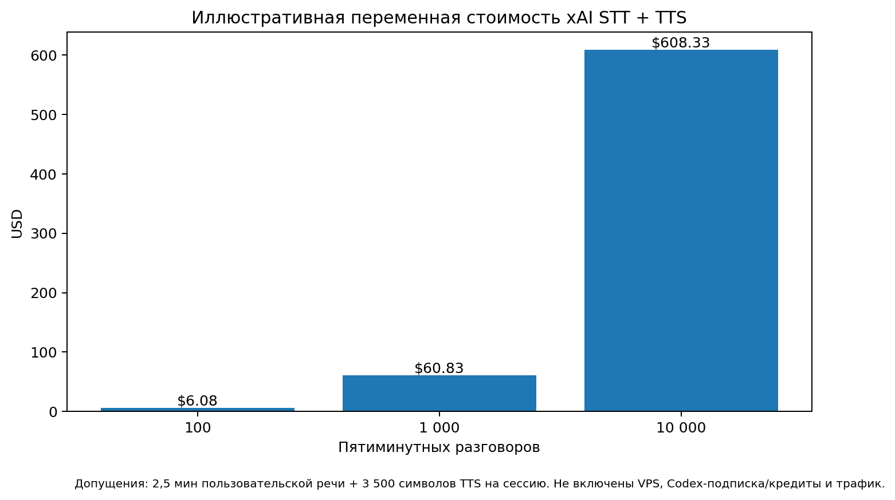

# 07. Trade-offs и Architecture Decision Records

## ADR-001. Разделить xAI voice и Codex/Luna brain

**Статус:** accepted.

### Решение

- xAI Streaming STT: речь → текст;
- Codex app-server + `gpt-5.6-luna` по умолчанию: диалог, policy, tools; model/effort остаются конфигурацией;
- xAI Streaming TTS: текст → речь.

### Почему

- пользователь уже имеет Codex subscription;
- Luna — быстрый и дешёвый вариант в семействе для повторяемых high-volume turns;
- voice provider и brain можно менять независимо;
- backend сохраняет полный контроль над business state.

### Цена решения

- выше end-to-end latency, чем у единой speech-to-speech модели;
- больше соединений и failure modes;
- нужен sentence chunker и interruption coordination;
- subscription auth требует операционной дисциплины.

### Митигация

streaming на каждом участке, компактный prompt context, low effort, provider adapters, SLO instrumentation.

## ADR-002. Использовать Codex subscription auth на trusted VPS

**Статус:** accepted с риском.

### Плюсы

- использует уже оплаченную подписку/credits;
- Luna доступна через Codex;
- быстрый старт без отдельного API-billing path.

### Минусы

- OpenAI рекомендует API keys для большинства generic automation сценариев;
- auth cache — чувствительный секрет;
- rolling limits не являются гарантированной production capacity;
- одна копия auth — одна машина/сериализованный поток;
- re-auth и изменения продукта могут потребовать участия владельца.

### Guardrails

- single VPS / single app replica;
- persistent encrypted/permissioned `CODEX_HOME`;
- startup preflight и admin alert;
- `BrainPort` позволяет добавить API-key adapter;
- приложение не покупает credits автоматически.

## ADR-003. Не использовать универсальный AI SDK в primary realtime runtime

**Статус:** accepted.

### Рассмотрено

| Вариант | Результат |
|---|---|
| Direct Codex app-server JSON-RPC | выбран для P0: полный доступ к threads, streamed deltas, `turn/interrupt`, `instructionSources` и experimental tools |
| `@openai/codex-sdk` | официальный и удобный для обычных streamed runs, но публичный TS surface не гарантирует обязательный low-level app-server control; официально требует Node 18+, а runtime — Bun |
| Vercel AI SDK | полезен для normalized text/structured output и future API-key adapters; Codex app-server bridge — community provider, а binary voice path всё равно custom |
| LangChain/LangGraph/Mastra | не выбран: deterministic state machine уже решает orchestration, дополнительный graph layer не даёт выигрыша |
| OpenAI Responses API | хороший production fallback, но usage-based и не использует subscription allowance |
| xAI speech-to-speech | не выбран, потому что мозг был бы Grok, а не Luna |

### Реализация

`BrainPort` изолирует transport. P0 — тонкий typed client к pinned `codex app-server`; protocol schemas проверяются contract tests. Zod используется для собственных domain/API contracts. `@openai/codex-sdk` разрешён только для spike/offline evals или будущей замены adapter после прохождения тех же interrupt/tool/isolation tests.

Подробная матрица — в [`10-ai-library-evaluation.md`](10-ai-library-evaluation.md).

## ADR-004. Dynamic tools — только за feature flag

**Статус:** accepted.

Dynamic tool API Codex app-server экспериментальный. Default может быть `dynamic` после contract test, но `envelope` fallback обязателен. Release не должен зависеть от незамеченного protocol drift.

## ADR-005. Backend-owned state machine

**Статус:** accepted.

Prompt-only state считается недостаточным. LLM может предложить action, но transition и side effects разрешает deterministic policy. Это особенно важно для порядка booking → qualification.

## ADR-006. Prompts в Markdown, без онлайн-редактора

**Статус:** accepted.

Плюсы: Git history, diff, review, простая параллельная работа. Минусы: нет non-technical editor и мгновенной публикации. Для MVP это правильный обмен.

## ADR-007. SQLite + WAL

**Статус:** accepted для single VPS.

Плюсы: минимум ops, транзакции, backup, один volume. Минусы: один writer/host, нет горизонтального scale. Текущий deployment всё равно single-replica из-за subscription auth.

## ADR-008. Один Compose project, modular monolith

**Статус:** accepted.

Приложение логически модульное, но не дробится на services. Caddy может быть вторым контейнером в том же Compose.

## ADR-009. Бронь — внутренняя сущность, не календарь

**Статус:** accepted.

Это сокращает scope и позволяет проверить conversation/tool design. UI и voice copy обязаны не создавать ложного ожидания calendar event.

## ADR-010. Qualification только после booking

**Статус:** accepted, non-negotiable.

Плюсы: меньше потерянных лидов и ясная транзакционная граница. Минусы: booking может быть менее подробно квалифицирована. Этот минус ожидаем и допустим.

## ADR-011. PCM streaming вместо MP3 в low-latency path

**Статус:** proposed/validate in spike.

PCM проще очередить и немедленно останавливать через Web Audio, но требует больше bandwidth. Для коротких browser sessions на VPS это приемлемо. Если Safari/сеть создают проблемы, adapter допускает MP3 fallback.

## ADR-012. Голос и предполагаемый бесплатный TTS — конфигурация, не архитектурная гарантия

**Статус:** accepted.

Владелец ожидает использовать доступный ему бесплатный allowance/кредиты xAI TTS. Архитектура это допускает, но не считает нулевую цену гарантией: публичный прайс провайдера может отличаться от условий конкретного аккаунта.

- стартовый smoke-test сравнивает `iris` — голос с заявленным sales-support tone — и `eve` как универсальный fallback;
- итоговый `voice_id` задаётся через `XAI_TTS_VOICE` и меняется без правок prompts/state machine;
- TTS adapter считает символы и пишет usage telemetry;
- cost guardrail и text-only fallback защищают от неожиданного биллинга или исчерпания allowance.

## ADR-013. Codex subscription/Luna — MVP optimization, не production entitlement

**Статус:** accepted с release guard.

Используем подписку владельца и `gpt-5.6-luna`, потому что это быстро и снижает прямой variable cost прототипа. При этом Codex account auth предназначен для trusted private automation, а public conversational workload не должен рассматриваться как гарантированный production API/SLA.

Guardrails:

- browser никогда не взаимодействует с Codex напрямую;
- rate limit, bounded queue, session limit и sandbox обязательны;
- до публичного коммерческого запуска проводится plan/terms/capacity review;
- `BrainPort` допускает отдельный API-key adapter;
- exhaustion subscription quota переводит сервис в controlled degraded mode, не повреждая booking data.

## Иллюстративная стоимость voice provider



Допущение одного разговора:

- 5 минут общей длительности;
- 2.5 минуты пользовательской речи;
- 3 500 TTS-символов;
- xAI Streaming STT: `$0.20/hour`;
- xAI TTS: `$15/1M chars`.

Расчёт:

```text
STT = 2.5 / 60 × 0.20 = $0.0083
TTS = 3500 / 1,000,000 × 15 = $0.0525
Итого ≈ $0.0608 на разговор
```

Это planning example, а не счёт: не включены VPS, bandwidth, Codex subscription/credits и реальные пропорции речи.

## Capacity envelope Codex subscription

Для планирования:

```text
примерные sessions per rolling window
= available Luna local messages / average brain turns per session
```

При 8 brain turns на conversation даже широкий published range даёт сильно разную capacity. Поэтому:

- не обещать throughput до preflight/load test на конкретном аккаунте;
- записывать turns/session;
- иметь concurrency queue;
- в случае роста трафика включить API-key BrainPort или отдельный production billing path.

## Risk register

| ID | Риск | Вероятность | Влияние | Митигация |
|---|---|---:|---:|---|
| R-01 | subscription quota исчерпана | medium | high | capacity limit, metrics, API fallback interface |
| R-02 | auth refresh/re-login | medium | high | persistent CODEX_HOME, readiness, runbook |
| R-03 | app-server experimental tool drift | medium | high | pin version, generated schemas, envelope fallback |
| R-04 | voice latency выше SLO | medium | high | streaming, low effort, profiling, shorter responses |
| R-05 | STT неверно распознаёт контакт | medium | high | targeted confirmation, validation |
| R-06 | LLM нарушает booking order | low/medium | high | backend state policy, tests |
| R-07 | duplicate booking on reconnect | medium without guard | high | unique constraint + idempotency |
| R-08 | marketing hallucination | medium | medium/high | allowed claims, evals, source attribution |
| R-09 | PII leak in logs | medium | high | redaction and log tests |
| R-10 | cheap VPS resource pressure | medium | medium | guardrails, metrics, bounded buffers |
| R-11 | xAI price/voice changes | medium | medium | config adapter, cost telemetry |
| R-12 | user thinks calendar event exists | medium | medium | explicit copy and payload semantics |

## Revisit triggers

Пересмотреть архитектуру, если:

- одновременно нужно больше одной VPS/реплики;
- Luna subscription становится bottleneck;
- median conversations требуют >12 brain turns;
- p95 latency стабильно >3 s;
- dynamic tools ломаются после upgrade;
- появляется реальная CRM/calendar integration;
- нужен multi-tenant data isolation.
